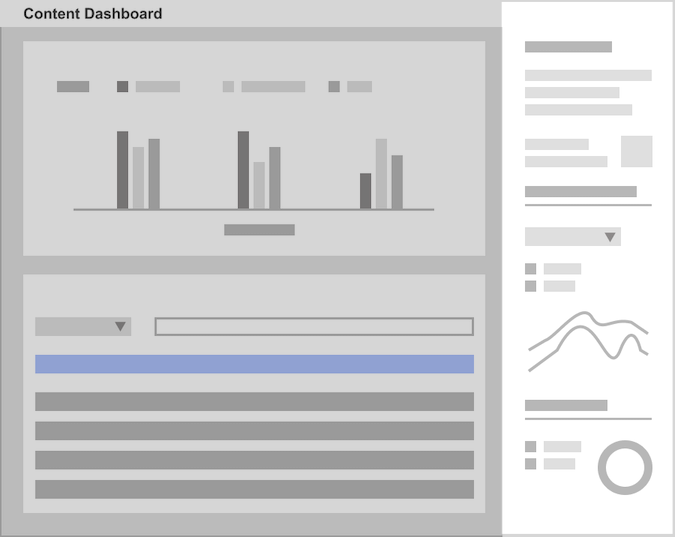
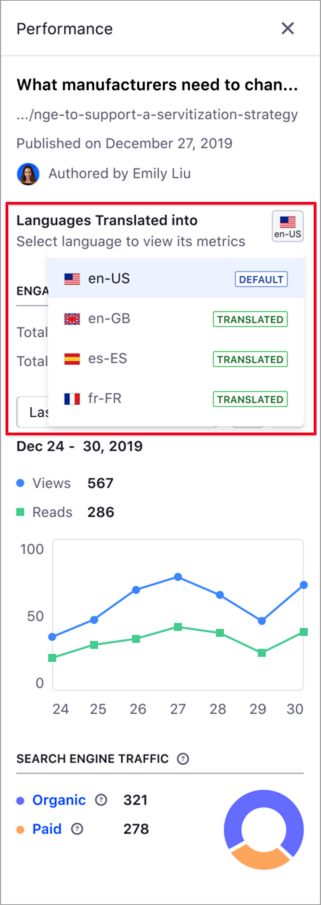
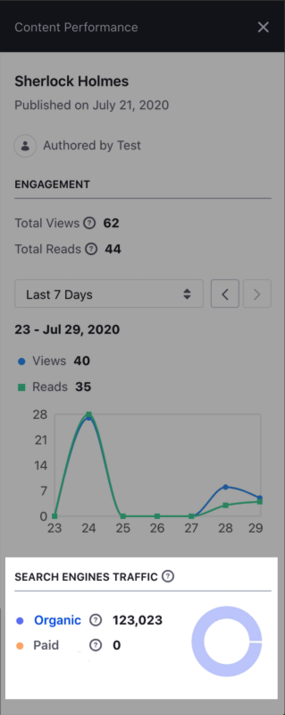
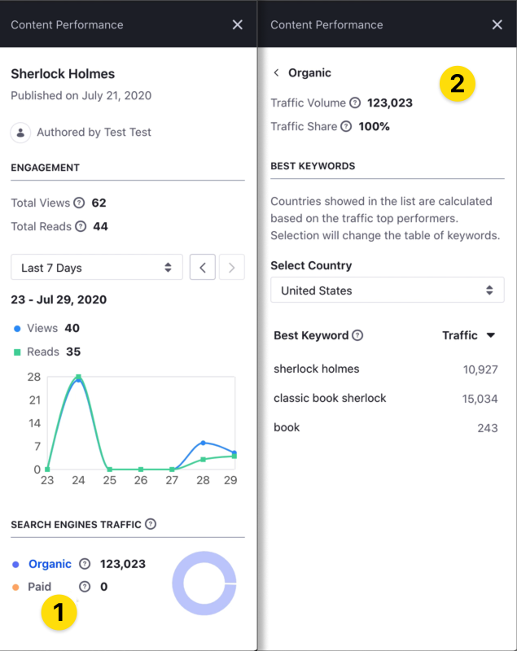

# Analyze Content Performance Using the Content Dashboard

You can use the Content Performance sidebar in the Content Dashboard page to analyze different information about your content, like the number of reads and views, traffic sources, or keywords driving an audience to your site. Using the Content Performance panel, content teams can periodically assess the content strategy execution and adapt this strategy base on quantitative data.



To open the Performance sidebar panel:

1. Click the Actions Menu next to the asset and choose *Performance*.
1. Alternatively, hover over the asset and click the *Metrics* () button.

```important::
   To access the metrics for your content in the Performance panel, you must connect the Liferay DXP instance with Liferay Analytics Cloud and synchronize your content. To learn more, see [Connecting Liferay DXP to Analytics Cloud](https://learn.liferay.com/analytics-cloud/latest/en/getting-started/connecting-data-sources/connecting-liferay-dxp-to-analytics-cloud.html).
```

```important::
   To access the metrics for your content in the Performance panel, you must:

    - Have the the view and edit permission for Web Content. See 
    - Connect the Liferay DXP instance with Liferay Analytics Cloud and synchronize your content. To learn more, see [Connecting Liferay DXP to Analytics Cloud](https://learn.liferay.com/analytics-cloud/latest/en/getting-started/connecting-data-sources/connecting-liferay-dxp-to-analytics-cloud.html).
```

When your content is localized in different languages, you can select the language in the *Languages Translated Into* section to show only the statistics for that language. To do so, click on the language icon drop-down menu and select the language.

```note::
   The language selector is not available for non-localized content.
```



The Content Performance sidebar contains two different areas:

- [Engagement](#engagement)
- [Search Engine Traffic](#search-engine-traffic)

## Engagement

This area shows the number of Views and Reads of your content, and how these numbers change over time. Views and Reads are two key values to understand the performance of your content. A visitor accessing one particular content (a viewer) may or may not read the content. To distinguish the audience that only visit the content (number of Views) from the audience engaging with the content (number of Reads), Liferay uses a specialized algorithm that considers parameters like article length, article language, or scroll behavior, among others.


By default, the Engagement area shows the total number of Views and Reads in the last seven days. You can change this period in the drop-down menu, and move back and forward using the arrow buttons ( ) to analyze engagement trends over time.

You can hover over any point of the 

If the line chart for the Engagement area does not show values for a certain period, it means that the information could not be collected or analyzed for that time.


## Search Engine Traffic

This part of the Performance sidebar provides information about the sources driving people to your content. Sources can be:

- Organic --- People finding the content through a search engine.
- Paid --- People finding the content through paid keywords.



You can click on the sources in the graphic to access additional information about these sources, like the traffic sources by country or the best keywords.

```note::
   Keywords are one or more words that people use to find content.
```



- **Traffic Volume** --- The estimated number of visitors to your page.
- **Traffic Share** --- Percentage of traffic you content receives from the traffic source.
- **Best Keyword** --- Top five keywords driving traffic through organic search.
- **Best Paid Keyword** --- Top five keywords driving traffic through paid search.

## Related Information

- [About the Content Dashboard](./about-the-content-dashboard.md)
- [Content Dashboard Interface](./content-dashboard-interface.md)
- [Defining Categories and Vocabularies for Content](../tags-and-categories/user-guide/defining-categories-and-vocabularies-for-content.md)