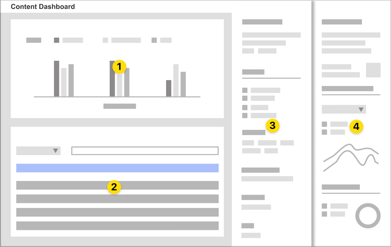
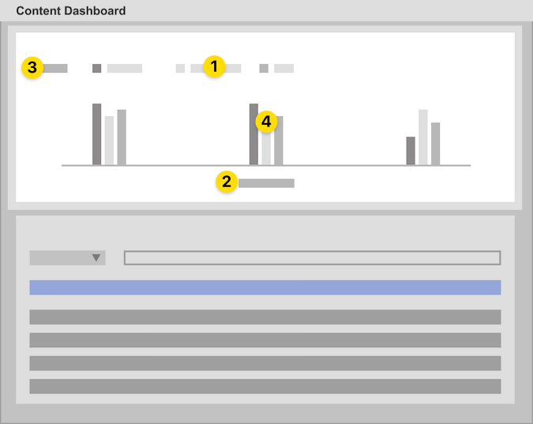

# Content Dashboard Interface

The Content Dashboard partas are:

- Chart area (1)
- Content View area (2)
- Information sidebar panel (3)
- Performance sidebar panel (4)


By default you can see the Chart area on the top and the Content View area on the button. Using the Actions Menu for each content, you can also access the Information and Performacne sidebar panels.

The Information and Performance panels are collapsable elements that 



To access the performance metrics for your content in the Performance panel, you must have a connection with Liferay Analytics Cloud and the connection must be . To learn more, see ...

By default, the Content Dashboard shows asset information from all sites and asset libraries where you have access.

## Accesing the Content Dashboard

1. Click on the Global Menu and, under the *Content* area, click *Content Dashaboard*
1. Alterantively, click


## The [[Graphic Area]]

The Chart area is in the upper side of the Content Dashboard 
The bar chart represents the combination of value from the two out-of-the-box Vocabularies: Audience and Stage.

In this area, we can find:

-  graphic legend (1)
- Chart X, representing one of the Vocabularies (2)
- Chart Y, representing the second Vocabulary (3)
- Bar Chart (4)



```tip::
   If the chart area does not show the expected graphic, verify your Categories for the default Vocabularies and ensure that your content is categorized.
```


### Customizing the Categories in the [[Graphic Area]]

By default, the bar chart shows the total number of assets for each Category. You can filter this data using the filters in the [[Content View Area]]. You can also remove the categories in the leyend. To do so, click or unclick the category you want to filter in

To customize the Categories:

1. Click the Actions Menu in the graphic area.
1. In the dual listbox, click the Vocabulary in the Available or *In Use* lists and click the > or < buttons to add or remove the Vocabularies you want to show.

You can show a maximun of two vocabularies.

1. Click Save ?

## The [[Content View Area]]

The Content View . The Audit Chart area changes dinamycally when you apply one or more filters in the Content View.

In this are of the Content Dashboard we can find:

- Filter and Sort selector (1)
- Filter editor (2)
- Search field (3)
- Content list (4)


| Column | Description |
| --- | --- |
| Title | cell 2 |
| Author | cell 2 |
| Subtype | cell 2 |
| Site or Asset Library | cell 2 |
| Status | cell 2 |
| Audience | Shows one of more Categories from the Audience Vocabulary |
| Topic | Shows one of more Categories from the Topic Vocabulary |
| Modified DAte | Last modified date or time |


### Sorting and Filtering Content in the [[Content View Area]]

By default, the bar chart shows the total number of assets for each Category. You can filter this data using the filters in the [[Content View Area]].

To filter the content:

1. Click the Filter and Order drop-down menu.
1. Click on one of the predefined filters or click of a custom filter (denoted by the three dots) to create your own filtering.

When you click in a custom filter (denoted by the three dots (...)), you can configure the . For example, if you click in the 

To remove one or more filters, click the close button next to the filter's name, or click the Clear button to remove all the filters and see all the available content.


To sort the content:

1. Click the Filter and Order drop-down menu.
1. Under the *Order By* section, select the order for the itmes.

## The Information Sidebar Panel

This panel provides access to multiple information for the asset selected, including the asset owner, available languages for the content, tags and categories, or review date, among others.


To open the Information sidebar panel:

1. Click the Actions Menu next to the asset and choose *Info*.
1. Alternatively, hover the 

## The [[Content Performance Area]]


You can access the Content Performance info panel for any of the assets in the Content area.

To open the Performance sidebar panel:

1. Click the ActionMenu next to the asset and choose
1. Alterantively hover 

The Content Performance info panel provides access to the following article's information:

- General information
- Engagement
- Search Engines Traffic

The General information section contains different information for your articles, like article name, URL, publication date, author, and languages the article is translated into.

## Related Information