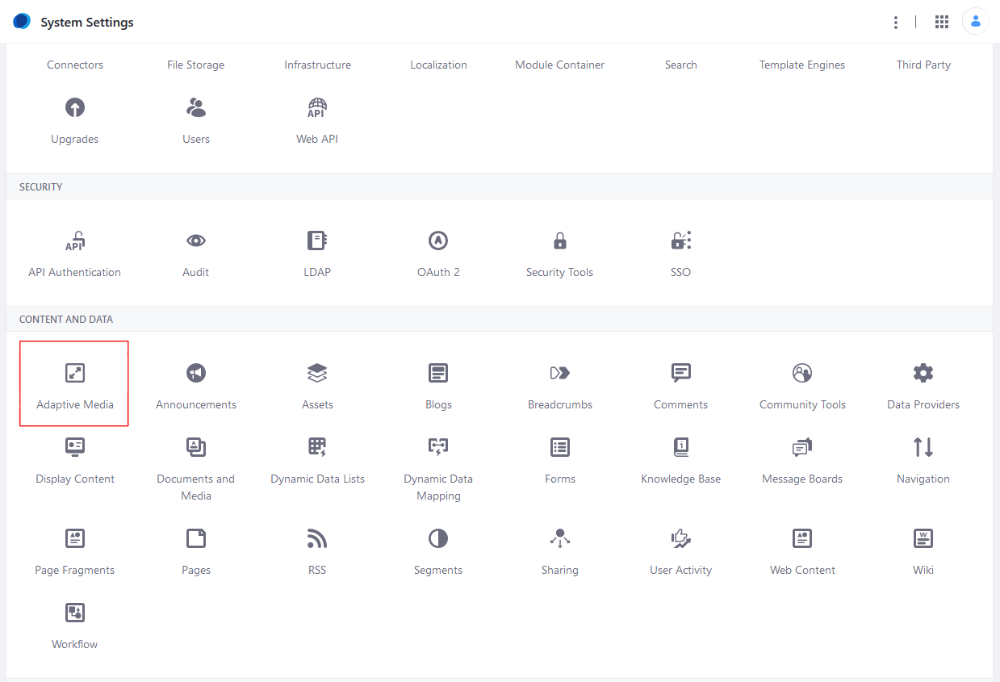
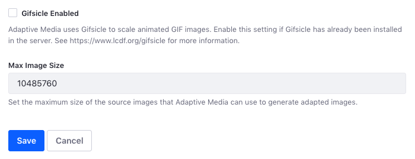

# Enabling Optimization of Animated GIFs

To scale animated GIFs, Adaptive Media uses an external tool called [Gifsicle](https://www.lcdf.org/gifsicle/). If Gifsicle isn't installed and `image/gif` is included as a supported MIME type, Adaptive Media scales only one frame of the GIF, making a static GIF.

Optimizing animated GIFs using Adaptive Media requires three steps: installing Gifsicle on your local server where DXP is running, setting the `PATH` environment variable, and then enabling Gifsicle in DXP's _System Settings_.

1. Install [Gifsicle](https://www.lcdf.org/gifsicle/) and add it to path of the server environment.

1. Navigate to the _Global Menu_ &rarr; _Control Panel_.

    

1. Click _System Settings_.
1. Click _Adaptive Media_.

    

1. Click _Images_ in the left navigation under _System Scope_.
1. Scroll down and and then click the box next to _Gifsicle Enabled_.

    

1. Click _Save_ when finished.

## Additional Information

-   [How Adaptive Media Works](../publishing-and-sharing/serving-device-and-screen-optimized-media/how-adaptive-media-works.md)
-   [Using Adapted Images in Site Content](../publishing-and-sharing/serving-device-and-screen-optimized-media/using-adapted-images-in-site-content.md)
