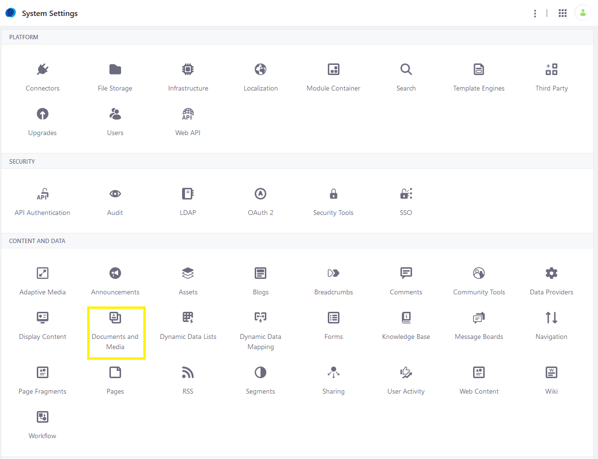
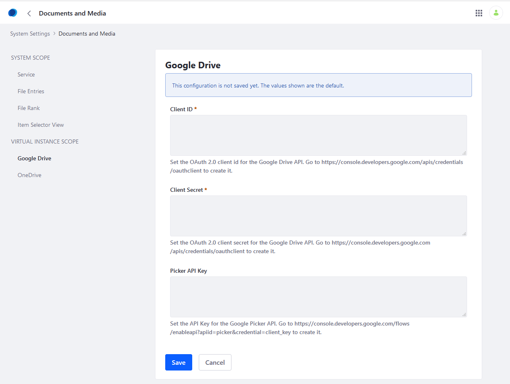
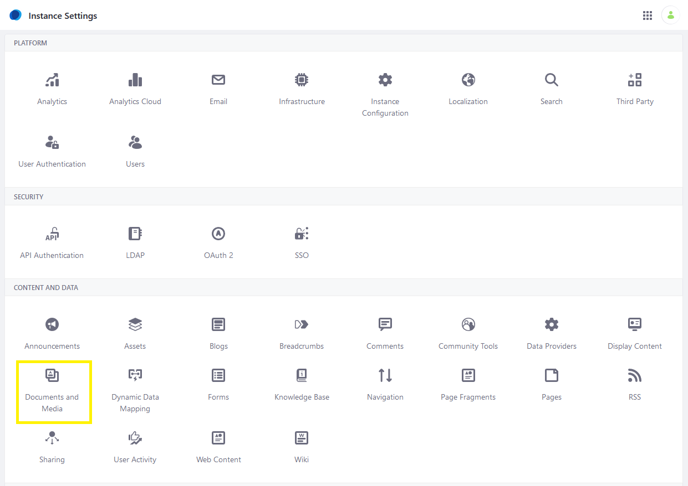
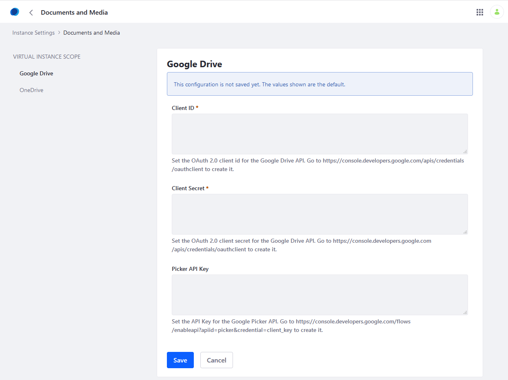

# Enabling Document Creation and Editing with Google Drive

Before you can use Google Docs&trade; to create and edit Documents and Media files, you must configure DXP to connect with the application in the [Google API Console](https://console.developers.google.com). You must be logged in as an administrator.

## Configure Your Google Project

First, you must configure your Google project to use the Google Drive&trade; API and set up OAuth 2 for use with that project.

1. Go to the [Google API Console](https://console.developers.google.com). If you don't have a suitable project, [create a new one](https://support.google.com/googleapi/answer/6251787?hl=en&ref_topic=7014522).
1. Enable the Google Drive&trade; API for your project. For instructions, see the Google API Console documentation on [enabling and disabling APIs](https://support.google.com/googleapi/answer/6158841).
1. Create an OAuth 2 client ID for your Google project. For instructions, see the Google API Console documentation on [setting up OAuth 2.0](https://support.google.com/googleapi/answer/6158849). Select _Web application_ when prompted to select your application type. Take note of the client ID and client secret that appear: you'll need them to configure the portal to use the Google Drive&trade; API.

## Configuring the Portal

Now that you have a Google project set up for use with DXP, you must connect your installation to that project. You can do this at two scopes:

-   Globally, for all instances in your DXP installation.
-   At the instance scope, for one or more instances in your DXP installation.

You can override the global configuration for one or more instances by configuring those instances separately. Similarly, you can configure only the instances you want to connect to your Google project and leave the global configuration empty.

Follow these steps to connect your DXP installation to your Google project:

### Granting Global Access

1. Navigate to _Control Panel_ &rarr; _System Settings_ &rarr; _Documents and Media_.

    

1. Click _Google Drive_ in the left menu.

    

1. Enter your Google project's OAuth 2 client ID and client secret into the _Client ID_ and _Client Secret_ fields.
1. Click _Save_.

The DXP instance is now connected at the global level.

### Granting Instance Level Access

1. Navigate to the _Control Panel_ &rarr; _Instance Settings_ &rarr; _Documents and Media_.

    

1. Click _Google Drive_ in the left menu.

    

1. Enter your Google project's OAuth 2 client ID and client secret into the _Client ID_ and _Client Secret_ fields.
1. Click _Save_.

```tip::
   To turn this feature off, delete the client ID and client secret values from the form.
```

```tip::
   You can ignore the *Picker API Key* field. This field is unrelated to the Google Docs online editing features in DXP.
```

## Additional Information

-   [Enabling Links to Google Drive Documents](./enabling-links-to-google-drive-documents.md)
-   [Creating and Editing Documents with Google Drive](../../uploading-and-managing/creating-documents/creating-and-editing-documents-with-google-drive.md)
