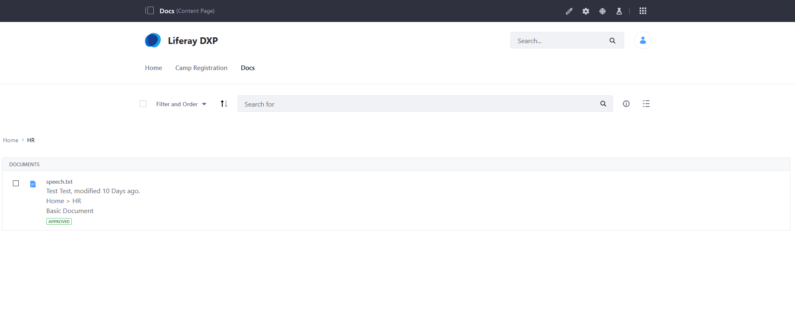
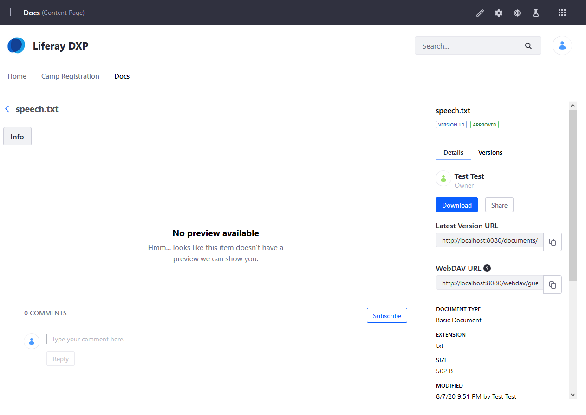
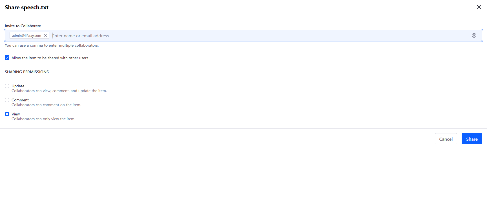
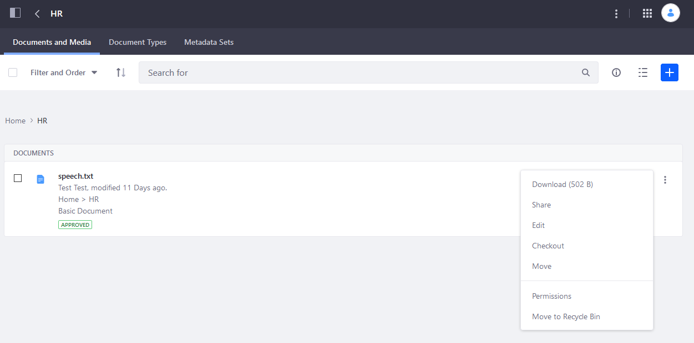
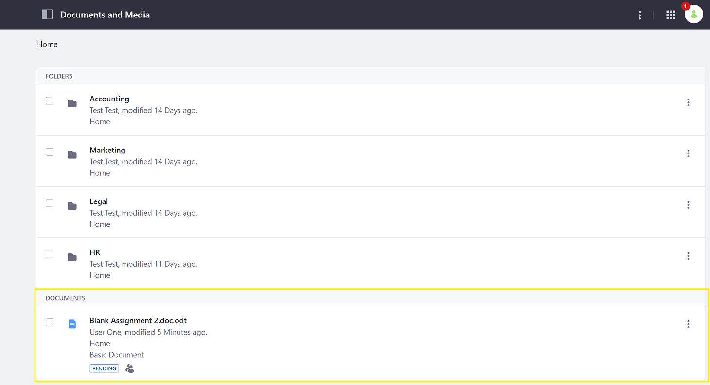
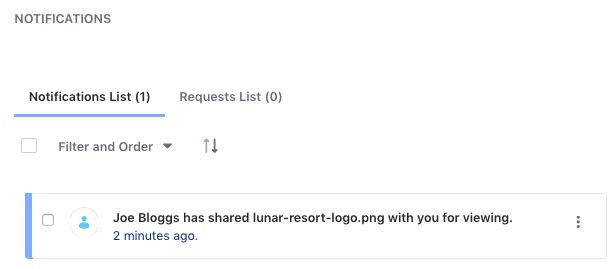
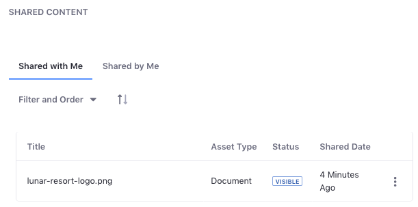
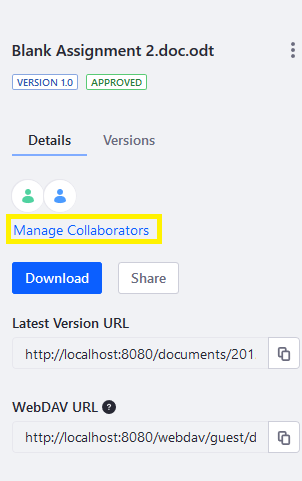
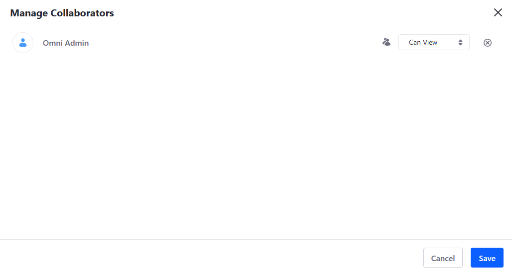

# Sharing Documents with Other Users

Using DXP's _Documents and Media_ app, users can share files directly with each other.

You can disable sharing. For instructions on this, see [Enabling and Configuring Sharing](./enabling-and-configuring-sharing.md).

When you share, you grant some of your own permissions for that file to the receiving user. There are some important caveats:

* You can only grant View, Comment, or Update permissions. For example, you can't grant Delete or Override Checkout permissions even if you have those permissions on the file.
* You can only grant permissions you have on the file. For example, you can't grant Update permission if you only have View and Comment permissions on the file.
* You must grant at least View permission.
* Traditional [Role-based permissions](../../../../users-and-permissions/roles-and-permissions/understanding-roles-and-permissions.md) always take precedence over sharing permissions. So although sharing can extend permissions, it can't remove those granted via Roles in the portal.
* By default, the Guest Role has Add Discussion permission. This overlaps with the Comment permission in sharing. Therefore, all users can comment on a file regardless of whether the Comment permission was granted via sharing. You can change this by removing the Add Discussion permission from the Guest Role.

Also note that the receiving User must be part of the same instance, but doesn't have to be a member of the same Site.

## Sharing Files in Documents and Media

To share a file, you must own that file or be an administrator. There are two ways to share a file: through the _Documents and Media_ widget on a page, or in _Site Administration_. If using the latter method, ensure you have access to _Site Administration_.

### Sharing a File on a Site Page

1. Navigate to the page where the _Documents and Media_ widget has been deployed.

    

1. Click on the file to be shared (for example, `speech.txt`).
1. Click the _Info_ button to expand the Info Panel.

    

1. Click _Share_.
1. Enter the email address of the collaborator. You can enter multiple addresses.
1. To let receiving Users share the file, check the _Allow the document to be shared with other users_ box.
1. Select the file permissions to grant to receiving Users.
Select one of the following file permissions to grant to receiving Users:

    * **Update:** View, comment, and update.
    * **Comments:** View and comment.
    * **View:** View only.

    

1. Click the _Share_ button on the window pane.

The file has been shared.

### Using the Site Administration

Follow these steps to share a file:

1. To access _Site Administration_, open the _Menu_ () and click your Site's name.
1. Click _Content & Data_ &rarr; *Documents and Media*.
1. Navigate to the folder where the file to be shared is located (for example, the _HR_ folder).
1. Click the file's *Actions* button () and select _Share_. This opens the Share dialog.

    

1. Enter the name or email address of the user you want to share the file with. To share the file with multiple users, enter each user's email address in a comma delimited list.
1. To let receiving users also share the file, select _Allow the document to be shared with other users_.
1. Select the file permissions to grant to receiving users:

    * **Update:** View, comment, and update.
    * **Comments:** View and comment.
    * **View:** View only.

1. Click _Share_.

## Working with Shared Files

You can access files shared with you in three places:

* **The Documents and Media Library:** Files shared with you are visible in their existing Documents and Media locations. For example, if someone shares a file with you that resides in the Documents and Media Library's Home folder, you can access the file in that folder.

* **The Notifications app:** When a file is shared with you, you get a notification. Clicking the notification takes you to the file in Documents and Media. For information on notifications, see [Managing Notifications and Requests](../../../../collaboration-and-social/notifications-and-requests/user-guide/managing-notifications-and-requests.md).

* **The Shared Content app:** You can access this app from your user menu. It lists all the content shared with you and the content you shared. Each file has an Actions button () for performing permitted actions on the file (e.g., view, comment, update).

## Managing Shared Files

After sharing a file, you can un-share it or modify its permissions on a per-user basis. This can only be done by Administrators, the file's owner, or any User with Update permission and permission to share the file. You can take these actions from the file's Info panel in Documents and Media. Follow these steps:

1. Click the file in Documents and Media, then click the Info_ button () at the top-right. The file's Info panel slides out from the right.

1. Click the _Manage Collaborators_ link. This shows a list of the Users you shared the file with and their file permissions.

   

1. Make any changes you want to the list of collaborators. To un-share the file with a User, click the `x` icon next to that User. You can also change the file permissions via the selector menu for each User.

   

1. Click *Save* and close the dialog.

## Additional Information

* [Enabling and Configuring Sharing](./enabling-and-configuring-sharing.md)
* [Documents and Media Permissions Reference](./documents-and-media-permissions-reference.md)
* [Understanding Role and Permissions](../../../../users-and-permissions/roles-and-permissions/understanding-roles-and-permissions.md)
