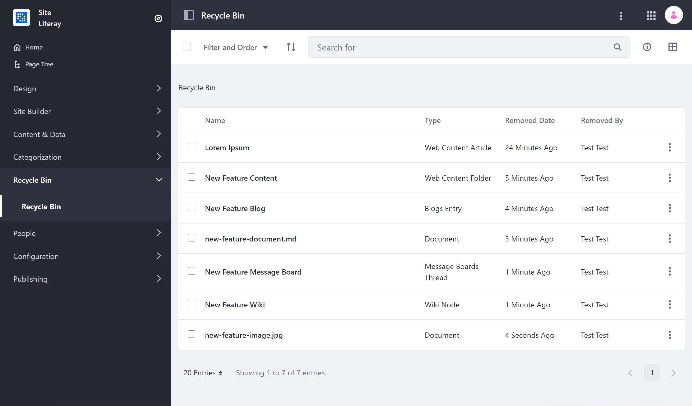
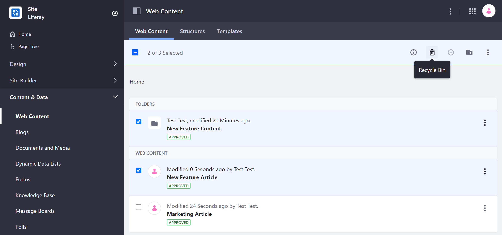
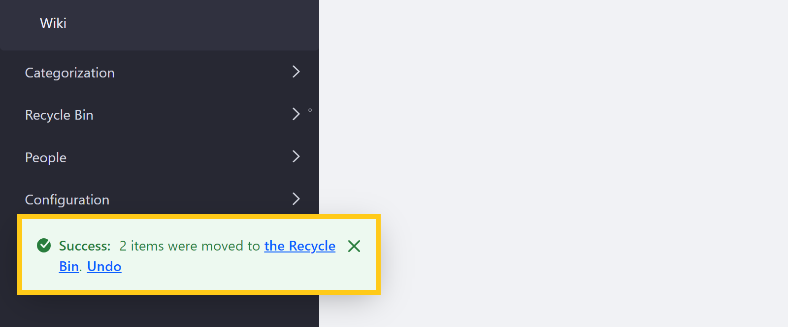
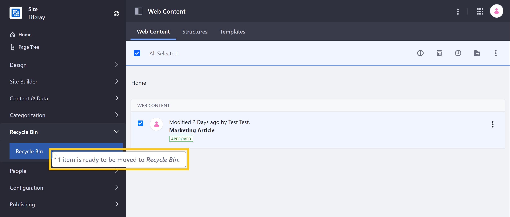
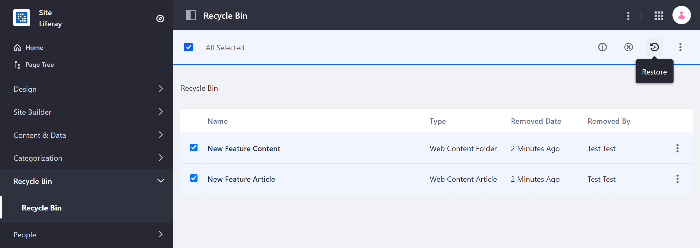

# Using the Recycle Bin

Recycle Bin functionality is available for the following asset types:

-   Blogs
-   Bookmarks
-   Documents and Media
-   Message Boards (and attachments)
-   Web Content
-   Wiki (and attachments)



```note::
   Attachments added to Wiki and Message Board entries do not go to the Recycle Bin when they are deleted. They can be restored in a similar fashion from the *Removed Attachments* menu within the application.
```

## Moving an Asset to the Recycle Bin

1. Open the _Product Menu_ () then click the compass icon () on the _Site Administration_ menu.
1. Select the site.
1. Click _Content & Data_ &rarr; _Web Content_.
1. Click the article's _Actions_ button () and click _Move to the Recycle Bin_. Note that the _Delete_ button is not listed.

    

1. Click OK in the confirmation window.
1. After deleting the file, a success message appears, offering an _Undo_ option. If you click _Undo_, the web content is retrieved from the Recycle Bin and stored in its original place.

    

Some applications, such as Web Content and Documents and Media, support folders for organizing content. You can also send folders to the Recycle Bin. Keep in mind that this action recursively sends all sub-folders and files to the Recycle Bin. Folders are restored and deleted the same way as a single file.

### Drag and Drop

You can also drag and drop items into the Recycle Bin.

1. While you're in the Control Panel, select an asset and drag it to the Recycle Bin portlet on the Control Panel menu.
1. When you click and begin dragging the asset, a message appears near your cursor notifying you of the number of files ready to be moved, and the Recycle Bin is highlighted, showing you where the files can be dropped.
1. After you drop the asset onto the Recycle Bin portlet, the asset is removed from its original location and transferred to the Recycle Bin.

    

## Restoring an Asset

1. Navigate to _Site Administration_ and click _Recycle Bin_ from the Content dropdown.
1. Next to the asset to be restored, click the _Actions_ button.
1. Click _Restore_.

    

1. Navigate back to the Web Content screen and verify that your content is back to its original place.

## Deleting an Asset Permanently

_Delete_ within the Recycle Bin is the permanent delete button. Once you select this, your file cannot be retrieved and is gone forever. There is also an _Empty the Recycle Bin_ option accessible from the () button at the top of the Recycle Bin screen. This permanently deletes all the files from the Recycle Bin.
