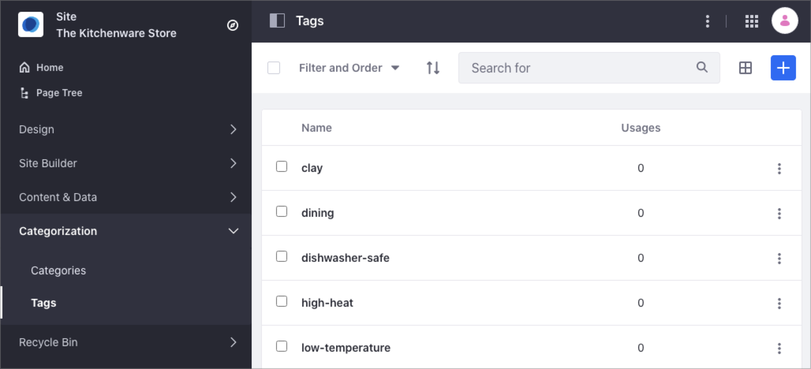

# Tagging Content

Tags are keywords you can use to organize your assets and describe specific information about its content. Tags tell users or visitors of your website what is the content about, and help them to find relevant information through search or navigation. For more information about Tags and Categories in Liferay DXP and the different usage scenarios, see [Organizing Content with Categories and Tags](organizing-content-with-categories-and-tags.md).

## Managing Tags

You can manage Tags under the Categorization panel in the Site Navigation menu. From here, you can create new Tags or customize the existing ones.



```note::
   Only site administrators can manage Tags in the Tags panel.
```

1. Open the Product Menu and, under the Site Menu, go to *Categorization* &rarr; *Tags*.
1. To create a new tag, click the *Add Tag* () button.
1. Type the *Name* or your new tag and click *Save*.

    ```note::
       Tags are all-lowercase.
    ```

1. To edit an existing tag, click the Actions () Menu next to the tag's name and select *Edit*.
1. If you want to merge one or more tags, check the box next to the tags you want to merge and click the *Merge* button ().

    

## Tagging Content

Use the Categorization section in the sidebar panel to tag content as it is being created.

1. Create or edit the content you want to tag.
1. In the sidebar panel, select the *Properties* tab.
1. Under the *Categorization* section and *Other Metadata* subsection, click *Select* next to *Tags*.

    

1. Select the tags you want to use from the list of existing tags and click *Done*.
1. If you want to create new tags for the content, write the name of the new tag in the *Tags* field and press Enter.

## Related Information

- [Organizing Content with Categories and Tags](./organizing-content-with-categories-and-tags.md)
- [Defining Categories and Vocabularies for Content](./defininig-categories-and-vocabularies-for-content.md)
- [Targeted Vocabularies](./targeted-vocabularies.md)