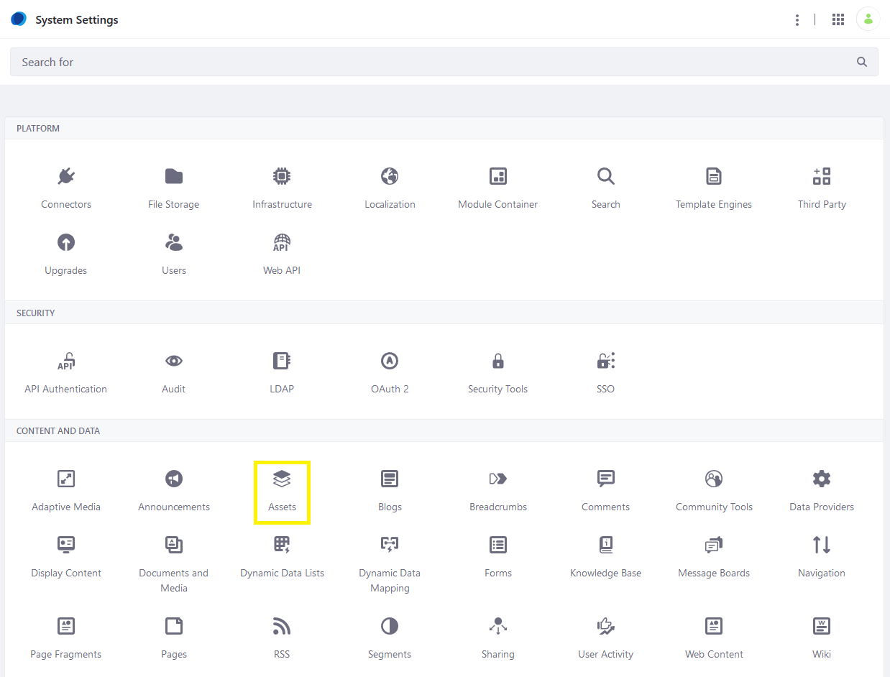
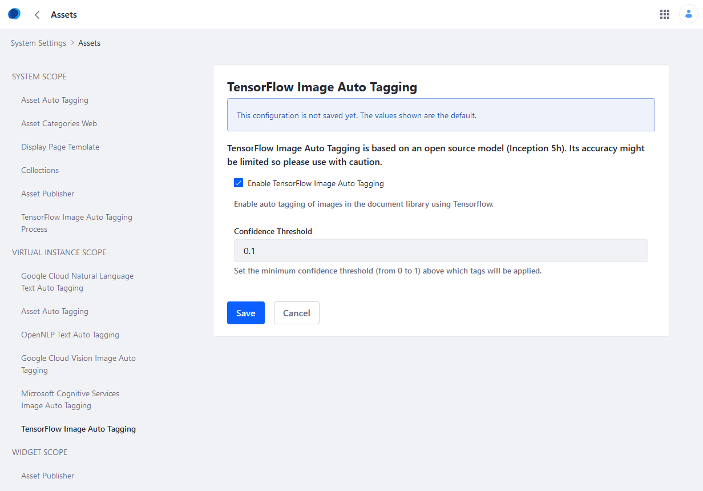
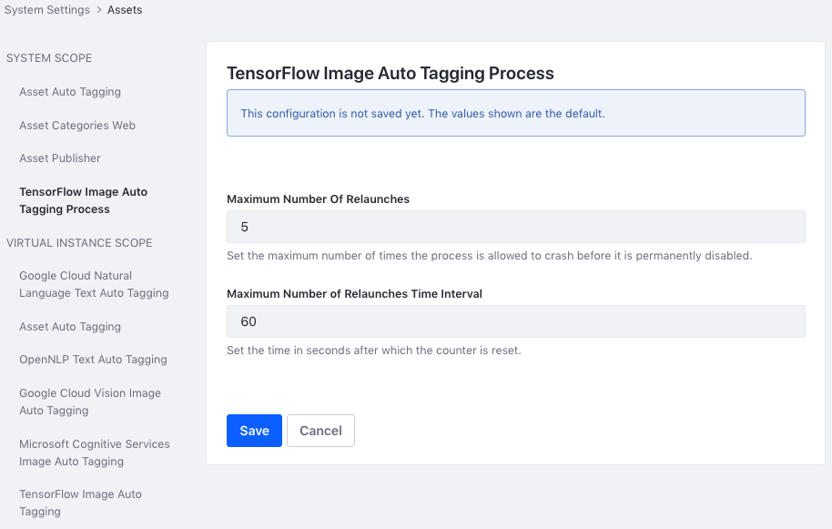
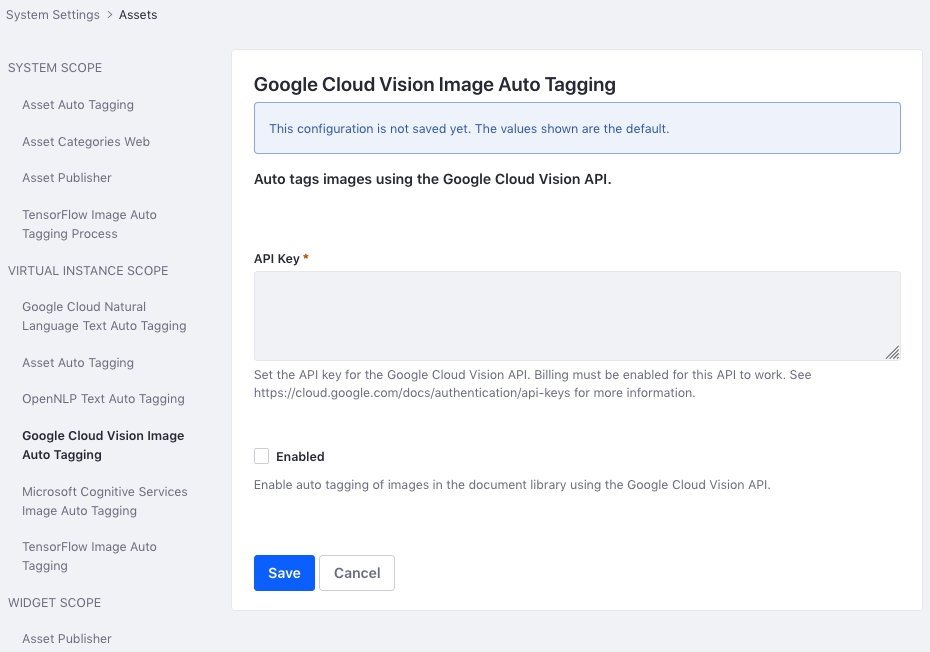
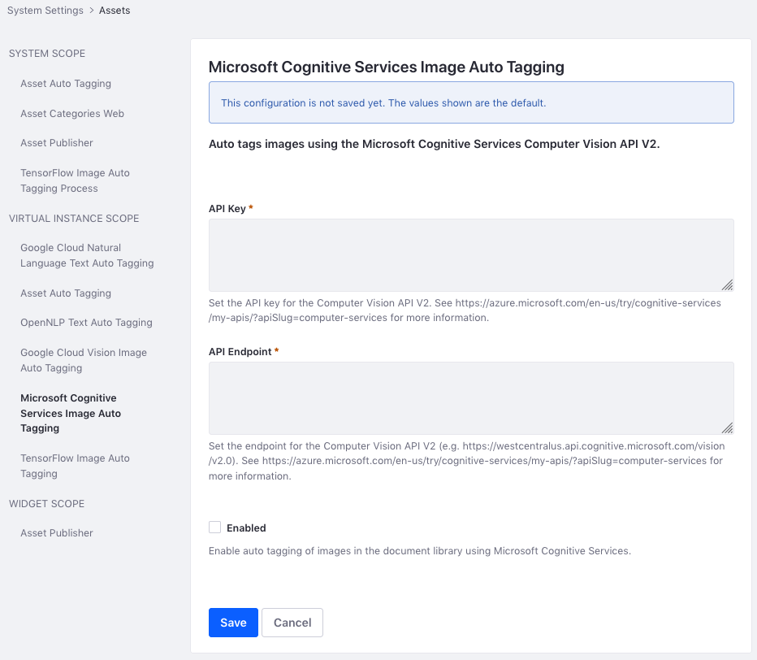

# Auto Tagging Images

Once [asset auto tagging has been enabled](./configuring-asset-auto-tagging.md), you can also enable image auto tagging. Image auto tagging tags images uploaded to the Documents and Media Library.

```tip::
   Currently, tags applied automatically are English only.
```

By default, Image Auto Tagging is disabled by default. In addition to enabling Auto Tagging in DXP, you must also configure an image tagging provider. Three providers are available:

-   [**TensorFlow:**](#configuring-tensorflow-image-auto-tagging) An open-source library that provides machine learning capabilities. TensorFlow image auto-tagging in DXP is based on [TensorFlow's `LabelImage` sample for Java](https://github.com/tensorflow/tensorflow/blob/master/tensorflow/java/src/main/java/org/tensorflow/examples/LabelImage.java), and uses the Inception5h model. Use this with caution, since its accuracy is limited.

-   [**Google Cloud Vision:**](#configuring-google-cloud-vision) Uses the [Google Cloud Vision API](https://cloud.google.com/vision/) to automatically tag images.

-   [**Microsoft Cognitive Services:**](#configuring-microsoft-cognitive-services) Uses [Microsoft Cognitive Services](https://azure.microsoft.com/en-us/services/cognitive-services/) to automatically tag images.


## Configuring TensorFlow Image Auto Tagging

1. Click the _Global Menu_ &rarr; _Control Panel_
1. Click _System Settings_.

    

1. Click _Assets_ under _Content and Data_.

    

1. Under _VIRTUAL INSTANCE SCOPE_, click _TensorFlow Image Auto Tagging_.
1. Fill out the form.
1. Click _Save_ when finished.

The form asks for this information:

**Enable TensorFlow Image Auto Tagging:** Check this box to select whether image auto-tagging is enabled by default in any instance that has asset auto tagging enabled.

**Confidence Threshold:** TensorFlow assigns a confidence level between 0 and 1 for each tag, where 1 is the highest confidence and 0 is the lowest. This field sets the minimum confidence level that TensorFlow needs to apply a tag. Higher values yield fewer tags because TensorFlow needs more confidence before it applies a tag. Lower values yield more tags.



### Optimizing TensorFlow Auto Tagging Performance

1. Click the _Global Menu_ &rarr; _Control Panel_
1. Click _System Settings_.
1. Click _Assets_.
1. Under _SYSTEM SCOPE_, click _TensorFlow Image Auto Tagging Process_.
1. Fill out the form.
1. Click _Save_ to apply the settings.

The form asks for this information:

**Maximum Number of Relaunches:** The maximum number of times the process is allowed to crash before it is permanently disabled.

**Maximum Number of Relaunches Time Interval:** The time in seconds after which the counter is reset.



The TensorFlow provider has been configured.

## Configuring Google Cloud Vision

1. Click the _Global Menu_ &rarr; _Control Panel_
1. Click _System Settings_.
1. Click _Assets_.
1. Under _VIRTUAL INSTANCE SCOPE_, click _Google Cloud Vision Image Auto Tagging_.
1. Enter your Google Cloud Vision API Key. For more information, see [Google's documentation on API keys](https://cloud.google.com/docs/authentication/api-keys).
1. Check the _Enabled_ box to enable Google Cloud Vision.

    

1. Click _Save_ when finished.

## Configuring Microsoft Cognitive Services

1. Click the _Global Menu_ &rarr; _Control Panel_
1. Click _System Settings_.
1. Click _Assets_
1. Under _VIRTUAL INSTANCE SCOPE_, click _Microsoft Cognitive Services Image Auto Tagging_.
1. Fill out the form.
1. Check the _Enabled_ box.

    

1. Click _Save_ when finished.

The form asks for this information:

**API Key:** Your [API key](https://azure.microsoft.com/en-us/try/cognitive-services/my-apis/?apiSlug=computer-services) for the Computer Vision API V2.

**API Endpoint:** The endpoint for the [Computer Vision API V2](https://westcentralus.api.cognitive.microsoft.com/vision/v2.0).

The Microsoft Cognitive Services provider has been configured. For more information, see the [Microsoft Cognitive Services documentation](https://docs.microsoft.com/en-us/azure/cognitive-services/).

If you have more than one virtual instance, you can configure each instance individually. Navigate to the _Control Panel_ &rarr; _Instance Settings_. Click _Assets_ then configure the provider there.

## Additional Information

-   [Configuring Asset Auto Tagging](./configuring-asset-auto-tagging.md)
-   [Auto Tagging Assets](./auto-tagging-assets.md)
