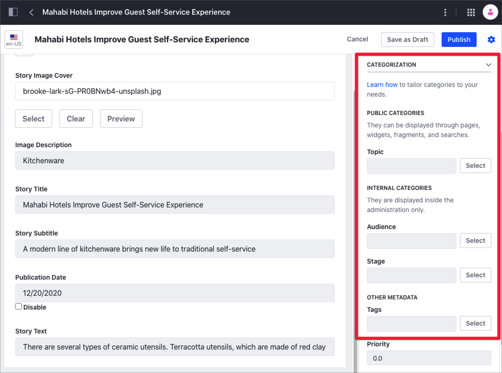
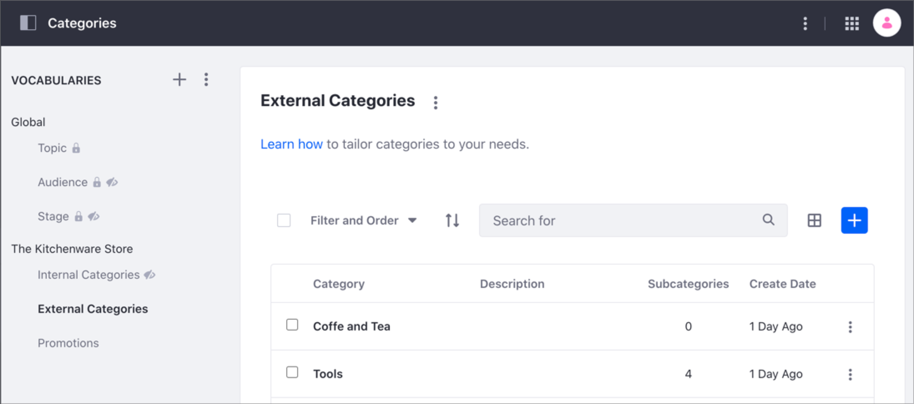
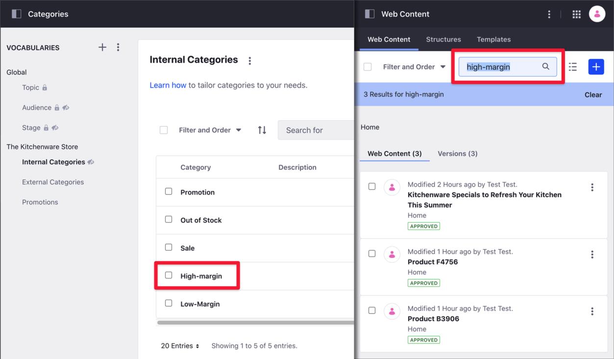
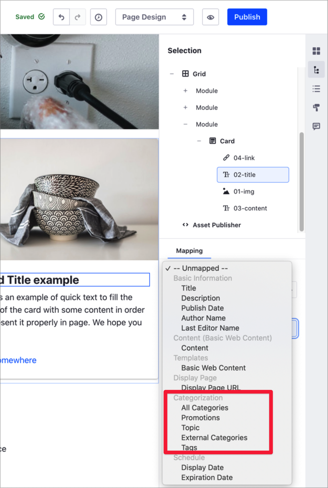

# Organizing Content with Categories and Tags

Categories and Tags are two essential tools you can use to organize and categorize your content in Liferay DXP, and help users find the content in your site through search or navigation.

Using Categories, you can group similar assets and organize your site content. For example, you can create the "Success Stories" Category and group all the customer success articles in your website under this Category. You can also create a hierarchy of Categories. For example, you can create the "Finance" and "Healthcare" Subcategories under the "Success Stories" main Category. To start using Categories in Liferay DXP, see [Defining Categories and Vocabularies for Content](./defining-categories-and-vocabularies-for-content.md).

You group Categories using Vocabularies. Your Categories and Vocabularies depend on your goal when organizing the site content. The Marketing department may want to use Categories based on different customer segments, while the Human Resources department may want to use Categories based on the company organization. You define and group Categories for internal use in Internal Vocabularies, or group Categories that are visible for your users in Public Vocabularies. For more information, see [Vocabulary Visibility](#vocabulary-visibility).

Tags are keywords you can use to organize your assets and describe specific information about its content. Tags tell users or visitors of your website what the content is about, and help them find relevant information through search or navigation. For example, in an online Kitchenware Store, you may find different tags describing the store items, like "glass", "clay", or "dishwasher-safe". Using these Tags in your content, visitors interested in "clay" kitchenware only can find relevant articles faster. Tags are not hierarchical, so you cannot group tags inside other tags. To start using Tags, see [Tagging Content and Managing Tags](./tagging-content-and-managing-tags.md).

The following table summarizes the main differences between Categories and Tags:

| Categories | Tags |
| --- | --- |
| Managed by administrators | Managed by administrators and non-administrators |
| Grouped in Vocabularies | Cannot be grouped |
| Hierarchical categorization | Non-hierarchical categorization |
| Global site Categories are instance-wide | Particular to each site |

In Liferay DXP, you can find Categories and Tags under the Categorization panel in the Site Navigation menu. From here, you can create new Categories and Tags or customize the existing ones. You create Tags and Categories at the site level.

```note::
   Only site administrators can manage Categories and Tags in the Categorization panel.
```


In addition to the Categorization panel, you can tag or categorize an asset at creation time or edit an existing asset using the Categorization section.



## Vocabulary Visibility

> Available: Liferay 7.3+.

When you [create a new Vocabulary](./defining-categories-and-vocabularies-for-content.md#defining-vocabularies), you define its Visibility and the visibility of the Categories included:

- *Public Visibility*: Visitors of your site can use Public categories to find the content through search or navigation. Public Categories are exposed to your site visitors.
- *Internal Visibility*: You can use Internal categories to organize and search your content internally. Internal Categories are not exposed to your site visitors.

    In the Categories panel, Internal Vocabularies show a *Hidden* icon  next to their name.

    

This Visibility option is useful when you need to separate internal and external categorization. For example, your Marketing department may want to create Internal categories for describing and organizing web content according to a specific target audience or criteria (for example, "USA visitors", or "High-Margin"), without exposing these Categories to consumers. At the same time, you may want to use Public Categories to provide your users with relevant search results.

Before configuring your Vocabulary's Visibility, consider the following information:

- Existing Vocabularies from previous Liferay versions have now Public Visibility.
- Content editors and administrators can use Public or Internal Categories for asset categorization and search.

    

- Website visitors can use and discover only Public categories in Pages, Widgets, Fragments, and Searches.
- Search Widgets in Content Pages won't consider or expose Internal Vocabularies.
- Custom portlets or applications using a Category selector only show Public Categories by default.
- When you map an existing content using Fragments, only Internal Vocabularies are available.
- If you select All Categories when mapping existing content, only Public Categories are displayed.

    

## Default Vocabularies

> Available: Liferay 7.3+.

In addition to the *Topic* Vocabulary in previous Liferay versions, you can find two new Vocabularies by default: *Audience* and *Stage*. These Vocabularies are industry standards that Content Authors, Content Strategist, and Marketers can use in combination with the [Content Dashboard](link?) to answer common content strategy questions :

- Determine content areas with enough content as well as content gaps.
- Audit of existing content.
- Discover trends or insights to create or adapt the content strategy.

```important::
   You can use Audience and Stage Vocabularies with Web Content Articles only.
```

```note::
   In previous Liferay versions, the *Topic* Vocabulary exists on each site. The *Topic* Vocabulary exists now at the Global Site.
```

## Related Information

- [Defining Categories and Vocabularies for Content](./defininig-categories-and-vocabularies-for-content.md)
- [Tagging Content and Managing Tags](./tagging-content-and-managing-tags.md)
- [Targeted Vocabularies](./targeted-vocabularies.md)
