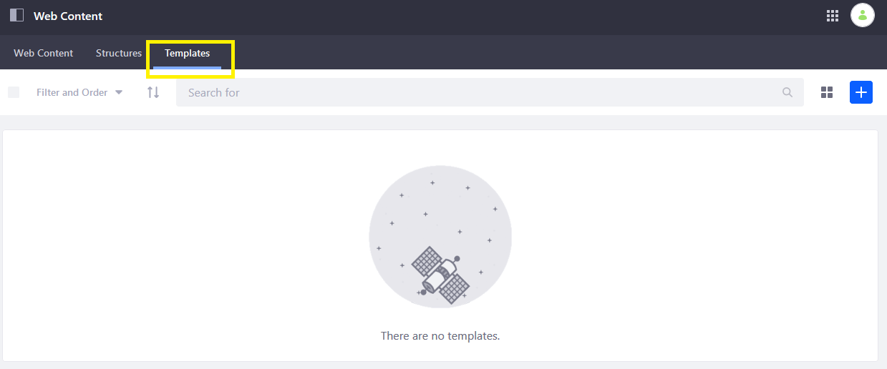
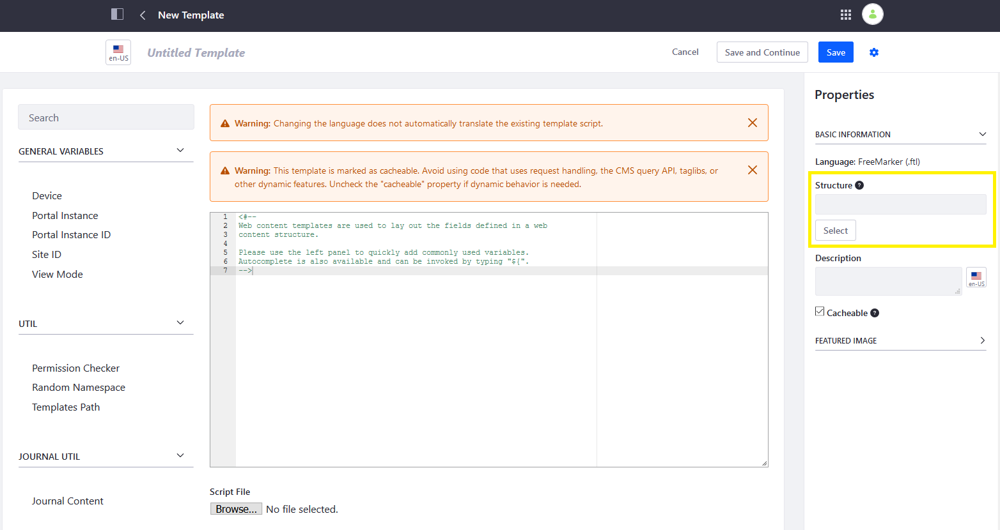
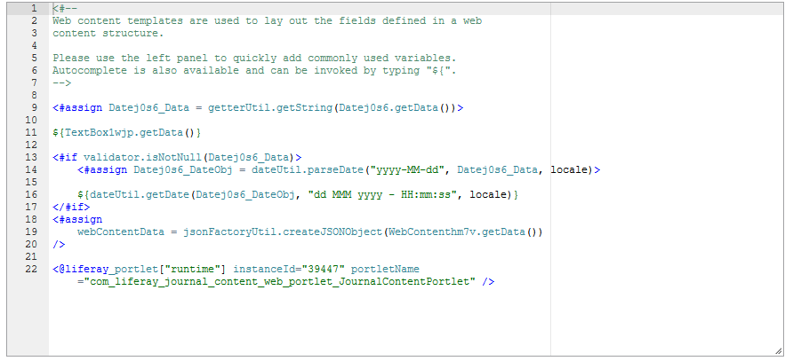
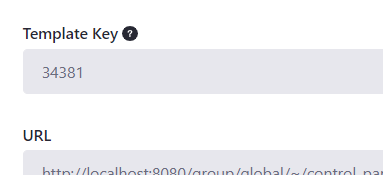

# Embedding Widgets in Templates

You can embed widgets in web content templates: it doesn't matter whether they're core apps, custom apps, instanceable, or non-instanceable. Below is an example of embedding a Web Content widget in FreeMarker:

```markup
<@liferay_portlet["runtime"] portletName="com_liferay_journal_content_web_portlet_JournalContentPortlet" />
```

1. Navigate to your Site's (the default DXP site in this example) _Site Administration_.
1. Click _Content & Data_ &rarr; _Web Content_.
1. Click on the _Templates_ tab.

    

1. Click the Add () icon.
1. Enter a name for the template (for example, _Template 1_)
1. Click _Select_ from the _Properties_ section to choose the structure (for example, _Structure 1_).

    

1. Paste your macro (for example, `<@liferay_portlet["runtime"] portletName="com_liferay_journal_content_web_portlet_JournalContentPortlet" />`) in the Template Editor. Depending on whether your portlet is instanceable, you may need to enter the portlet ID.

    

1. Click _Save_ when finished.

```important::
   The `theme` variable is no longer injected into the FreeMarker context. For more information about why the theme variable was removed for DXP 7.0 and suggestions for updating your code, visit the `Taglibs Are No Longer Accessible via the theme Variable in FreeMarker <https://help.liferay.com/hc/articles/360017892092-Introduction-to-Breaking-Changes-#taglibs-are-no-longer-accessible-via-the-theme-variable-in-freemarker>`_ breaking change entry.
```

## Embedding Other Templates

In addition to embedding widgets in templates, you can embed a template within another template. This allows for reusable code, JavaScript library imports, scripts, or macros.

Below is an example of embedding a template in FreeMarker:

```markup
<#include "${templatesPath}/[template-key]" />
```

You can find the *Template Key* when editing a previously published template.



## Additional Information

* [Embedding a Portlet by Portlet Name](https://help.liferay.com/hc/articles/360028746512-Embedding-a-Portlet-by-Portlet-Name)
