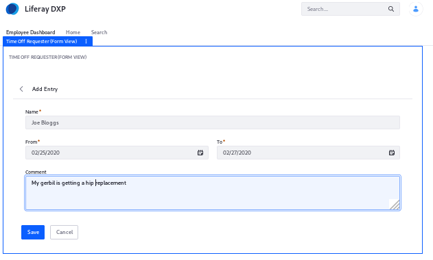
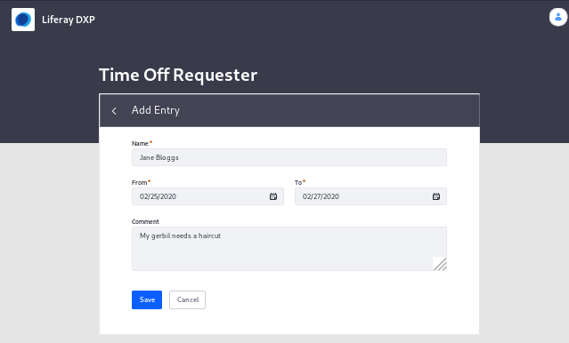

# App Builder Overview

> Available: Liferay DXP 7.3+

App Builder is a low-code application development solution for Liferay DXP. Build a data model, define the application's forms (for entering data) and tables (for viewing and managing data records), then deploy your application to your Liferay DXP site, or as a completely standalone application. With App Builder, creating functional business applications with dedicated user interfaces and data separation, can be done without a single line of code.

<!-- Wiz-bang screenshot of App Builder -->

## Creating an App

Apps made with App builder are made up of 3 components that are defined in the app builder UI: objects, form views, and table views. To skip straight to building an application, see the next article on [Creating Applications with App Builder](./creating-applications-with-app-builder.md).

### App Builder Objects

An _Object_ is at the foundation of every App Builder application. It defines the information and types of information that you want to the application to collect and interact with. For example, a Guestbook object would contain a _Name_ field and a _Message_ field, at least. There are two kinds of objects in App Builder:

* _Custom Objects_ are created using a drag-and-drop Form Builder interface.
* _Native Objects_ are pre-defined sets of data fields that can be used out of the box or extended to suit your needs.

```note::
   Native Objects are not present in the App Builder at the time of this writing. In future versions of the App Builder, Native Objects with default fieldsets will be bundled with Liferay DXP to jump-start your app development.
```

To create applications based on an object, create at least one form view, create at least one table view, and deploy the application.

Native objects contain data fields out of the box. Define the data fields of a custom object at the same time as creating its form views.

### Form Views

A form view defines what data fields of the object are to be filled out by the application's users. The Liferay Forms application's form builder tool is leveraged in this pursuit. An App Builder object can have multiple form views.

Adding fields to a form view automatically adds them to the object. Fields that were added to the object via a previously created form view can be re-used by dragging the field from a dedicated section of the form builder that shows all the object's existing fields.

### Table Views

Table views display the data records collected for an object. In addition, users with permission can access the _Add new entry_ functionality, see the details of an entry, and manage the application's entries. Table views can display all of the object's fields, or a subset. Every app has one table view, though the object can have as many as needed. A drag-and-drop interface lets you create table views from the existing fields of the object.

## Deployment

Once an object is defined and at least one form and table view are created, you can deploy an application. You have several deployment options:

**Widget:** Deploy the application to the widget menu, and add it to a page using the Add Widgets menu (from Add &rarr; Widgets, search for your application by name). Deploying as a widget really deploys three variations of the application to the Add Widgets menu, each with a different label. Each option exposes different features for your application's users:

| Widget Menu Label     | Submit Form Entries | View Entries | Update and Delete Entries |
|-----------------------|-----------|------------|----------------|
| App Name              |     &#10004;   |      &#10004;   |      &#10004;       |
| App Name [Form View]  |     &#10004;   |         |          |
| App Name [Table View] |        |      &#10004;   |      &#10004;       |



**Standalone:** Deploy the application to a dedicated page that's not part of a site and not visible to any navigation menu. This limits access to only people with the link.



**Product Menu:** Deploy the application to the Control Panel, the Site Menu, or both. This gives you flexibility in deciding where administrative Users will access the application.


A Standalone or Product Menu application always includes both the form and table view. The table view is the default view, while an add button provides access to the form view.

## Next Steps

* [Creating an Application with App Builder](./creating-an-application-with-app-builder.md)
