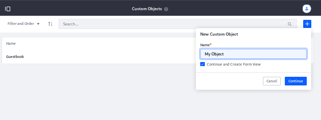
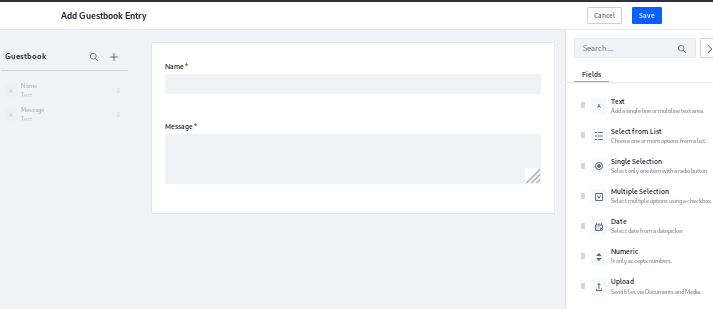
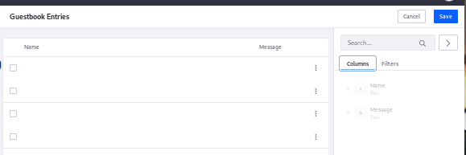

# Creating a Time Off Management Application with App Builder

Objects are the foundation of every App Builder application. They define all of the data fields that can be contained in the application. To create applications based on an object, you have four tasks: create a custom object, create at least one form view, create at least one table view, and deploy the application.

* [Creating a custom object](#creating-a-custom-object)
* [Creating form views](#creating-form-views)
* [Creating table views](#creating-table-views)
* [Deploying the application](#deploying-the-application)

Here we'll create a pair of simplistic time off management applications with App Builder, backed by an object called Time Off Request. The first application will be a Time Off Requester widget that just shows an Add Request form. The application's Users will fill out this form when they want to request time off. The second application is a Time Off Management application deployed to the Product Menu, where administrative Users can see and manage the Time Off Requests.

## Creating the Custom Object

Create the Time Off Request custom object:

1. Navigate to Control Panel &rarr; App Builder &rarr; Custom Objects, and click the add button.

1. Enter the name: _Time Off Request_.

1. To create a form view for the object and define the data fields present in the object, leave the _Continue and Create Form View_ setting checked and click _Continue_.



Define the data fields to include in the Time Off Request object by creating a form view.

## Creating Form Views

Once you're ready to define the data fields handled by your custom object, write as many form views as is needed for the application. The form views collect the fields of the custom object. They're populated by the application's Users filling out the forms they encounter. The Time Off Requester and Manager applications only need one form view between them.

1. Open the custom object (Control Panel &rarr; App Builder &rarr; Custom Objects).

1. From the _Form Views_ tab, click the Add button. The Form Builder is displayed.

1. Name the form view _Add Request_.

1. Using the layout in the screenshot, add 

    - a required text field labeled _Name_
    - a required date field labeled _From_
    - a required date field labeled _To_
    - an optional text field labeled _Comment_, which allows multiple lines

1. Save the form view.



In addition to the embedded form builder, any fields included in the custom object (via the existence of other form views) are available to add to the form view in the left sidebar.

The form defines the data fields of your custom object and provides the data collection interface for the application's users. To display and mange the collected data, create a table view.

## Creating Table Views

Table views are for displaying and managing (deleting, editing) the collected data. Like form views, a custom object can have one or multiple table views. The Time Off Requester and Manager applications only need one table view between them.

1. Open the Time Off Request object (Control Panel &rarr; App Builder &rarr; Custom Objects).

1. From the Table Views tab, click the Add button. The Table Builder is displayed.

1. Name the table view _Time Off Requests_.

1. Drag all the available fields except for the Comment field onto the table canvas.

1. Save the table view.




```note::
    Even though it's not in the table view, the Comment field is still visible in the Details View of an individual record. In a deployed application, click on a specific record from the table view to display the Details View of the record.
```

## Deploying the Application

A custom object can have multiple applications. The Time Off Request object will have two: one is a widget application for displaying the form view to our site's users, and the other is an administrative application in the Product Menu, where the request can be managed by users with additional permissions.

1. Open the Time Off Request (Control Panel &rarr; App Builder &rarr; Custom Objects).

1. From the _Apps_ tab, click the Add button.

1. Name the app _Time Off Requester_.

1. Select the form view, the table view, and configure the deployment options for the app. The deployment can be of three main types (described more fully in the introductory article):

    * **Widget**
    * **Standalone**
    * **Product Menu**

    For the Time Off Requester, select _Widget_ and click Deploy. The app is live!

1. Following the same procedure, create a second app called _Time Off Request Manager_, this time choosing to deploy the app in the Product Menu.


Add the widget (the version that only displays the form view) to a page (perhaps a private page where only logged in Users can access it), and let your administrators know that the Time Off Manager application in the Product Menu is where they should monitor time off requests from employees.

In addition to deploying, you can undeploy and redeploy App Builder applications at any time (e.g., if a new set of time off management applications are created). To undeploy,

1. Open the custom object (Control Panel &rarr; App Builder &rarr; Custom Objects).

1. From the _Apps_ tab, click the kebab menu for the app you want to undeploy.

1. Select _Undeploy_.
