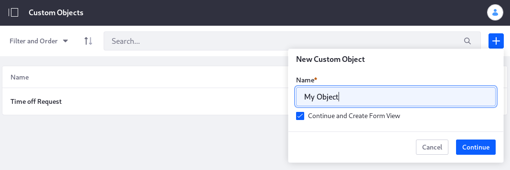
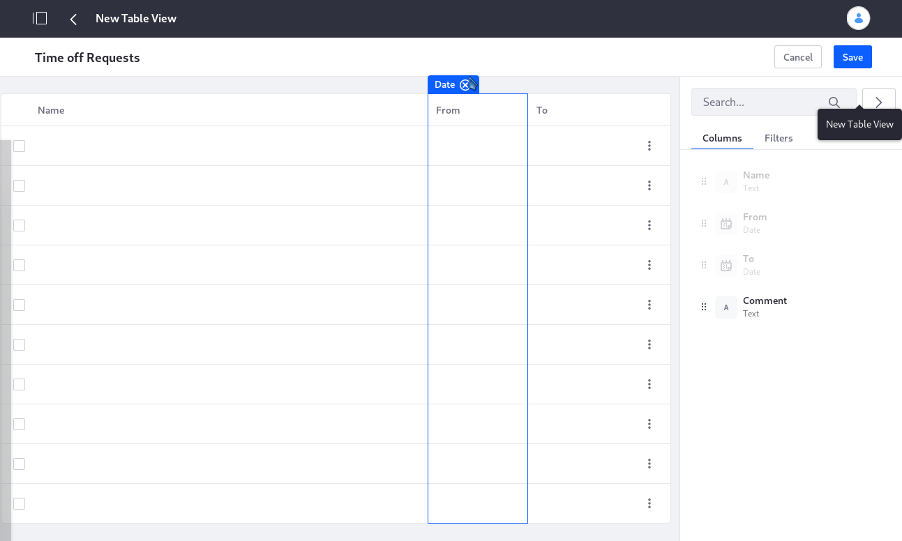

# Creating a Standard Application

To create applications based on a custom object takes four steps: create the object, create at least one form view, create at least one table view, and deploy the application.

* [Creating a Custom Object](#creating-a-custom-object)
* [Creating Form Views](#creating-form-views)
* [Creating Table Views](#creating-table-views)
* [Deploying the Application](#deploying-the-application)

Here you'll create two simple time off management applications with App Builder, backed by a custom object called Time Off Request. The first application is a Time Off Requester widget that just shows an Add Request form. Users fill out this form when they want to request time off. The second application is a Time Off Management application deployed to the Product Menu, where administrative Users can see and manage the Time Off Requests.

## Creating a Custom Object

1. Open the Applications Menu () and navigate to Control Panel &rarr; App Builder &rarr; Custom Objects.

1. Click the add button ().

1. Enter the name: _Time Off Request_.

1. To create a form view for the object and define the data fields present in the object, leave the _Continue and Create Form View_ setting checked and click _Continue_.

   

Define the data fields to include in the Time Off Request object by creating a form view.

## Creating Form Views

A form view defines the visual interface used to enter the data defined in your Custom Object. You can create as many form views as needed for your application. The Time Off Requester and Manager applications only need one form view between them:

1. Open the custom object (Control Panel &rarr; App Builder &rarr; Custom Objects).

1. From the _Form Views_ tab, click the Add button. The Form Builder appears.

1. Name the form view _Add Request_.

1. Using the layout in the screenshot, add

    * a required text field labeled _Name_
    * a required date field labeled _From_
    * a required date field labeled _To_
    * an optional text field labeled _Comment_, which allows multiple lines

1. Save the form view.

    

In addition to the embedded form builder, any fields included in the custom object (via the existence of other form views) can be added to the form view in the left sidebar.

To define how users view and interact with your application's data, create a table view.

## Creating Table Views

Table views display and manage (deleting, editing) entries submitted to your application. Like form views, an object can have one or multiple table views. The Time Off Requester and Manager applications only need one table view between them.

1. Open the Time Off Request object (Control Panel &rarr; App Builder &rarr; Custom Objects).

1. From the Table Views tab, click the _Add_ button. The Table Builder appears.

    

1. Name the table view _Time Off Requests_.

1. Drag all the available fields except the Comment field onto the table canvas.

1. Save the table view.

```note::
    Even though it's not in the table view, the Comment field still appears in the Details View of an individual record. In a deployed application, click a specific record from the table view to display its Details View. 
```

## Deploying the Application

Deploying an application makes it accessible to users. There are several deployment options. See the [App Builder Overview](./app-builder-overview.md#deployment) to learn about them. 

The Time Off Request has two apps to deploy: a widget application for adding to a page, and an administrative application in the [Product Menu](../../getting-started/navigating-dxp.md#product-menu), where requests can be managed by those with additional permissions.

1. Open the Time Off Request (Control Panel &rarr; App Builder &rarr; Custom Objects).

1. From the _Apps_ tab, click the Add button ().

   ```note::
      If you want to create a `Workflow Powered` app for the object (available to DXP subscribers), you must create and deploy the app from the Apps entry in the Application Menu. See `Creating a Workflow Powered Application <./creating-a-workflow-powered-application.md>`__ for details.
   ```

1. Name the app _Time Off Requester_.

1. Select the form view, the table view, and configure the [deployment options](./app-builder-overview.md#deployment) for the app.

   For the Time Off Requester application, select _Widget_ and click _Deploy_. The Time Off Requester widget application can now be deployed to a page and utilized immediately by site users.

1. Following the same procedure, create a second app called _Time Off Request Manager_, this time choosing to deploy the app in the Product Menu (leave the default selection to add it to the Applications Menu).

    

Administrators can now access the Time Off Manager application in the Product Menu to begin monitoring time off requests from site users.

## Undeploying an Application

You can undeploy and redeploy App Builder applications at any time (e.g., if a new set of time off management applications are created). If you undeploy an application, entries already submitted are preserved, but no new entries can be added: 

1. Open the custom object (Control Panel &rarr; App Builder &rarr; Custom Objects).

1. From the _Apps_ tab, click the kebab menu for the app you want to undeploy.

1. Select _Undeploy_.

## Editing an Object with Data Records

You can delete, add, or edit a field, even after data records have been added for it, and the App Builder prevents data corruption or loss. 

### Deleting Fields

Deleting a field from an object with existing data records prevents the field from display in the UI, but doesn't delete the data. If you create a field with same name and type as a deleted field, the field's data is restored for records that already hold its data.

To remove a field from an existing object, hover over it in the object view and click the *x*. You're asked for confirmation and warned about data loss.


### Adding and Editing Fields

When you add or edit an existing field, the changes only affect records added after the add or edit. Existing records remain unaffected by the change. 

To add a field to an existing object, open the any of its form views and click the _Add_ button in the left pane of the form builder.


To edit a field, navigate to its form view and click the field in the form builder to reveal its properties.


## Related Information

* [App Builder Overview](./app-builder-overview.md)
* [Creating a Workflow Powered App](./creating-a-workflow-powered-application.md)
