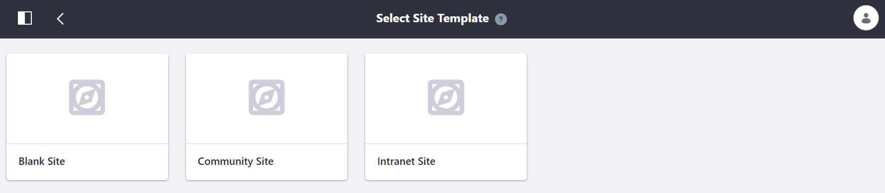
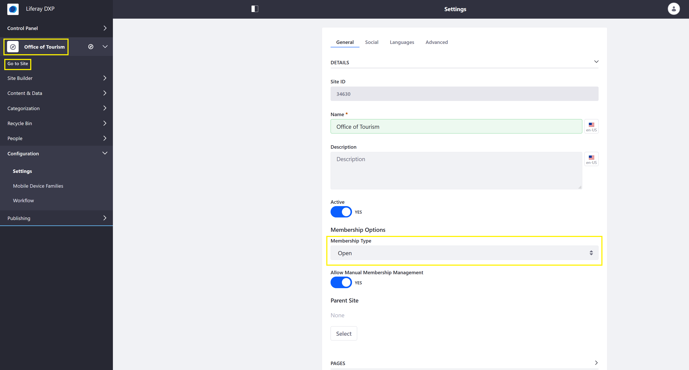
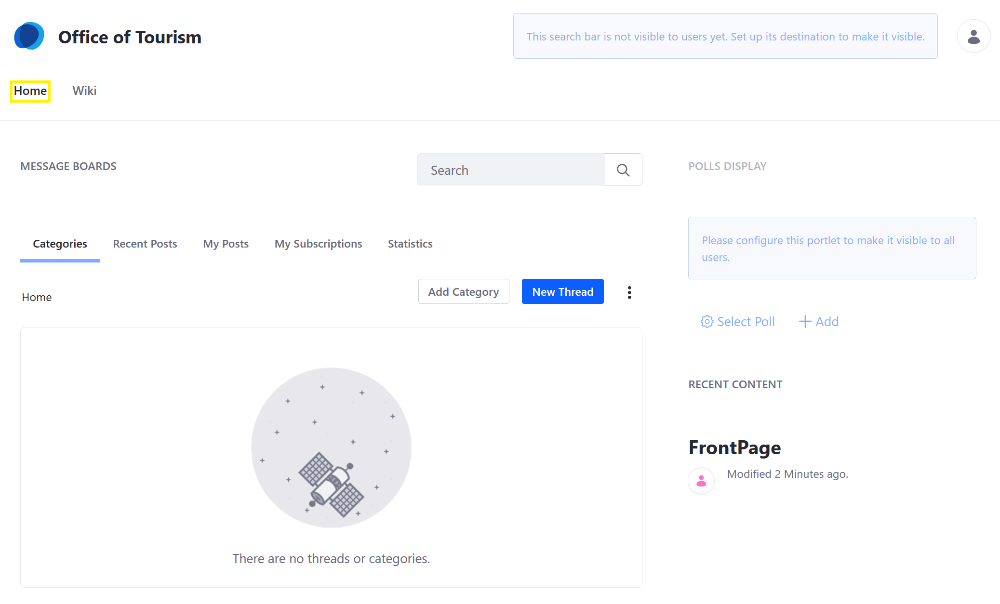

# Creating Your First Site

Sites are collections of pages that contain and display content for your site. This article walks through creating a new site based on an existing out-of-the-box template.

## Creating a Site

To create a new site, follow these steps:

1. Open the _Product Menu_ and navigate to the _Control Panel_ and select _Sites_ → _Sites_.
1. Click the Add icon () at the top right of the page.
1. Select a _Site Template_.

   

1. Click _Community Site_.
1. Enter a name for the site.
1. Click _Save_.

A new site with two pre-existing pages is created and ready for use. Click to learn more about [Site Settings](../site-building/01-introduction-to-site-building.md).

## Viewing the Site

To view the new site, click _Go to Site_.

There are two pages: _Home_ and _Wiki_

## What's Next

<!-- Direct reader who is following "Getting Started" flow to the "Changing a theme" article placeholder. -->

See [Building Sites from Templates](https://help.liferay.com/hc/articles/360028819712-Building-Sites-from-Templates) to learn more about the other site templates.
