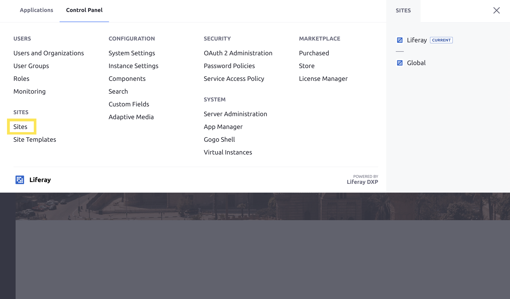
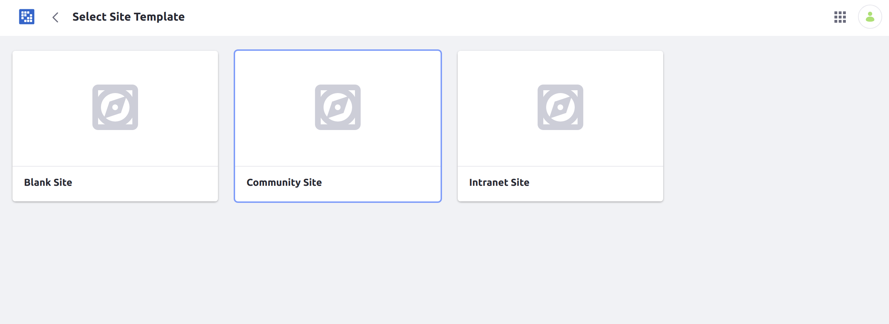
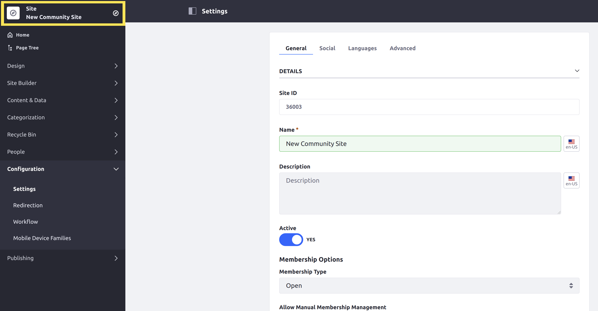
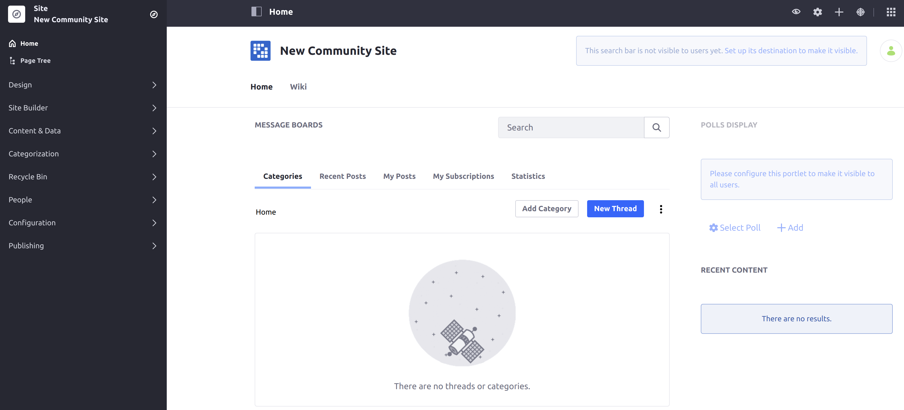

# Creating Your First Site

When you first start Liferay DXP, a fully functional site called _Liferay DXP_ is included by default. (This site is sometimes called the _Guest_ site because it is available to everyone.) To create a new site with separate content and themes, follow these steps:

1. Open the _Product Menu_ and navigate to the _Control Panel_ and select _Sites_ → _Sites_.
1. Click the Add icon () at the top right of the page.
1. Select a _Site Template_.

   

1. Click _Community Site_.
1. Enter a name for the site.
1. Click _Save_.

A new site with two pre-existing pages is created and ready for use. In the image below, when a new site is created, the new site scope is always selected. Furthermore, administrators can configure the _Membership Options_ which controls whether a site is open to for all members, require approval to join, or restricted. Lastly, when creating a site with the _Blank Site Template_, users are not yet able to navigate to the site; add a site page first.

To view the new site, click _Go to Site_.

There are two pages: _Home_ and _Wiki_

## What's Next

See [Building Sites from Templates](https://help.liferay.com/hc/articles/360028819712-Building-Sites-from-Templates) to learn more about the other site templates.

Learn how to customize a site by changing its theme.
