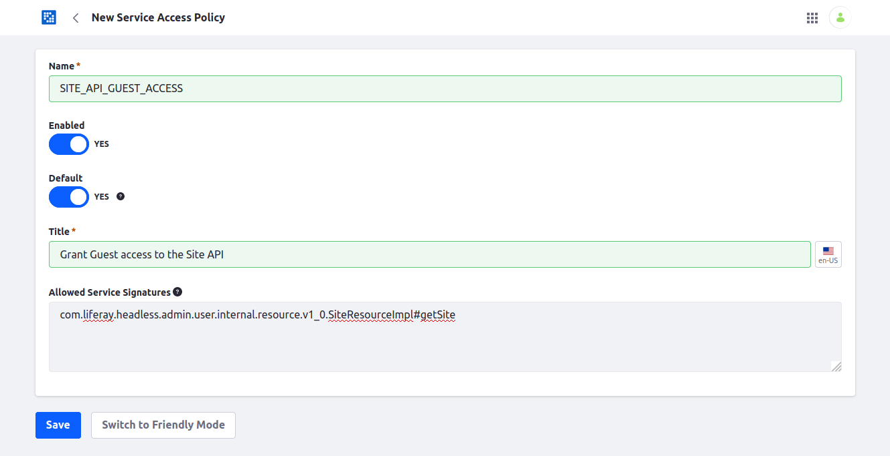

# Making Unauthenticated Requests

By default, Liferay DXP restricts API access for the sake of security, requiring authentication in order to get a valid response. However, in certain cases it may make sense to open up an API for guest access.

Making an API request without passing credentials generally leads to an error response:

```
curl localhost:8080/o/headless-admin-user/v1.0/sites/20122
```

```
{
  "message" : "Access denied to com.liferay.headless.admin.user.internal.resource.v1_0.SiteResourceImpl#getSite"
}
```

If you need access to an API without credentials, then grant unrestricted access via a Service Access Policy.

## Relaxing API Restrictions via Service Access Policy

You can use [Service Access Policies](../../installation-and-upgrades/securing-liferay/securing-web-services/setting-service-access-policies.md) to define API access at a granular level.

1. Visit your site with your browser at `http://localhost:8080`.

1. Sign in using the default credentials:

    **User Name:** `test@liferay.com`  
    **Password:** `test`

1. Go to Global Menu &rarr; Control Panel &rarr; Security &rarr; Service Access Policy.

1. Click _Add_ ().

1. Give the policy a descriptive name. It makes sense to call it something like "SITE_API_GUEST_ACCESS".

1. Switch the _Enabled_ toggle to enable the policy.

1. Switch the toggle labeled _Default_ to apply the policy to unauthenticated requests as well as authenticated requests.

1. Give the policy a localized title, like _Grant Guest access to the Site API_.

1. Click _Switch to Advanced Mode_ at the bottom.

1. Copy and paste the method signature from the error message above: `com.liferay.headless.admin.user.internal.resource.v1_0.SiteResourceImpl#getSite`.

1. Click _Save_.



Your Service Access Policy is now active, granting Guests access to the Sites API.

## Confirming Access

Now that the Service Access Policy change is applied, the API call that previously failed now succeeds:

```
curl localhost:8080/o/headless-admin-user/v1.0/sites/20122
```

```
{
  "availableLanguages" : [ "en-US" ],
  "description" : "",
  "friendlyUrlPath" : "/guest",
  "id" : 20122,
  "key" : "Guest",
  "membershipType" : "open",
  "name" : "Guest",
  "parentSiteId" : 0,
  "sites" : [ ]
}
```

You can apply this pattern to open access to any headless REST API. Leverage the flexibility of Service Access Policies to make this as granular as you need.

```important::
   Service Access Policies can't discriminate between GraphQL APIs as easily as Headless REST APIs, since all the APIs are consolidated under a single endpoint. So while opening up GraphQL access like this may work in some cases, it isn't generally recommended, because you might accidently grant access to too much data.
```
