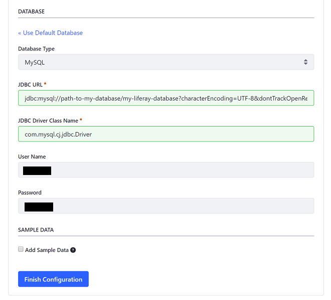

# Database Configuration

By default for demonstration purposes, Liferay DXP is configured to use an embedded HSQL database. Beyond demonstration purposes, we recommend using a full-featured, supported RDBMS, such as:

* MySQL
* MariaDB
* Oracle
* PostgreSQL

```note::
   The `Liferay DXP Compatibility Matrix <https://web.liferay.com/documents/14/21598941/Liferay+DXP+7.2+Compatibility+Matrix/b6e0f064-db31-49b4-8317-a29d1d76abf7>`_ lists the supported databases and versions.
```

<!-- TODO Update the matrix link to the 7.3 matrix, when it's published - jhinkey -->

Connecting Liferay DXP to a database requires:

* [Database Configuration](#database-configuration)
* [Installing a JDBC Connector](#installing-a-jdbc-connector)
* [Configuring a Data Source](#configure-a-data-source)

## Database Configuration

Once you've selected a database, follow these steps to configure it:

* [Create a Blank Database With UTF-8 Support](#creatre-a-blank-database-with-utf-8-support)
* [Configure Database User Access](#configure-database-user-access)
* [Configure the Query Result Sort Order (Optional)](#configure-the-query-result-sort-order-optional)

```important::
   Always consult the database vendor's documentation before modifying the database.
```

### Create a Blank Database With UTF-8 Support

Multilingual character sets require using UTF-8. Create a database that uses UTF-8. Here is a MySQL command example:

```sql
create database lportal character set utf8;
```

### Configure Database User Access

Liferay DXP requires database user credentials to persist data. The simplest, easiest way is through a database user that has full database permissions up to and including permissions to create and drop tables. With such a user DXP plugins interact with the database seamlessly and upgrade operations are done automatically. Restricting the database user permissions more than this is not recommended.

However, if your organization requires limiting Liferay DXP database user permissions once the database is initialized, see the high security database user practices next.

#### High Security Database User Practices

Your organization may have more stringent security policies that require limiting database Liferay DXP database user permissions once the database is initialized. If permissions for Select, Insert, Update and Delete operations are the only ones allowed for the user, you must initialize and maintain the database manually. Here's what's recommended to accomplish this:

1. Grant full rights for the Liferay DXP database user to do anything to the database.
1. Install Liferay DXP and start it so that it automatically populates the database.
1. Once the database has been populated with the Liferay DXP tables, remove all permissions from the Liferay DXP database user except permissions to perform Select, Insert, Update and Delete operations.

```warning::
   There are some caveats to running Liferay DXP with these constraints. Many plugins create new tables when they’re deployed. Additionally, you must manually run the database upgrade function to upgrade Liferay DXP. If the Liferay DXP database user does not have adequate rights to create/modify/drop tables in the database, you must grant those rights to that user before deploying one of these plugins or starting the Liferay DXP upgrade. Once the tables are created or the upgrade completes, you can remove those rights until the next deploy or upgrade. If your team creates plugins that create their own tables, you must similarly grant temporary rights to the Liferay DXP database user before deploying the plugin.
```

### Configure the Query Result Sort Order (Optional)

Every database has a default order for sorting results (see [this article](https://help.liferay.com/hc/en-us/articles/360029315971-Sort-Order-Changed-with-a-Different-Database)). If you're concerned about this order, consult the database vendor documentation to learn its sort order and if necessary, configure the database to use a default query result order you prefer for Liferay DXP entities.

You've configured your database server, database, and database user. You're ready to install a JDBC connecter that Liferay DXP uses to communicate with the database.

## Install a JDBC Connector

Liferay DXP requires a JDBC connector for communicating with your database. 

### Open Source Databases

The Liferay DXP bundle includes several open source JDBC connectors. Connector files are normally provided and installed to a global folder on the application server, such as `/lib/ext` on Tomcat or `/module` on JBoss EAP and WildFly.

If you're connecting to a proprietary database, like Oracle or DB2, download the connector from the vendor and install it to a global folder on the applications server. 

**Proprietary Databases:**

| Database | Connector | Vendor Site | Notes |
| :------- | :-------- | :---------- | :---- |
| DB2 | `db2jcc4.jar` | [IBM](https://www.ibm.com/) |  The `dbc2jcc` connector has been deprecated after 3.72. |
| Oracle | `ojdbc8.jar` | [Oracle](https://www.oracle.com/index.html) | The `ojdbc8.jar` library with at least Oracle 12.2.0.1.0 JDBC 4.2 versioning is required because of [data truncation issues](https://issues.liferay.com/browse/LPS-79229) that have been detected reading data from CLOB columns. |

## Configuring a Data Source

The best option for most people is to set up a built-in data source connection during [DXP startup](../installing-liferay/running-liferay-dxp-for-the-first-time.md) using the Setup Wizard.



```note::
   If you're using a data source managed on your application server. See the instructions for your application server: `Tomcat <../installing-liferay/installing-liferay-on-an-application-server/installing-liferay-dxp-on-tomcat.md>`_, `WildFly <../installing-liferay/installing-liferay-on-an-application-server/02-installing-liferay-on-wildfly.md>`_, `JBoss EAP <../installing-liferay/installing-liferay-on-an-application-server/03-installing-liferay-on-jboss-eap.md>`_, `WebLogic <../installing-liferay/installing-liferay-on-an-application-server/04-installing-liferay-on-weblogic.md>`_, or `WebSphere <../installing-liferay/installing-liferay-on-an-application-server/installing-liferay-on-websphere.md>`_.
```