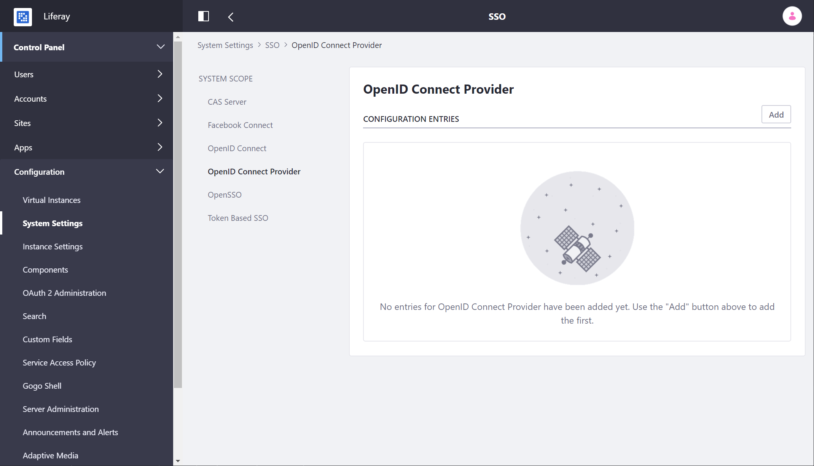

# Using OpenID Connect

OpenID Connect is a lightweight authentication layer that enables users to authenticate using accounts they have on other systems. It's built on top of the [OAuth 2.0](../using-oauth2/introduction-to-using-oauth2.md) authorization protocol. By using OpenID Connect, you _delegate_ user authentication to other providers, making it easy for users with existing accounts to authenticate to your Liferay installation.

```note::
   You can add multiple providers to your installation, but Liferay DXP can't be an OpenID Connect provider.
```

OpenID Connect's token flow is similar to OAuth 2.0, because it's built on top of its functionality. OAuth 2.0 is only an authorization protocol, so it sends an _access token_ that grants access to particular APIs. OpenID Connect adds to this an _identity token_ that passes user information like _name_ and _email_, provided the user has authenticated and granted permission.

## Creating a Client in OpenID Connect Provider

To use OpenID Connect, you must first register it as a client in your provider. This is an OAuth 2.0 client. The process varies by provider:

1. Navigate to the provider's website and create a client.

1. During the creation process, you must supply an _authorized redirect URL_ that can process the tokens sent from the provider. Liferay DXP's URL is

    ```
    https://[server.domain]/c/portal/login/openidconnect
    ```

1. The provider sends several pieces of information. Some of these, like the Discovery Endpoint, Authorization Endpoint, or Issuer URL are the same regardless of the client. The two pieces of information unique to your request are the `client_id` and the `client_secret`.

Collect the information from the provider. You'll need it create the provider connection.

## Configuring an OpenID Connect Provider Connection

Go to _Control Panel_ &rarr; _Configuration_ &rarr; _System Settings_ &rarr; _Security_ &rarr; _SSO_ and select **_OpenID Connect Provider_** under the _System Scope_.



Follow these steps:

1. Add the provider by clicking the _Add_ button.

1. Use the information you received from the provider to fill out the form.

<!-- NOTE: Please put all of the following options into a table

**Provider Name:** This name appears in the Sign-In Portlet when users use OpenID Connect to log in.

**OpenID Client ID:** Provide the OAuth 2.0 Client ID you received from your provider.

**OpenID Connect Client Secret:** Provide the OAuth 2.0 Client Secret you received from your provider.

**Scopes:** Leave the default, which requests the user name and the email. Your provider may offer other scopes of user information.

**Discovery Endpoint:** Other URLs may be obtained from this URL, and they vary by provider.

**Discovery Endpoint Cache in Milliseconds:** Cache the endpoints (URLs) discovered for this amount of time.

**Authorization Endpoint:** This URL points to the provider's URL for authorizing the user (i.e., signing the user in).

**Issuer URL:** The provider's URL that points to information about the provider who is issuing the user information.

**JWKS URI:** A URL that points to the provider's JSON Web Key Set that contains the public keys that can verify the provider's tokens.

**ID Token Signing Algorithms:** Set the supported ID token algorithms manually. Normally, this is "discovered" at the discovery endpoint. You can add as many of these as you need.

**Subject Types:** A Subject Identifier is a unique and never reassigned identifier the provider uses to establish who the user is, and is consumed by the client (i.e., @product@). There are two types: public (provides the same value to all clients) and private (provides a different value to each client).

**Token Endpoint:** The provider's URL where tokens can be requested.

**User Information Endpoint:** The OAuth 2.0 protected URL from which user information can be obtained.

-->

Once you've filled out the form, click _Save_, and you're ready to enable OpenID Connect authentication.

An exported configuration results in this System Settings configuration file:

```
com.liferay.portal.security.sso.openid.connect.internal.configuration.OpenIdConnectProviderConfiguration-[name].config
```

where `[name]` is a descriptive, but unique name for example `provider1`.

## Enabling OpenID Connect Authentication

1. Go to _Control Panel_ &rarr; _Configuration_ &rarr; _System Settings_ &rarr; _Security_ &rarr; _SSO_ and select **_OpenID Connect_** under _Virtual Instance Scope_.

    

1. Click the _Enabled_ check box, and then click _Save_.

An exported configuration results in this System Settings configuration file:

```
com.liferay.portal.security.sso.openid.connect.configuration.OpenIdConnectConfiguration.config
```

Now users can sign in with OpenID Connect.

## Signing In With OpenID Connect

A new link appears in the Sign-In Portlet for signing in with OpenID Connect:

1. From the Sign-In Portlet, click the OpenID Connect link at the bottom.

1. Choose a provider and click _Sign In_.

1. This takes you to your provider's sign in page. Enter your credentials and log in.

1. Upon successful authentication, you're redirected back to Liferay DXP in an authenticated state.
