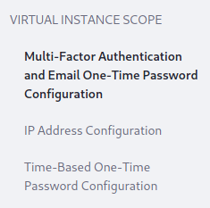
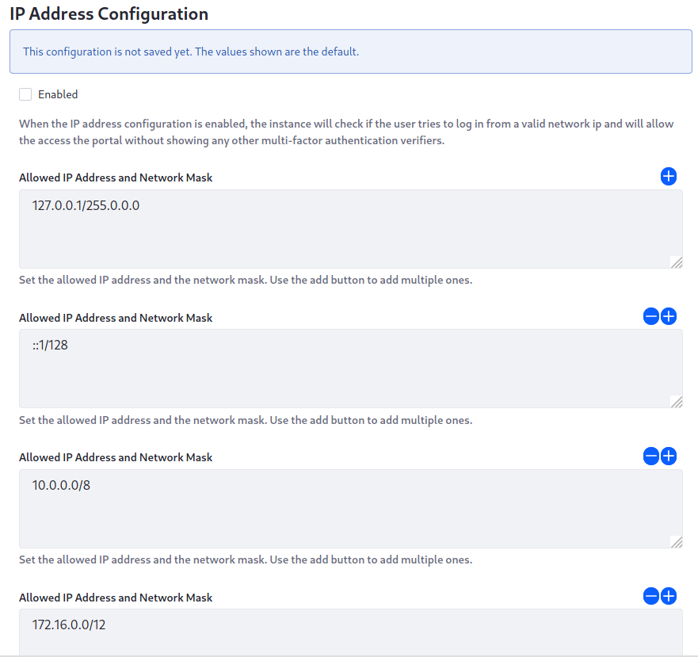
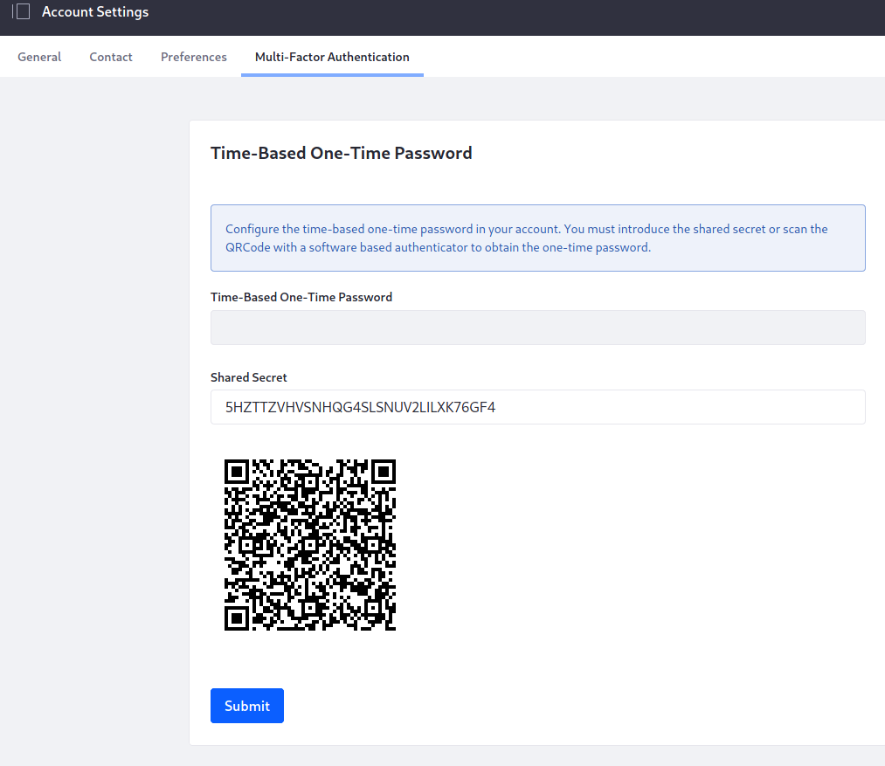

# Factor Checkers

Liferay DXP ships with two additional factor checkers for Multi-Factor Authentication. Both of them are disabled by default, because they're only useful in particular circumstances. Once Multi-Factor Authentication is enabled, however, you can configure them. 

## IP Address Factor Checker

The IP Address checker is useful when Liferay DXP serves a group of users from an internal network or connecting through a VPN. When you enable this checker, users' IP addresses are compared with allowed IP address masks. If they match, users can bypass the other checkers and log in. This essentially defines trusted networks as the extra factor in authenticating. 

You can add any number of IP address masks to your configuration. 

## Time-Based One-Time Password Factor Checker

The Time-Based One-Time Password checker provides an additional checker based on the [Google App Authenticator](https://play.google.com/store/apps/details?id=com.google.android.apps.authenticator2). 

Users gain a profile option for choosing this verifier. When enabled, users can generate a code that provides an additional factor that lasts for a period of time as a matter of convenience. Users can define a factor for a particular device or web browser and then have that additional factor automatically supplied. You can configure these options: 

**Order:** Factor checkers run in a particular order, with higher numbers going first. Set the order for this checker. 

**Clock Skew:** Because this checker communicates with a third-party server, their system clocks can be out of sync. Set the time in milliseconds the clocks can differ by before rejecting a code. 

**Algorithm Key Size:** Set the size in characters for the generated key. 
