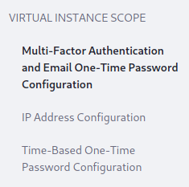
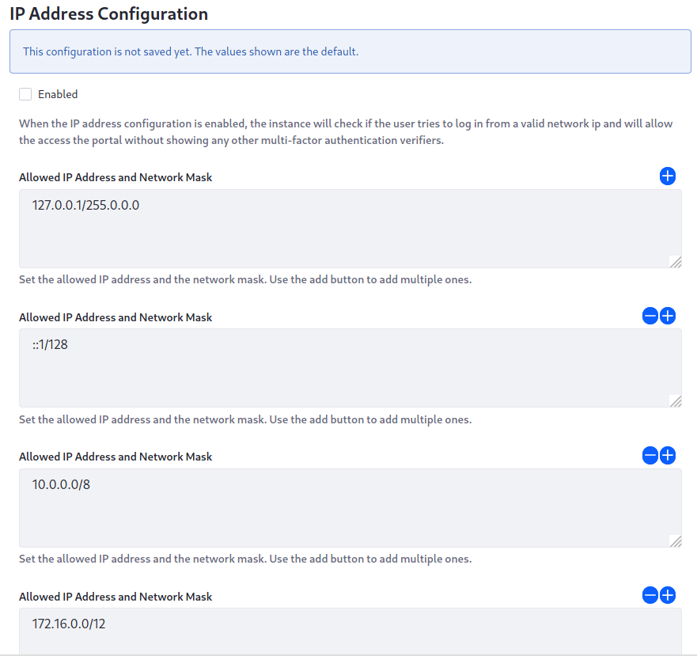
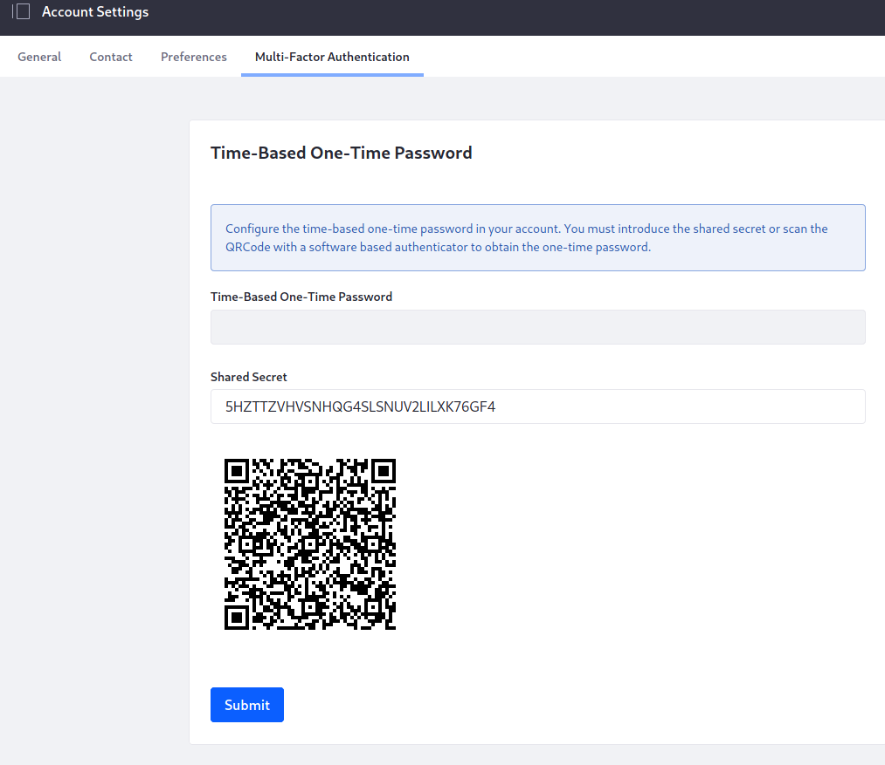

# Multi-Factor Authentication Checkers

Liferay DXP 7.3 ships with two additional factor checkers for Multi-Factor Authentication. Both of them are disabled by default, because they're only useful in particular circumstances. Once Multi-Factor Authentication is enabled, however, you can configure them.

## IP Address MFA Checker

The IP Address checker is useful when Liferay DXP serves a group of users from an internal network or connecting through a VPN. When you enable this checker, users' IP addresses are compared with allowed IP address masks. If they match, users can bypass the other checkers and log in. This essentially defines trusted networks as the extra factor in authenticating.

You can add any number of IP address masks to your configuration: _Control Panel_ &rarr; _Instance Settings_ &rarr; _Security_ &rarr; _Multi-Factor Authentication_ &rarr; _IP Address Configuration_.

**Enabled**: When the IP address configuration is enabled, the instance checks the user's IP address against a valid list. If on the list, it allows access without showing any other multi-factor authentication verifiers.

**Allowed IP Address and Network Mask**: Add allowed IP address ranges and network masks. Defaults to `127.0.0.1/255.0.0.0, ::1/128, 10.0.0.0/8, 172.16.0.0/12, 192.168.0.0/16, fc00::/7`.

## Time-Based One-Time Password MFA Checker

The Time-Based One-Time Password checker provides an additional checker based on the [Google App Authenticator](https://play.google.com/store/apps/details?id=com.google.android.apps.authenticator2).

Users gain a profile option for choosing this verifier. When enabled, users can generate a code that provides an additional factor that lasts for a period of time as a matter of convenience. Users can define a factor for a particular device or web browser and then have that additional factor automatically supplied. You can configure these options via _Control Panel_ &rarr; _Instance Settings_ &rarr; _Security_ &rarr; _Multi-Factor Authentication_ &rarr; _Time-Based One-Time Password Configuration_:

**Enabled**: Enable time-based one-time password. Take into account that time-based one-time password also needs to be configured by each user. They will find a new section to configure it at "Account Settings".

**Order:** Factor checkers run in a particular order, with higher numbers going first. Set the order for this checker.

**Clock Skew:** Because this checker communicates with a third-party server, their system clocks can be out of sync. Set the time in milliseconds the clocks can differ before a code is rejected. This means the checker could perform a validation against the current time and then two further validations (+ clock skew time / - clock skew time).

**Algorithm Key Size:** Set the size in characters for the generated key.

## Related Information

[Using Multi-Factor Authentication](./using-multi-factor-authentication.md)
