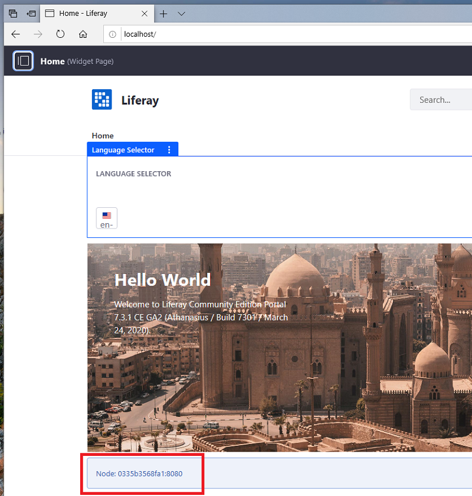

# Example: Creating a DXP Cluster

An easy way to learn DXP clustering is to set up a cluster environment on a single machine using [Docker containers](https://docs.docker.com/get-started/overview/). Here you'll prepare each required server and each DXP app server node in their own containers. The containers will refer to each other by container name over a Docker bridge network. This is a fast way to set up a DXP cluster development environment.

Here are the server's you'll create:

| Server Type | Implementation | Server Container |
| :---------- | :------- | :---------- |
| Database | MariaDB  | `some-mariadb` |
| Search Engine | Elasticsearch | `elasticsearch` |
| File Store | DBStore | `some-mariadb` |
| App Server | Tomcat | `dxp-1` |
| App Server | Tomcat | `dxp-2` |

Here are the steps:

1. [Configure a network for the containers](#configure-a-network-for-the-containers) (example-specific)
1. [Prepare a database server](#prepare-a-database-server)
1. [Prepare a search engine server](#prepare-a-search-engine-server)
1. [Prepare a File Store](#prepare-a-file-store)
1. [Configure the DXP server cluster](#configure-the-dxp-server-cluster)

```note::
   DXP cluster environments can also be set up using an `on-premises DXP Tomcat bundle<../../installing-liferay/installing-a-liferay-dxp-tomcat-bundle.md>`_, using `DXP installed to an app server <../../installing-liferay/installing-liferay.html>`_ on-premises, or using any combination of Docker containers and DXP installations.
```

## Configure a Network for the Containers

Since the server containers in this example run on the same machine, the server IP addresses can be complicated. By launching all of the containers on a [Docker bridge network](https://docs.docker.com/network/bridge/), the containers can refer to each other by container name, rather than IP address. Outside of this kind of environment, IP addresses would be used.

Create an arbitrarily named Docker bridge network for the containers to use on your host machine:

```bash
docker network create --driver=bridge my-bridge
```

A bridged network called `my-bridge` is available.

## Prepare a Database Server

A DXP cluster requires a data source that's accessible to all of the app server nodes. The data source can be a JNDI data source, a database server, or a database server cluster. See the [compatibility matrix](https://www.liferay.com/compatibility-matrix) for the database servers your DXP version supports.

Create a database server container based on a [MariaDB Docker image](https://hub.docker.com/_/mariadb/):

1. Create a MariaDB database server container.

    ```bash
    docker pull mariadb:10.2
    docker run --name some-mariadb --network=my-bridge -e MYSQL_ROOT_PASSWORD=my-secret-pw -d mariadb:10.2
    ```

    The `docker pull` command downloads the MariaDB version 10.2 Docker image.

    The `docker run` command creates a MariaDB Docker container called `some-mariadb` on the `my-bridge` Docker network. The database server's `root` user password is `my-secret-pw`. See the [MariaDB Docker Hub page](https://hub.docker.com/_/mariadb/) for more information.

1. In a shell on the container, [create a database](../../reference/database-configurations.md) for DXP.

    ```bash
    docker exec -it some-mariadb bash

    mysql -uroot -pmy-secret-pw

    MariaDB [(none)]> create database dxp_db character set utf8;
    MariaDB [(none)]> quit

    exit
    ```

See [Database Configuration for Cluster Nodes](./database-configuration-for-cluster-nodes.md) for more information.

Your database server is ready for DXP.

## Prepare a Search Engine Server

A DXP cluster requires a search engine server that's accessible to all of the app server nodes. See [Configuring a Search Engine in a Cluster](./clustering-search.md) for more information.

Create a search engine server container based on an [Elasticsearch Docker image](https://hub.docker.com/_/elasticsearch):

1. Download the Elasticsearch Docker image that's compatible with your DXP version.

    ```bash
    docker pull elasticsearch:6.8.7
    ```

1.  Start an Elasticsearch server container, mounting the container's data folder to a host machine folder.

    ```bash
    mkdir -p ~/elasticsearch/es_data_volume

    docker run -it -p 9200:9200 -p 9300:9300  -e cluster.name=LiferayElasticsearchCluster -e ES_JAVA_OPTS="-Xms512m -Xmx512m" --network my-bridge --name elasticsearch -v ~/elasticsearch/es_data_volume:/usr/share/elasticsearch/data elasticsearch:6.8.7
    ```

    The first command creates an arbitrary local folder to hold container's search indexes.

    The `docker run` command creates an Elasticsearch Docker container that publishes on ports `9200` and `9300`, and has an Elasticsearch cluster called `LiferayElasticsearchCluster`. `512m` of initial memory is allocated to the server. The `-v ...` option maps the container's data folder to the host machine folder you created.

1. In a shell on the container, install the required Elasticsearch plugins.

    ```bash
    docker exec -it elasticsearch bash 

    cd /usr/share/elasticsearch
    ./bin/elasticsearch-plugin install analysis-icu
    ./bin/elasticsearch-plugin install analysis-kuromoji
    ./bin/elasticsearch-plugin install analysis-smartcn
    ./bin/elasticsearch-plugin install analysis-stempel

    exit
    ```

Your search engine server is ready to store and retrieve search indexes for DXP.

## Prepare a File Store

A DXP cluster requires a File Store that's accessible to all of the app server nodes. For convenience, this example uses a [DBStore File Store](../../../system-administration/file-storage/other-file-store-types/dbstore.md) configured on the DXP database. It's configured by the app server nodes (described next). See [File Store](../../..//system-administration/file-storage/configuring-file-storage.md) for other file store types.

## Configure the DXP Server Cluster

Each DXP app server that you add as a cluster node must be configured for the cluster and configured to connect to the servers you created.

Here's a summary of the items to configure:

| Item | Configuration Method |
| :--- | :---------- |
| Search engine connection | Configuration file |
| Data source connection | `portal-ext.properties` file | See [Database Templates](../../reference/database-templates.md) |
| File Store connection | `portal-ext.properties` file. Some File Store types require a configuration file too. | See [Configuring a File Store](../../..//system-administration/file-storage/configuring-file-storage.md) |
| Cluster Link | `portal-ext.properties` file | See [Configuring Cluster Link](./configuring-cluster-link.md) |

The portal properties can be specified using Docker environment variables or a `portal-ext.properties` file. Since this example uses several properties, properties files are used.

One way to organize your node configurations is to create a folder for each node:

```bash
mkdir dxp-1 dxp-2
```

You're ready to configure the DXP server nodes.

### Configure the Search Engine Connection

1. Create a search engine configuration file:

    ```bash
    mkdir -p dxp-1/files/osgi/configs
    touch dxp-1/files/osgi/configs/com.liferay.portal.search.elasticsearch6.configuration.ElasticsearchConfiguration.config
    ```

1. Configure the Elasticsearch server connection in the `.config` file:

    ```properties
    operationMode="REMOTE"
    transportAddresses="elasticsearch:9300"
    clusterName="LiferayElasticsearchCluster"
    ```

1. Copy the configuration to your other node(s).

    ```bash
    mkdir -p dxp-2/files/osgi/configs
    cp dxp-1/files/osgi/configs/com.liferay.portal.search.elasticsearch6.configuration.ElasticsearchConfiguration.config dxp-2/files/osgi/configs/
    ```

See [Using Configuration Files](../../../system-administration/system-settings/using-configuration-files.md) for more information. 

### Configure Cluster Link and the Other Server Connections

On each DXP server, use portal properties to enable Cluster Link and to configure connections with the data source and file store.

1. Create a `portal-ext.properties` file for each node:

    ```bash
    touch dxp-1/files/portal-ext.properties
    touch dxp-2/files/portal-ext.properties
    ```

1. Add this to the `dxp-1/files/portal-ext.properties` file:

    ```properties
    jdbc.default.jndi.name=

    jdbc.default.driverClassName=org.mariadb.jdbc.Driver
    jdbc.default.url=jdbc:mariadb://some-mariadb:3306/dxp_db?useUnicode=true&characterEncoding=UTF-8&useFastDateParsing=false
    jdbc.default.username=root
    jdbc.default.password=my-secret-pw

    dl.store.impl=com.liferay.portal.store.db.DBStore

    virtual.hosts.default.site.name=

    cluster.link.enabled=true

    cluster.link.autodetect.address=some-mariadb:3306

    cluster.link.channel.logic.name.control=control-channel-logic-name-1
    cluster.link.channel.logic.name.transport.0=transport-channel-logic-name-1

    module.framework.properties.osgi.console=11312

    web.server.http.port=8080

    web.server.display.node=true
    ```

1. Add this to the `dxp-2/files/portal-ext.properties` file:

    ```properties
    jdbc.default.jndi.name=

    jdbc.default.driverClassName=org.mariadb.jdbc.Driver
    jdbc.default.url=jdbc:mariadb://some-mariadb:3306/dxp_db?useUnicode=true&characterEncoding=UTF-8&useFastDateParsing=false
    jdbc.default.username=root
    jdbc.default.password=my-secret-pw

    dl.store.impl=com.liferay.portal.store.db.DBStore

    virtual.hosts.default.site.name=

    cluster.link.enabled=true

    cluster.link.autodetect.address=some-mariadb:3306

    cluster.link.channel.logic.name.control=control-channel-logic-name-2
    cluster.link.channel.logic.name.transport.0=transport-channel-logic-name-2

    module.framework.properties.osgi.console=11313

    web.server.http.port=9080

    web.server.display.node=true
    ```

You've configured the properties required to configure the server connections, to enable and configure Cluster Link. Cluster Link enables communication between the nodes and replicates cache between them.

The tables below describe the common and unique property settings.

#### Common Properties 

These property settings are common to each node:

| Property Setting | Description |
| :--------------- | :---------- |
| `cluster.link.autodetect.address=some-mariadb:3306` | Known address to ping to get cluster node addresses |
| `cluster.link.enabled=true` | Enables Cluster Link |
| `dl.store.impl=com.liferay.portal.store.db.DBStore` | File Store (Document Library Store) class |
| `jdbc.default.jndi.name=` | Data source JNDI name |
| `jdbc.default.driverClassName=org.mariadb.jdbc.Driver` | Database driver class |
| `jdbc.default.url=jdbc:mariadb://some-mariadb:3306/dxp_db?useUnicode=true&characterEncoding=UTF-8&useFastDateParsing=false` | Data source URL |
| `jdbc.default.username=root` | Database admin user name |
| `jdbc.default.password=my-secret-pw` | Database admin user password |
| `virtual.hosts.default.site.name=` | Specifies the site name that will default to the company's virtual host. See the [Virtual Hosts](http://docs.liferay.com/portal/7.2-latest/propertiesdoc/portal.properties.html) properties and [Instance Configuration General Settings](https://help.liferay.com/hc/en-us/articles/360031899692-Instance-Configuration-Instance-Settings#general) for more information. |
| `web.server.display.node=true` | Displays the server address and web server port |

#### Distinguishing Properties

The following port properties and cluster logic name properties distinguish each node.

| Property | dxp-1 | dxp-2 |
| :------- | :---- | :---- |
| `cluster.link.channel.logic.name.control` | control-channel-logic-name-1 | control-channel-logic-name-2 |
| `cluster.link.channel.logic.name.transport.0` | transport-channel-logic-name-1 | transport-channel-logic-name-2 |
| `module.framework.properties.osgi.console` | 11312 | 11313 |
| `web.server.http.port` | 8080 | 9080 |

See [Cluster Link](./cluster-link.md) for more information on cluster configuration.

### Start Both Nodes

1. Start `dxp-1`:

    ```bash
    docker run -it --name dxp-1 --network my-bridge -p 8080:8080 -v ${PWD}/dxp-1/files:/mnt/liferay liferay/portal:7.3.1-ga2
    ```

    JGroups cluster messages like these print to the console:

    ```
    ...
    INFO  [SCR Component Actor][JGroupsClusterChannelFactory:173] Autodetecting JGroups outgoing IP address and interface for some-mariadb:3306
    INFO  [SCR Component Actor][JGroupsClusterChannelFactory:210] Setting JGroups outgoing IP address to 172.18.0.4 and interface to eth0

    -------------------------------------------------------------------
    GMS: address=control-channel-logic-name-1, cluster=liferay-channel-control, physical address=172.18.0.4:47533
    -------------------------------------------------------------------
    INFO  [SCR Component Actor][JGroupsReceiver:93] Accepted view [control-channel-logic-name-1|0] (1)[control-channel-logic-name-1]
    INFO  [SCR Component Actor][JGroupsClusterChannel:110] Create a new JGroups channel {channelName: liferay-channel-control, localAddress: control-channel-logic-name-1, ...
    ...
    -------------------------------------------------------------------
    GMS: address=transport-channel-logic-name-1, cluster=liferay-channel-transport-0, physical address=172.18.0.4:53231
    -------------------------------------------------------------------
    ...
    INFO  [SCR Component Actor][JGroupsReceiver:93] Accepted view [transport-channel-logic-name-1|0] (1) [transport-channel-logic-name-1]
    INFO  [SCR Component Actor][JGroupsClusterChannel:110] Create a new JGroups channel {channelName: liferay-channel-transport-0, localAddress: transport-channel-logic-name-1,...
    ... 
    ```

    The messages indicate these things:

    * JGroups auto-detects `dxp-1`'s IP address as `"172.18.0.4`.
    * JGroups creates `dxp-1`'s control channel and accepts it into the JGroups view.
    * JGroups creates `dxp-1`'s transport channel and accepts it into the JGroups view (the cluster)

1. Start `dxp-2`:

    ```
    docker run -it --name dxp-2 --network my-bridge -p 9080:8080 -v ${PWD}/dxp-2/files:/mnt/liferay liferay/portal:7.3.1-ga2
    ```

    As the `dxp-2` node starts, the `dxp-1` console cluster messages reflect `dxp-2`'s IP address (`172.18.0.5`), and that JGroups has created `dxp-2`'s control channel and transport channel and has accepted the channels into the JGroups view (the cluster).

    ```
    INFO  [jgroups-42,liferay-channel-control,control-channel-logic-name-1][JGroupsReceiver:93] Accepted view [control-channel-logic-name-1|1] (2) [control-channel-logic-name-1, control-channel-logic-name-2]
    INFO  [jgroups-41,liferay-channel-transport-0,transport-channel-logic-name-1][JGroupsReceiver:93] Accepted view [transport-channel-logic-name-1|1] (2) [transport-channel-logic-name-1, transport-channel-logic-name-2]
    INFO  [default-2][ClusterExecutorImpl:544] Updated cluster node {bindInetAddress=/172.18.0.5, clusterNodeId=e6ee6b63-4625-1996-0bd6-dd2edf106d95, portalInetSocketAddress=/127.0.0.1:8080, portalProtocol=http}
    ```

### Test the Cluster

Test the cluster by adding content (e.g., the Language Selector widget) via one node and verifying the content shows in the other node (refresh the browser).



The figure above shows the DXP homepage via both nodes and highlights their URLs and their node information (`Node: [container-id]:8080`).

You can check the container IDs using `docker container ls -a` commands:

```bash
$ docker container ls -a | grep dxp-1
0335b3568fa1        liferay/portal:7.3.1-ga2       "/bin/sh -c /usr/loc…"   About an hour ago   Up About an hour (healthy)   8000/tcp, 8009/tcp, 11311/tcp, 0.0.0.0:8080->8080/tcp   dxp-1
$ docker container ls -a | grep dxp-2
aa547271b4d3        liferay/portal:7.3.1-ga2       "/bin/sh -c /usr/loc…"   43 minutes ago      Up 43 minutes (healthy)      8000/tcp, 8009/tcp, 11311/tcp, 0.0.0.0:9080->8080/tcp   dxp-2
```

### Shutting Down and Restarting the Containers

When you're ready to stop the containers, use the `docker container stop` command:

```bash
docker stop dxp-2
docker stop dxp-1
docker stop elasticsearch
docker stop some-mariadb
```

Use the `docker container start` command to restart each container:

```bash
docker start -i some-mariadb
docker start -i elasticsearch
docker start -i dxp-1
docker start -i dxp-2
```

## What's Next 

The cluster you've created makes DXP accessible from the two DXP server addresses: `localhost:8080` and `localhost:9080`. It's much better, however, to make DXP nodes transparent to users so that they could access DXP at a single address (e.g., `localhost:8080`). You can configure a web server as a reverse proxy to the cluster nodes and even balance load between the nodes. See [Configuring a Reverse Proxy](./configuring-a-reverse-proxy.md) next.

## Additional Information

* [Database Configuration for Cluster Nodes](./database-configuration-for-cluster-nodes.md)
* [Clustering Search](./clustering-search.md)
* [Configuring Cluster Link](./configuring-cluster-link.md)