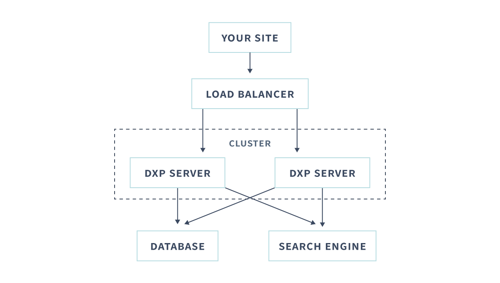
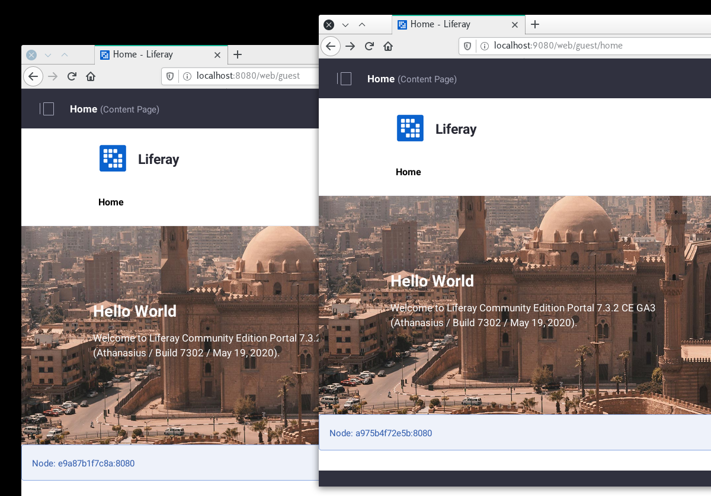
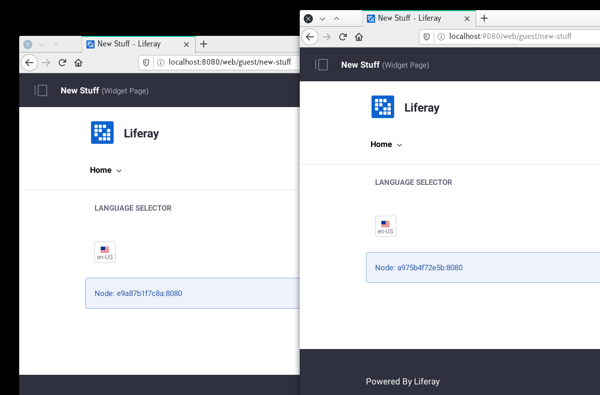

# Example: Creating a Simple DXP Cluster

A fast, easy way to learn DXP clustering is to set up a two node DXP cluster environment on one machine using [Docker containers](https://docs.docker.com/get-started/overview/). Here you'll create two DXP server containers along with server containers for a database, search engine, and file store.

Here are the server containers you'll create:

| Server Type   | Implementation | Container Name  |
| :------------ | :------------- | :-------------- |
| Database      | MariaDB        | `some-mariadb`  |
| File Store    | DBStore        | `some-mariadb`  |
| Search Engine | Elasticsearch  | `elasticsearch` |
| DXP Server    | Tomcat         | `dxp-1`         |
| DXP Server    | Tomcat         | `dxp-2`         |

```warning::
   This example is for learning purposes and is not suitable for production use cases. For production environments, you should include an HTTP server for load balancing requests to the DXP servers, use separate database servers for read only and read-write operations, and consider clustering and load balancing database servers, file store servers, and search engine servers. Please read all of the `Clustering for High Availability <./clustering-for-high-availability.md>`_ articles for more information.
```

<!--

Should we remove this diagram since it includes a load balancer? -->

Here are the main steps:

1. [Start a Database Server](#prepare-a-database-server)
1. [Start a File Store Server](#prepare-a-file-store-server)
1. [Start a Search Engine Server](#prepare-a-search-engine-server)
1. [Configure the Search Engine for Each Node](#configure-the-search-engine-for-each-node)
1. [Start the DXP Cluster](#start-the-dxp-cluster)
1. [Test the DXP Cluster](#test-the-dxp-cluster)

## Start a Database Server

A DXP cluster requires a data source that's accessible to all of the DXP cluster nodes. The data source can be a JNDI data source or a direct connection to a database server or a database server cluster. Please see the [compatibility matrix](https://help.liferay.com/hc/en-us/articles/360049238151) for the database servers your DXP version supports. Please see [Database Configuration for Cluster Nodes](./database-configuration-for-cluster-nodes.md) for more information.

Create the database server and DXP database:

1. Start a MariaDB Docker container.

    ```bash
    docker run --name some-mariadb -e MYSQL_ROOT_PASSWORD=my-secret-pw -d mariadb:10.2
    ```

1. In a shell on the container, [create the DXP database](../../reference/database-configurations.md).

    Sign in to the database server.

    ```bash
    docker exec -it some-mariadb bash -c "/usr/bin/mysql -uroot -pmy-secret-pw"
    ```

    Create a database for DXP.

    ```sql
    create database dxp_db character set utf8;
    ```

    End your database session.

    ```bash
    quit
    ```

    End your bash session.

    ```bash
    exit
    ```

Your database server is ready for DXP.

## Start a File Store Server

A DXP cluster requires a File Store accessible to all of the DXP cluster nodes. For convenience, this example uses a [DBStore File Store](../../../system-administration/file-storage/other-file-store-types/dbstore.md) configured on the DXP database. The database server already started in this example includes the File Store. Please see [Configuring File Storage](../../../system-administration/file-storage/configuring-file-storage.md) for information on configuring all File Store types.

## Start a Search Engine Server

A DXP cluster requires a search engine (running as a separate process) accessible to all of the DXP cluster nodes. Please see [Installing a Search Engine](../../../using-search/installing-and-upgrading-a-search-engine/installing-a-search-engine.md) for more information.

Create and configure an Elasticsearch server:

1. Set a local folder for storing an Elasticsearch server's data volume. For example,

    ```bash
    mkdir -p elasticsearch/es_data_volume
    ```

1. Start an Elasticsearch container named `elasticsearch`.

    ```bash
    docker run -it --name elasticsearch -p 9200:9200 -p 9300:9300 -e cluster.name=LiferayElasticsearchCluster -e ES_JAVA_OPTS="-Xms512m -Xmx512m" -v $(pwd)/elasticsearch/es_data_volume:/usr/share/elasticsearch/data elasticsearch:6.8.7
    ```

    ```note::
       If the container reports ``max virtual memory areas vm.max_map_count [xxxxx] is too low, increase to at least [xxxxxx]``, then set ``vm.max_map_count`` to a sufficient value using a command like this one: ``sudo sysctl -w vm.max_map_count=[xxxxxx]``. Then start the container.
    ```

1. Install the required Elasticsearch plugins.

    ```bash
    docker exec -it elasticsearch bash -c '/usr/share/elasticsearch/bin/elasticsearch-plugin install analysis-icu && /usr/share/elasticsearch/bin/elasticsearch-plugin install analysis-kuromoji && /usr/share/elasticsearch/bin/elasticsearch-plugin install analysis-smartcn && /usr/share/elasticsearch/bin/elasticsearch-plugin install analysis-stempel'
    ```

Your search engine is ready to manage search indexes.

## Configure the Search Engine Server For Each Node

Use [Configuration Files](../../../system-administration/configuring-liferay/configuration-files-and-factories/using-configuration-files.md) to configure Elasticsearch for each DXP node:

1. Create the Configuration Files locations.

    ```bash
    mkdir -p dxp-1/files/osgi/configs dxp-2/files/osgi/configs
    ```

1. Configure Elasticsearch for the `dxp-1` server node.

    ```bash
    cat <<EOT >> dxp-1/files/osgi/configs/com.liferay.portal.search.elasticsearch6.configuration.ElasticsearchConfiguration.config
    operationMode="REMOTE"
    transportAddresses="elasticsearch:9300"
    clusterName="LiferayElasticsearchCluster"
    EOT
    ```

1. Configure Elasticsearch for the `dxp-2` server node.

    ```bash
    cat <<EOT >> dxp-2/files/osgi/configs/com.liferay.portal.search.elasticsearch6.configuration.ElasticsearchConfiguration.config
    operationMode="REMOTE"
    transportAddresses="elasticsearch:9300"
    clusterName="LiferayElasticsearchCluster"
    EOT
    ```

You'll make these configuration files accessible to the cluster nodes via bind mounts on the DXP server containers.

```note::
   The ``docker run --add-host elasticsearch:[ip] ...`` commands used later for the DXP servers add ``/etc/hosts/`` entries that map the name _elasticsearch_ to the Elasticsearch server host IP address.
```

## Start the DXP Cluster

The DXP cluster node containers will have these unique settings:

| Configuration                             | dxp-1                          | dxp-2                          |
| :---------------------------------------- | :----------------------------- | :----------------------------- |
| AJP port mapping                          | `8009:8009`                    | `9009:8009`                    |
| HTTP port mapping                         | `8080:8080`                    | `9080:8080`                    |
| OSGi container port mapping               | `11311:11311`                  | `11312:11311`                  |
| Bind mount                                | `$(pwd)/dxp-1:/mnt/liferay`    | `$(pwd)/dxp-2:/mnt/liferay`    |
| Cluster Link control channel logic name   | control-channel-logic-name-1   | control-channel-logic-name-2   |
| Cluster Link transport channel logic name | transport-channel-logic-name-1 | transport-channel-logic-name-2 |

Start the DXP containers.

1. Get the container IP addresses for the `elasticsearch` and `some-mariadb` containers by executing the [`docker network inspect bridge`](https://docs.docker.com/engine/reference/commandline/network_inspect/) command. The `bridge` network is the default network.

    ```important::
       In the ``docker run`` commands that follow, you'll replace `[IP address]` with the ``elasticsearch`` and ``some-mariadb`` container IP addresses.
    ```

1. Start `dxp-1`.

    Command expanded for readability:

    ```bash
    docker run -it \
      --add-host elasticsearch:[IP address] \
      --add-host some-mariadb:[IP address] \
      -e LIFERAY_JDBC_PERIOD_DEFAULT_PERIOD_JNDI_PERIOD_NAME="" \
      -e LIFERAY_JDBC_PERIOD_DEFAULT_PERIOD_DRIVER_UPPERCASEC_LASS_UPPERCASEN_AME=org.mariadb.jdbc.Driver \
      -e LIFERAY_JDBC_PERIOD_DEFAULT_PERIOD_URL="jdbc:mariadb://some-mariadb:3306/dxp_db?useUnicode=true&characterEncoding=UTF-8&useFastDateParsing=false" \
      -e LIFERAY_JDBC_PERIOD_DEFAULT_PERIOD_USERNAME=root \
      -e LIFERAY_JDBC_PERIOD_DEFAULT_PERIOD_PASSWORD=my-secret-pw \
      -e LIFERAY_CLUSTER_PERIOD_LINK_PERIOD_ENABLED=true \
      -e LIFERAY_CLUSTER_PERIOD_LINK_PERIOD_CHANNEL_PERIOD_LOGIC_PERIOD_NAME_PERIOD_CONTROL=control-channel-logic-name-1 \
      -e LIFERAY_CLUSTER_PERIOD_LINK_PERIOD_CHANNEL_PERIOD_LOGIC_PERIOD_NAME_PERIOD_TRANSPORT_PERIOD_NUMBER0=transport-channel-logic-name-1 \
      -e LIFERAY_CLUSTER_PERIOD_LINK_PERIOD_AUTODETECT_PERIOD_ADDRESS=some-mariadb:3306 \
      -e LIFERAY_WEB_PERIOD_SERVER_PERIOD_DISPLAY_PERIOD_NODE=true \
      -e LIFERAY_DL_PERIOD_STORE_PERIOD_IMPL=com.liferay.portal.store.db.DBStore \
      --name dxp-1 \
      -p 11311:11311 \
      -p 8009:8009 \
      -p 8080:8080 \
      -v $(pwd)/dxp-1:/mnt/liferay \
      liferay/portal:7.3.2-ga3
    ```

    Command condensed to one line:

    ```bash
    docker run -it --name dxp-1  --add-host elasticsearch:[IP address] --add-host some-mariadb:[IP address] -e LIFERAY_JDBC_PERIOD_DEFAULT_PERIOD_JNDI_PERIOD_NAME="" -e LIFERAY_JDBC_PERIOD_DEFAULT_PERIOD_DRIVER_UPPERCASEC_LASS_UPPERCASEN_AME=org.mariadb.jdbc.Driver -e LIFERAY_JDBC_PERIOD_DEFAULT_PERIOD_URL="jdbc:mariadb://some-mariadb:3306/dxp_db?useUnicode=true&characterEncoding=UTF-8&useFastDateParsing=false" -e LIFERAY_JDBC_PERIOD_DEFAULT_PERIOD_USERNAME=root -e LIFERAY_JDBC_PERIOD_DEFAULT_PERIOD_PASSWORD=my-secret-pw -e LIFERAY_CLUSTER_PERIOD_LINK_PERIOD_ENABLED=true -e LIFERAY_CLUSTER_PERIOD_LINK_PERIOD_CHANNEL_PERIOD_LOGIC_PERIOD_NAME_PERIOD_CONTROL=control-channel-logic-name-1 -e LIFERAY_CLUSTER_PERIOD_LINK_PERIOD_CHANNEL_PERIOD_LOGIC_PERIOD_NAME_PERIOD_TRANSPORT_PERIOD_NUMBER0=transport-channel-logic-name-1 -e LIFERAY_CLUSTER_PERIOD_LINK_PERIOD_AUTODETECT_PERIOD_ADDRESS=some-mariadb:3306 -e LIFERAY_WEB_PERIOD_SERVER_PERIOD_DISPLAY_PERIOD_NODE=true -e LIFERAY_DL_PERIOD_STORE_PERIOD_IMPL=com.liferay.portal.store.db.DBStore --name dxp-1 -p 11311:11311 -p 8009:8009 -p 8080:8080 -v $(pwd)/dxp-1:/mnt/liferay [$LIFERAY_LEARN_DXP_DOCKER_IMAGE$]
    ```

1. Start `dxp-2`.

    Command expanded for readability:

    ```bash
    docker run -it \
      --add-host elasticsearch:[IP address] \
      --add-host some-mariadb:[IP address] \
      -e LIFERAY_JDBC_PERIOD_DEFAULT_PERIOD_JNDI_PERIOD_NAME="" \
      -e LIFERAY_JDBC_PERIOD_DEFAULT_PERIOD_DRIVER_UPPERCASEC_LASS_UPPERCASEN_AME=org.mariadb.jdbc.Driver \
      -e LIFERAY_JDBC_PERIOD_DEFAULT_PERIOD_URL="jdbc:mariadb://some-mariadb:3306/dxp_db?useUnicode=true&characterEncoding=UTF-8&useFastDateParsing=false" \
      -e LIFERAY_JDBC_PERIOD_DEFAULT_PERIOD_USERNAME=root \
      -e LIFERAY_JDBC_PERIOD_DEFAULT_PERIOD_PASSWORD=my-secret-pw \
      -e LIFERAY_CLUSTER_PERIOD_LINK_PERIOD_ENABLED=true \
      -e LIFERAY_CLUSTER_PERIOD_LINK_PERIOD_CHANNEL_PERIOD_LOGIC_PERIOD_NAME_PERIOD_CONTROL=control-channel-logic-name-2 \
      -e LIFERAY_CLUSTER_PERIOD_LINK_PERIOD_CHANNEL_PERIOD_LOGIC_PERIOD_NAME_PERIOD_TRANSPORT_PERIOD_NUMBER0=transport-channel-logic-name-2 \
      -e LIFERAY_CLUSTER_PERIOD_LINK_PERIOD_AUTODETECT_PERIOD_ADDRESS=some-mariadb:3306 \
      -e LIFERAY_WEB_PERIOD_SERVER_PERIOD_DISPLAY_PERIOD_NODE=true \
      -e LIFERAY_DL_PERIOD_STORE_PERIOD_IMPL=com.liferay.portal.store.db.DBStore \
      --name dxp-2 \
      -p 11312:11311 \
      -p 9009:8009 \
      -p 9080:8080 \
      -v $(pwd)/dxp-2:/mnt/liferay \
      liferay/portal:7.3.2-ga3
    ```

    Command condensed to one line:

    ```bash
    docker run -it --add-host elasticsearch:[IP address] --add-host some-mariadb:[IP address] -e LIFERAY_JDBC_PERIOD_DEFAULT_PERIOD_JNDI_PERIOD_NAME="" -e LIFERAY_JDBC_PERIOD_DEFAULT_PERIOD_DRIVER_UPPERCASEC_LASS_UPPERCASEN_AME=org.mariadb.jdbc.Driver -e LIFERAY_JDBC_PERIOD_DEFAULT_PERIOD_URL="jdbc:mariadb://some-mariadb:3306/dxp_db?useUnicode=true&characterEncoding=UTF-8&useFastDateParsing=false" -e LIFERAY_JDBC_PERIOD_DEFAULT_PERIOD_USERNAME=root -e LIFERAY_JDBC_PERIOD_DEFAULT_PERIOD_PASSWORD=my-secret-pw -e LIFERAY_CLUSTER_PERIOD_LINK_PERIOD_ENABLED=true -e LIFERAY_CLUSTER_PERIOD_LINK_PERIOD_CHANNEL_PERIOD_LOGIC_PERIOD_NAME_PERIOD_CONTROL=control-channel-logic-name-2 -e LIFERAY_CLUSTER_PERIOD_LINK_PERIOD_CHANNEL_PERIOD_LOGIC_PERIOD_NAME_PERIOD_TRANSPORT_PERIOD_NUMBER0=transport-channel-logic-name-2 -e LIFERAY_CLUSTER_PERIOD_LINK_PERIOD_AUTODETECT_PERIOD_ADDRESS=some-mariadb:3306 -e LIFERAY_WEB_PERIOD_SERVER_PERIOD_DISPLAY_PERIOD_NODE=true -e LIFERAY_DL_PERIOD_STORE_PERIOD_IMPL=com.liferay.portal.store.db.DBStore --name dxp-2 -p 11312:11311 -p 9009:8009 -p 9080:8080 -v $(pwd)/dxp-2:/mnt/liferay [$LIFERAY_LEARN_DXP_DOCKER_IMAGE$]
    ```

The `--add-host [domain]:[IP address]` options [add `/etc/hosts` file entries](https://docs.docker.com/engine/reference/run/#managing-etchosts) that map the domain names to the IP addresses. This enables configurations (such as environment variables, Portal Properties, and `.config` files) to refer to the servers by domain name.

The `-e [variable]=[value]` options set the DXP container environment variables. See [Appendix A: Environment Settings](#appendix-a-environment-settings) for more information.

### Visit the DXP Nodes

The DXP cluster nodes are available at the following URLs:

-   DXP-1: http://localhost:8080
-   DXP-2: http://localhost:9080

The figure below shows the cluster node home pages.



Each node's container ID and port (`Node: [id]:[port]`) appear at the bottom of each page. The `LIFERAY_WEB_PERIOD_SERVER_PERIOD_DISPLAY_PERIOD_NODE=true` environment setting enabled this display feature. You can find a container's ID using the [`docker container ls`](https://docs.docker.com/engine/reference/commandline/container_ls/) command.

### Index the Content into the Search Engine

Initiate indexing DXP content:

1. Navigating to _Control Panel &rarr; Configuration &rarr; Search_.

1. In the Index Actions tab, click these options:

    - _Reindex all search indexes_
    - _Reindex all spell check indexes_

Content indexes into the search engine. Please see [Search Overview](../../../using-search/getting-started/search-overview.html) for more information.

## Test the DXP Cluster

Test data synchronization between the nodes:

1. Add content to one of the cluster nodes.

    For example, add a new Widget Page called _New Stuff_ and add the Language Selector widget to it.

1. Refresh the UI on the other cluster node.

Both nodes show the same new content.



Congratulations on creating a working DXP cluster!

## What's Next

Configure your [database](./database-configuration-for-cluster-nodes.md) for your DXP cluster.

## Appendix A: Environment Settings

The example DXP server containers uses these settings.

| Configuration                                                                                                                                               | Description                                         |
| :---------------------------------------------------------------------------------------------------------------------------------------------------------- | :-------------------------------------------------- |
| LIFERAY_JDBC_PERIOD_DEFAULT_PERIOD_JNDI_PERIOD_NAME=                                                                                                        | Data source JNDI name                               |
| LIFERAY_JDBC_PERIOD_DEFAULT_PERIOD_DRIVER_UPPERCASEC_LASS\\<br>\_UPPERCASEN_AME=\\<br>org.mariadb.jdbc.Driver                                               | Database driver class                               |
| LIFERAY_JDBC_PERIOD_DEFAULT_PERIOD_URL=\\<br>jdbc:mariadb://some-mariadb:3306/dxp_db?\\<br>useUnicode=true&characterEncoding=UTF-8&useFastDateParsing=false | Data source URL                                     |
| LIFERAY_JDBC_PERIOD_DEFAULT_PERIOD_USERNAME=\\<br>root                                                                                                      | Database admin user name                            |
| LIFERAY_JDBC_PERIOD_DEFAULT_PERIOD_PASSWORD=\\<br>my-secret-pw                                                                                              | Database admin user password                        |
| LIFERAY_CLUSTER_PERIOD_LINK_PERIOD_ENABLED=\\<br>true                                                                                                       | Enables Cluster Link                                |
| LIFERAY_CLUSTER_PERIOD_LINK_PERIOD_CHANNEL_PERIOD_LOGIC_PERIOD_NAME\\<br>\_PERIOD_CONTROL=\\<br>control-channel-logic-name-2                                | The cluster node's unique control channel name      |
| LIFERAY_CLUSTER_PERIOD_LINK_PERIOD_CHANNEL_PERIOD_LOGIC_PERIOD_NAME\\<br>\_PERIOD_TRANSPORT_PERIOD_NUMBER0=\\<br>transport-channel-logic-name-2             | The cluster node's unique transport channel name    |
| LIFERAY_CLUSTER_PERIOD_LINK_PERIOD_AUTODETECT_PERIOD_ADDRESS=\\<br>some-mariadb:3306                                                                        | Known address to ping to get cluster node addresses |
| LIFERAY_WEB_PERIOD_SERVER_PERIOD_DISPLAY_PERIOD_NODE=\\<br>true                                                                                             | Displays the server address and web server port     |
| LIFERAY_DL_PERIOD_STORE_PERIOD_IMPL=\\<br>com.liferay.portal.store.db.DBStore                                                                               | File Store (Document Library Store) class           |

Please see the Env/[Portal Property](https://docs.liferay.com/dxp/portal/7.3-latest/propertiesdoc/portal.properties.html) definitions for more information.

## Additional Information

-   [Database Configuration for Cluster Nodes](./database-configuration-for-cluster-nodes.md)
-   [Configuring Cluster Link](./configuring-cluster-link.md)
