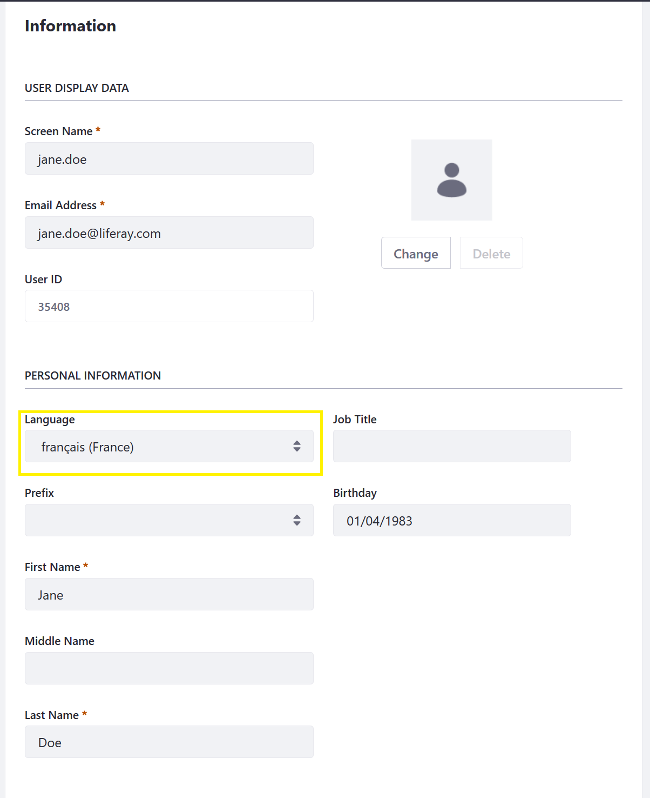
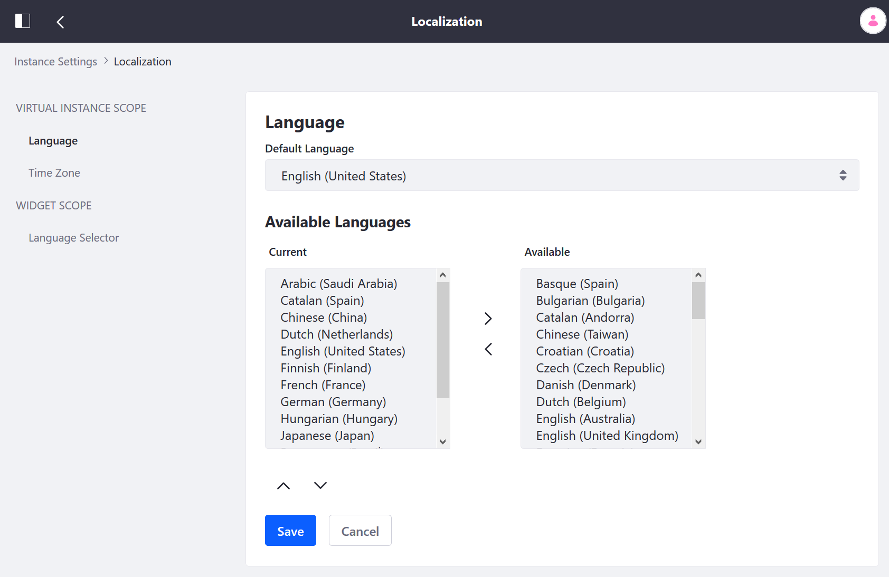

# Configuring Localization

Liferay DXP supports localization. By default, Liferay DXP is configured with English (US) as the default language and set to GMT time zone. You can modify your own default language and time zones, or change the language and locale for the entire DXP instance.

## Configuring Individual Localization Settings

To configure an individual user's display settings:

1. Navigate to the _Control Panel_ &rarr; _Users and Organizations_.
1. Select a language in the _Language_ dropdown menu.

    

1. Click _Save_.
1. Click the _Preference_ tab.
1. Click _Display Settings_ in the left menu.
1. Select the desired time zone.

    

1. Click _Save_.

For this user, DXP instance is now displayed in her specific language and all assets are time-stamped in her time zone.

## Configuring Instance-wide Settings

Administrators can set time zones in the _Control Panel_ which changes the time zone at the [Instance](https://help.liferay.com/hc/articles/360031899692-Instance-Configuration-Instance-Settings) level.

1. Navigate to the _Control Panel_ &rarr; _Configuration_.
1. Click _Instance Settings_.
1. Click _Localization_.
1. Click _Time Zone_ in the left menu.

    

1. Select the desired time zone.
1. Click _Save_.

### Setting the JVM Time Zone to GMT

```Warning::
   Do not change the JVM's time zone.
```

It is highly recommended that the JVM's time zone is set to GMT. Moreover, the database server's JVM must also be set to GMT. Otherwise, this causes issues such as Calendar Events and Web Content articles displaying the wrong dates.

The root case is because the system assumes each date stored in the database is stored in GMT time. When the system needs to display one stored date to the end users, the display date is calculated by the application server's current date. This date is affected by the configured JVM level time zone and the stored GMT format date. To make sure the display date is calculated correctly, the time zone must be configured to GMT at the JVM level. Otherwise, an incorrect time zone offset at the JVM level causes the display date to be wrongly calculated and displayed. See [JVM Configurations](../reference/jvm-configurations.md)

### Modifying the Instance's Default and Available Languages

1. Navigate to the _Control Panel_ &rarr; _Configuration_.
1. Click _Instance Settings_.
1. Click _Localization_.
1. Click _Language_ in the left menu.
1. Select the default language in the _Default Language_ dropdown menu.
1. Use the central left and right arrows to add or remove available languages and locales.

    

1. Click _Save_.

## Additional Information

* [Adding a Language](../../liferay-internals/extending-liferay/adding-a-language.md)
* [Customizing Core Languages](../../liferay-internals/customizing-the-core/customizing-core-languages.md)
