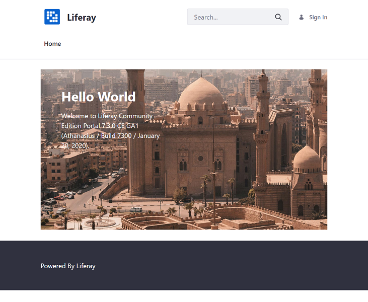

# Basic Database Upgrade Steps

The fastest way to upgrade to DXP 7.3+ is by using the latest Liferay Docker image and the _Auto Upgrade_ feature. Auto Upgrade is a mode of running DXP that invokes all upgrade processes on DXP startup. When Auto Upgrade completes, DXP launches on the upgraded database. If your data set is small and you're upgrading to DXP 7.3+, these basic database upgrade steps may be for you.

The Docker Desktop is available from [here](https://www.docker.com/products/docker-desktop). Liferay provides [DXP images](https://hub.docker.com/r/liferay/dxp) (Subscription) and [Community Edition images](https://hub.docker.com/r/liferay/portal).

```important::
   Before running the basic database upgrade steps, review the `Upgrade Overview <./upgrade-overview.md>`_.
```

```important::
   For production and enterprise level deployments of Liferay, use the Upgrade Tool to perform upgrades. For more information see `Using the Liferay Upgrade Tool <./using-the-database-upgrade-tool.md>`_.
```

```warning::
   **Always** `back up <../../10-maintaining-a-liferay-dxp-installation/backing-up.md>`_ your database and installation before upgrading. Testing the upgrade process on backup copies is advised.
```

```important::
   If you're upgrading from 6.2 or earlier, update your file store configuration. See the `Updating the File Store <../configuration-and-infrastructure/updating-the-file-store.md>`_ for more information.
```

## Using the Latest Docker Image

Here are the data upgrade steps:

1. Set up a new [Liferay Home](../../reference/liferay-home.md) folder with the contents of your current Liferay Home. You'll bind this new Liferay Home to the Docker image in a later step.

    ```bash
    cp /old-version/liferay-home/ /new-version/liferay-home/
    ```
    Alternatively if your current Liferay Home is in source control, create a new branch.

    ```bash
    git checkout -b new-version
    ```

1. Make sure you're using the JDBC database driver your database vendor recommends. If you're using MySQL, for example, set `jdbc.default.driverClassName=com.mysql.cj.jdbc.Driver` in `portal-ext.properties` and replace the MySQL JDBC driver JAR your app server uses. See this [Database Drivers](../configuration-and-infrastructure/migrating-configurations-and-properties.md#database-drivers) for more details.

1. Disable search indexing during database upgrade by setting `indexReadOnly="true"` in a `com.liferay.portal.search.configuration.IndexStatusManagerConfiguration.config`file:

    ```bash
    cd liferay-home
    echo "indexReadOnly=\"true\"" > osgi/configs/com.liferay.portal.search.configuration.IndexStatusManagerConfiguration.config
    ```

1. Run the latest DXP Docker image mounted to your new Liferay Home using the following command, substituting your environment values as needed:

    ```bash
    docker run -it -p 8080:8080 \
     -v /path/to/liferay-home:/mnt/liferay \
     liferay/portal:7.3.0-ga1 \
     -e LIFERAY_UPGRADE_PERIOD_DATABASE_PERIOD_AUTO_PERIOD_RUN=true
    ```

    The `-v /path/to/liferay-home:/mnt/liferay` arguments bind mount the `/path/to/liferay-home` folder on the host to `/mnt/liferay` in the container.

    The database upgrade processes run.

1. In the console or log, confirm successful database upgrade and DXP startup. Upgrade process messages report starting and completing each upgrade process. A message like this one indicates DXP startup completion:

    ```
    org.apache.catalina.startup.Catalina.start Server startup in [x] milliseconds
    ```

    If there are any upgrade failures or errors, you can use the logs and [Gogo Shell commands](../upgrade-stability-and-performance/upgrading-modules-using-gogo-shell.md) to troubleshoot them and finish the upgrades.

1. Re-enable search indexing by setting `indexReadOnly="false"` or by deleting the `com.liferay.portal.search.configuration.IndexStatusManagerConfiguration.config` file.

    ```bash
    rm osgi/configs/com.liferay.portal.search.configuration.IndexStatusManagerConfiguration.config
    ```

1. Validate your upgraded database.

    

Your Liferay DXP database upgrade is now complete!

```note::
   If you're done upgrading the database, then leave off the `-e LIFERAY_UPGRADE_PERIOD_DATABASE_PERIOD_AUTO_PERIOD_RUN=true` environment setting from your Docker command the next time you run DXP.
```

## Conclusion

If the upgraded DXP database is all you need, then enjoy using your new version of DXP! If there's more to completing your upgrade, these articles can help you finish:

* [Upgrade Overview](./upgrade-overview.md) describes all of the upgrade topics. Maybe there's a topic you still need to address.

* [Using the Liferay Database Upgrade Tool](./using-the-database-upgrade-tool.md) demonstrates upgrading the database while the DXP server is offline. If auto-upgrade (above) took too long or you'd like to upgrade a larger data set or an enterprise-level DXP environment, [tuning the database, pruning unneeded data](../upgrade-stability-and-performance/database-tuning-for-upgrades), and using database upgrade tool is recommended.

* [Custom Code Upgrade](https://help.liferay.com/hc/en-us/articles/360029316391-Introduction-to-Upgrading-Code-to-Liferay-DXP-7-2) guides you in adapting custom plugin code you've developed to the new DXP version.

* [Updating a Cluster](../10-Maintaining-a-liferay-dxp-installation/10-maintaining-clusters/01-maintaining-clustered-installations.md) describes how to upgrade DXP in a clustered environment.
