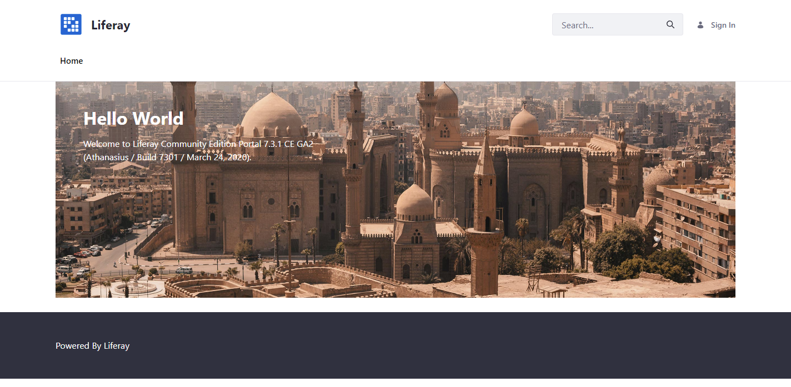

# Upgrading Via Docker

A DXP Docker image invokes all DXP upgrade processes when an auto upgrade parameter is passed to the command for running the image. When the upgrade processes complete, DXP launches on the upgraded database.

The Docker Desktop is available from [here](https://www.docker.com/products/docker-desktop). Liferay provides DXP Community Edition images [here](https://hub.docker.com/r/liferay/portal).

```important::
   For critical installations and Subscribers, use the Database Upgrade Tool. For more information see `Using the Liferay Upgrade Tool <./using-the-database-upgrade-tool.md>`_.
```

```warning::
   **Always** `back up <../../maintaining-a-liferay-dxp-installation/backing-up.md>`_ your database and installation before upgrading. Testing the upgrade process on backup copies is advised.
```

## Upgrading with the Latest Docker Image

Here are the steps for using the Docker image:

1. Set up a new [Liferay Home](../../reference/liferay-home.md) folder with the contents of your current Liferay Home. You'll bind this new Liferay Home to the Docker image in a later step.

    ```bash
    cp /old-version/liferay-home/ /new-version/liferay-home/
    ```

    Alternatively if your current Liferay Home is in source control, create a new branch.

    ```bash
    git checkout -b new-version
    ```

1. Make sure you're using the JDBC database driver your database vendor recommends. If you're using MySQL, for example, set `jdbc.default.driverClassName=com.mysql.cj.jdbc.Driver` in [`portal-ext.properties`](../../reference/portal-properties.md) and replace the MySQL JDBC driver JAR your app server uses. See [Database Drivers](../configuration-and-infrastructure/migrating-configurations-and-properties.md#database-drivers) for more details.

1. Disable search indexing during database upgrade by setting `indexReadOnly="true"` in a `com.liferay.portal.search.configuration.IndexStatusManagerConfiguration.config`file:

    ```bash
    cd /new-version/liferay-home
    echo "indexReadOnly=\"true\"" > osgi/configs/com.liferay.portal.search.configuration.IndexStatusManagerConfiguration.config
    ```

1. Run the DXP Docker image mounted to your new Liferay Home using the following command, substituting your environment values as needed:

    ```bash
    docker run -it -p 8080:8080 \
     -v /new-version/liferay-home:/mnt/liferay \
     liferay/portal:7.3.0-ga1 \
     -e LIFERAY_UPGRADE_PERIOD_DATABASE_PERIOD_AUTO_PERIOD_RUN=true
    ```

    The `-v /new-version/liferay-home:/mnt/liferay` arguments bind mount the `/new-version/liferay-home` folder on the host to `/mnt/liferay` in the container.

    The parameter `-e LIFERAY_UPGRADE_PERIOD_DATABASE_PERIOD_AUTO_PERIOD_RUN=true` triggers the database upgrade processes to run.

1. In the console or log, confirm successful database upgrade and DXP startup. Upgrade process messages report starting and completing each upgrade process. A message like this one indicates DXP startup completion:

    ```bash
    org.apache.catalina.startup.Catalina.start Server startup in [x] milliseconds
    ```

    If there are any upgrade failures or errors, you can use the logs and [Gogo Shell commands](../upgrade-stability-and-performance/upgrading-modules-using-gogo-shell.md) to troubleshoot them and finish the upgrades.

1. Re-enable search indexing by setting `indexReadOnly="false"` or by deleting the `com.liferay.portal.search.configuration.IndexStatusManagerConfiguration.config` file.

    ```bash
    rm osgi/configs/com.liferay.portal.search.configuration.IndexStatusManagerConfiguration.config
    ```

1. Validate your upgraded database.

    

Your Liferay DXP database upgrade is now complete!

```note::
   If you're done upgrading the database, leave off the `-e LIFERAY_UPGRADE_PERIOD_DATABASE_PERIOD_AUTO_PERIOD_RUN=true` environment setting from your Docker command the next time you run DXP.
```

## Conclusion

If the upgraded DXP database is all you need, then enjoy using your new version of DXP! If there's more to completing your upgrade, these articles can help you finish:

* [Upgrade Overview](./upgrade-overview.md) describes all of the upgrade topics. Maybe there's a topic you still need to address.

* [Using the Database Upgrade Tool](./using-the-database-upgrade-tool.md) demonstrates upgrading the database while the DXP server is offline. If the upgrade took too long, [tuning the database](../upgrade-stability-and-performance/database-tuning-for-upgrades.md), [pruning unneeded data](../upgrade-stability-and-performance/database-pruning-for-faster-upgrades.md), and using database upgrade tool is recommended.

* [Custom Code Upgrade](https://help.liferay.com/hc/en-us/articles/360029316391-Introduction-to-Upgrading-Code-to-Liferay-DXP-7-2) guides you in adapting custom plugin code you've developed to the new DXP version.

* [Maintaining Clustered Installations](../maintaining-a-liferay-dxp-installation/maintaining-clustered-installations/maintaining-clustered-installations.md) describes how to upgrade DXP in a clustered environment.