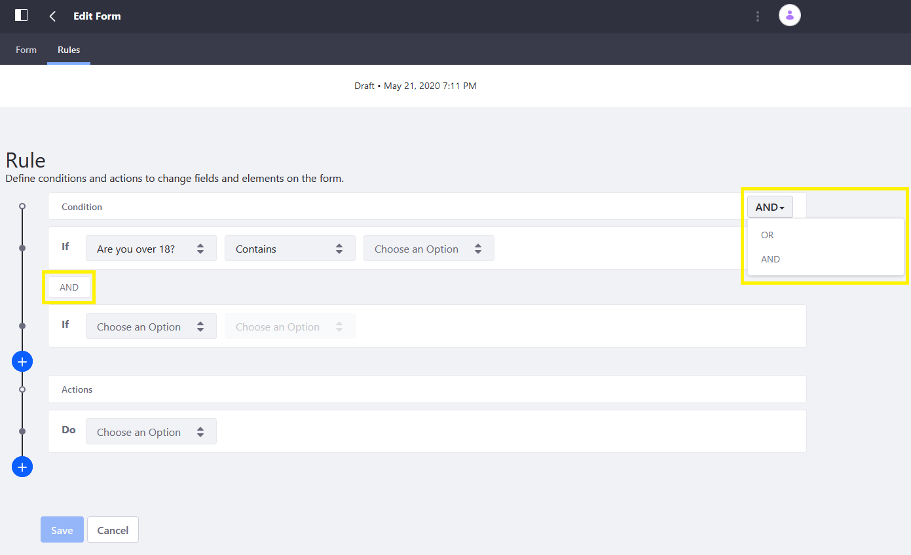
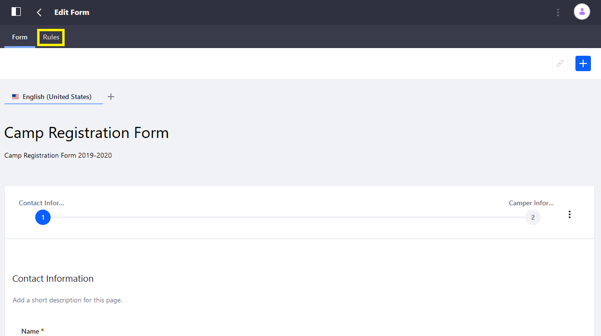
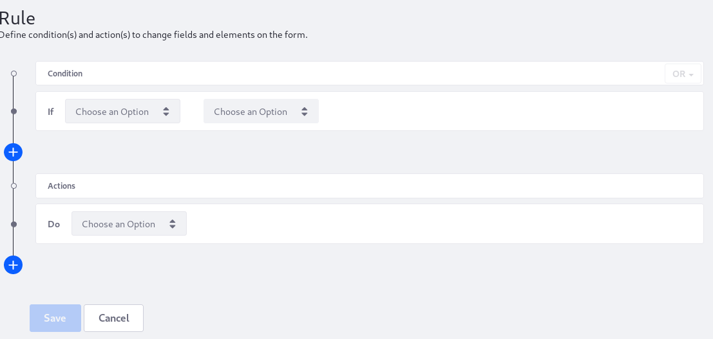
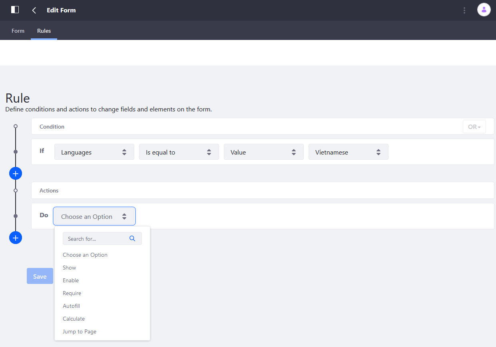

# Introduction to Form Rules

Once users have created a form, they can implement Form Rules. Form Rules allow users to show a particular question on a form depending on whether they meet a particular condition. For example, a summer camp registration form may ask whether the participant is over the age of 18. Depending on the answer, the registration form may require additional information.

## Form Rule Conditions and Actions

Each rule consists of one or more conditions and actions:

* **Conditions** determine whether any actions are executed.
* **Actions** determine what happens if the condition is met.

```tip::
   Rules are stored in the database in JSON format by default.
```

Users can choose _OR_ or _AND_ to define the relationship between multiple conditions:

* **OR**: The action is triggered if _any_ of the conditions you specify evaluates to _true_.
* **AND**: The action is triggered only if *all* the conditions you specify evaluate to *true*.



## Accessing the Rule Builder

1. Navigate to the Form where the Form Rule is to be applied.
1. Click on the _Rules_ tab.

    

1. Click the _Add_ button () to get started.

    

## Specifying Conditions

When building a rule, users must specify a field (for example, _Are you over 18?_), a condition (_Is equal to_), the Value (_Yes/ No_) to be compared against. If the condition's _if statement_ is _true_, the action is triggered. If it is _false_, no action happens.

| Condition | Description |
| --- | --- |
| Is equal to | This checks whether the inputted value is equal to the condition. Example: if a language matches Spanish, then trigger the action.  |
| Is not equal to | This checks whether the inputted value is not equal to the condition. |
| Contains | This checks whether the inputted value contains the value. |
| Does not contain | This checks whether the inputted value does not contain the value. |
| Is empty | This checks whether a field *is* empty. |
| Is not empty | This assumes you want to do something as long as a field is *not* empty. |
| User | This condition checks whether the user belongs to a certain DXP Role. If yes, the action is triggered. |

## Form Rule Actions

The following Actions are available:



| Action | Description |
| --- | --- |
| [Show](./using-the-show-hide-rules.md) | Sets the visibility of a form field based on a predefined condition. |
| **Enable** | Use a predefined condition to enable or disable a field. |
| **Require** | Use a predefined condition to make a field required. |
| [Jump to Page](./using-the-jump-to-page-rule.md) | Based on user input, skip over some form pages directly to a relevant page. _This rule doesn't appear in the rule builder until a second page is added to the form_. |
| **Autofill with Data Provider** | Use a [data provider](../using-data-providers-to-populate-form-options.md) to populate fields when a condition is met in another field. |
| **Calculate** | Populate a field with a calculated value using data entered in other fields. |

## Additional Information

* [Creating Forms](../../creating-forms.md)
* [Using the Show-Hide Rule](./using-the-show-hide-rule.md)
* [Using the Require Rule](./using-the-require-rule.md)
* [Using the Enable Rule](./using-the-enable-disable-rule.md)
* [Using the Jump to Page Rule](./using-the-jump-to-page-rule.md)
* [Using the Autofill Rule](./using-the-autofill-rule.md)
* [Using the Calculate Rule](./using-the-calculate-rule.md)