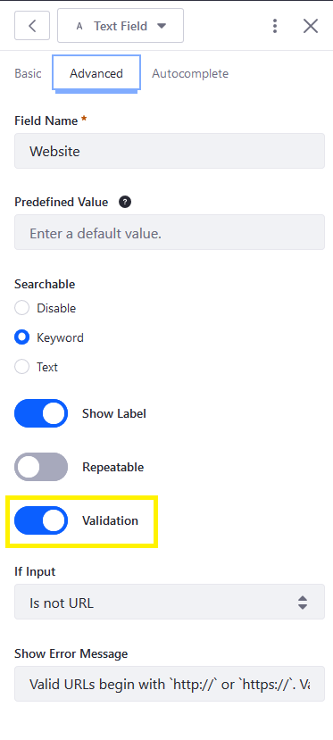
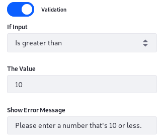

# Validating Text and Numeric Field Entries

Validation ensures that only certain values are entered in a text or numeric field. This function is disabled by default.

To enable validation:

1. In either a Text or Numeric field, open the right menu.
1. Click the _Advanced_ tab.
1. Slide the _Validation_ toggle to the right. This enables validation.

    

Once validation has been enabled, specify the _If Input_ condition and enter the _Show Error Message_ which indicate how validation failed.

## Text Fields

See [Validation Conditions Reference](./validation-rules.md) for more information about the other validation conditions.

### Validating Email Addresses

Users can validate email addresses. To ensure that the user has entered a valid email address:

1. Select the _Is not email_ condition from the _If Input_ dropdown.
1. Enter the error message in the _Show Error Message_ field: Please enter a valid email address.
1. Click _Save Form_ when finished.

    

### Validating URLs

Similar to emails, users can validate URLs.

To validate URLs:

1. Select the _Is not URL_ condition from the _If Input_ dropdown.
1. Enter an error message.
1. Click _Save Form_ when finished.

### Using Regular Expressions

Users can use [regular expressions](https://en.wikipedia.org/wiki/Regular_expression) to create custom validation criteria. For example, use this regular expression to ensure that ten consecutive numeric digits are entered in a phone number field:

    ^[0-9]{10}$

To validate a text field using a regular expression:

1. Select the _Does Not Match_ condition from the _If Input_ dropdown menu.
1. Enter the regular expression.
1. Enter an error message in the _Show Error Message_ field.

    

1. Click _Save Form_ when finished.

## Validating Numeric Fields

Numeric field validation is similar to text field validation, but the conditions compare the value of the number entered to some other value.

To validate numeric fields:

1. Select the desired condition from the _If Input_ dropdown menu (for example, _Is greater than_).
1. Enter numeric value (_10_) that serves as the limit.
1. Enter an error message in the _Show Error Message_ field.

    

1. Click _Save Form_ when finished.

### Requiring Only Integers

Users can require numeric values to be integers only. By default, the _My numeric type is_ value is set to Decimal.

To configure the Numeric field to accept only integers:

1. Open the right navigation menu.
1. On the _Basic_ tab, click on the _Integer_ radio button.

    

1. Click _Save Form_ to apply the changes.

## Additional Information

* [Validation Conditions Reference](./validation-conditions-reference.md)
* [Creating Forms](../creating-forms.md)
