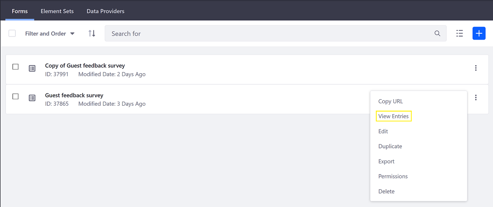
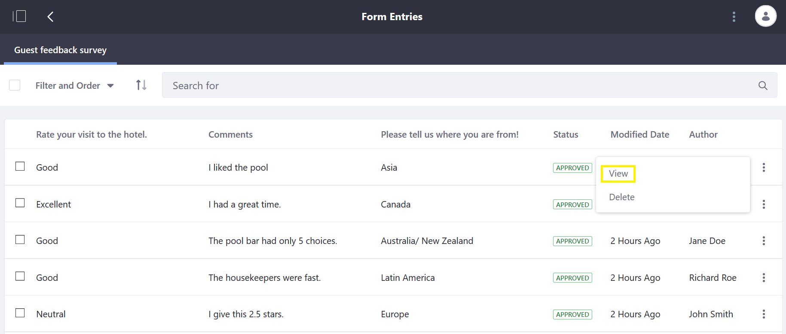
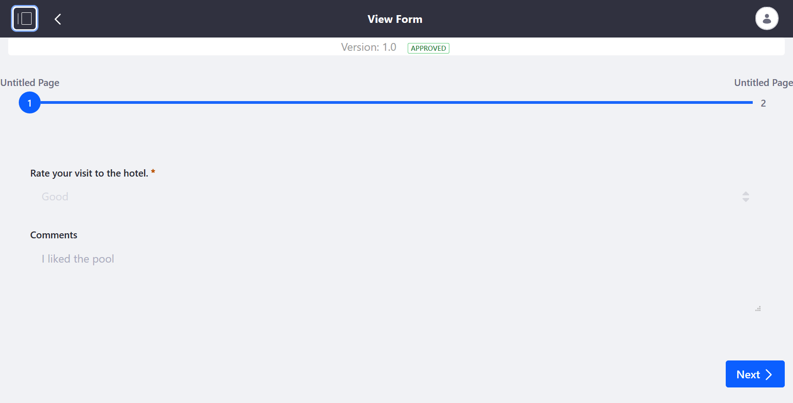
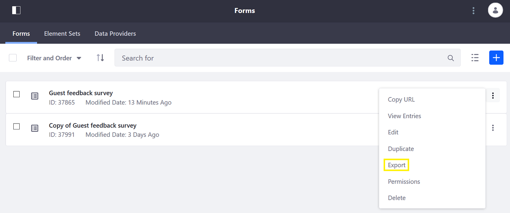
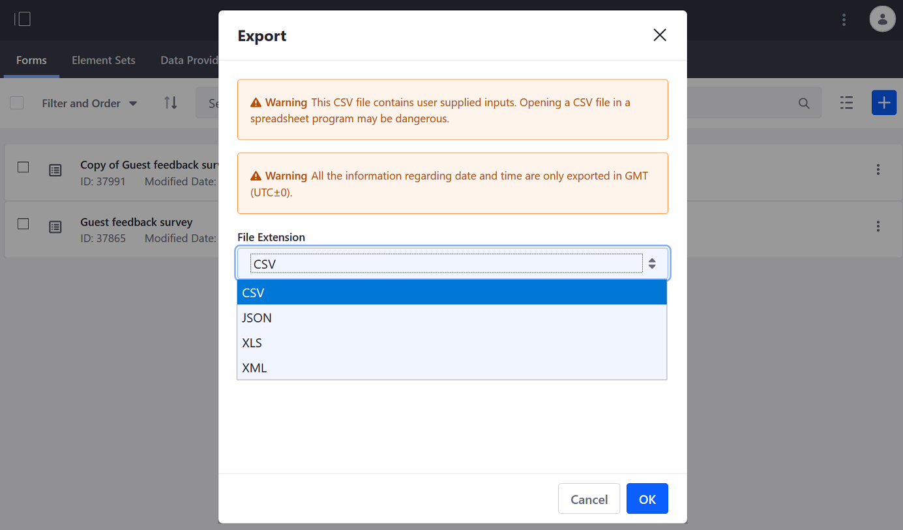
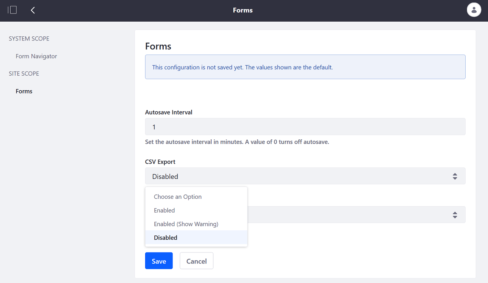
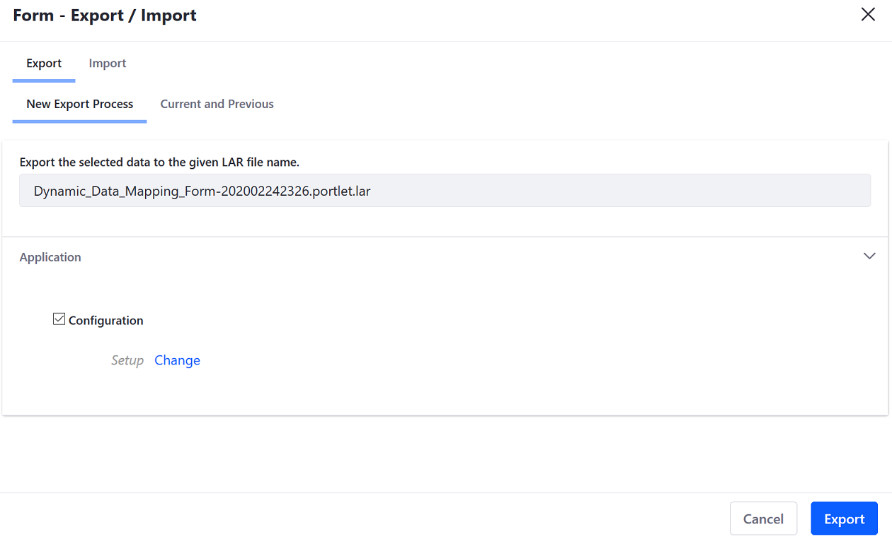

# Managing Form Entries

Once users begin submitting form entries, you can access the form entry data through the UI or export the data to a different file format for further analysis and review.

## Viewing Form Entries

1. Open the _Product Menu_ () then click the compass icon () on the _Site Administration_ menu. Select the site where the form has been created.
1. Navigate to _Content & Data_ &rarr; _Forms_.
1. Click the _Actions_ () button for the form and select _View Entries_.

    

1. If the form has multiple fields that do not fit into the window, click the _Actions_ () button next to the entry and select _View_.

    

1. The _View Form_ page shows the responses from each form page. Click _Next_ to advance.

    

1. Click _Back_ to return to view the _Form Entries_ again.

## Exporting Form Entries

To export the form entries:

1. Navigate to the Forms application in your site's _Content & Data_ section.
1. Click the _Actions_ () button next to the form and select _Export_.

    

1. Choose a File Extension. You can export entries in `CSV`, `JSON`, `XLS`, or `XML`.

    

1. Click _OK_ then open the file or save it locally.

### Disabling CSV Export

There is a system level setting to determine whether administrators can export entries in CSV format:

1. Navigate to _Control Panel_ &rarr; _Configuration_ &rarr; _System Settings_.
1. Click the _Forms_ category in _Content & Data_.
1. Click the _Forms_ entry under the _SITE SCOPE_ menu.
1. The CSV Export property has three options:

    - **Enabled** to enable CSV Export without a warning
    - **Enabled (Show Warning)** to enable CSV Export with the following warning to administrators:

        `This CSV file contains user supplied inputs. Opening a CSV file in a spreadsheet program may be dangerous.`

    - **Disabled** to turn off CSV Export.

    

1. Select the option to enable or disable the ability to export entries.
1. Click _Save_ when finished.

## Deleting Form Entries

1. Navigate to _Site Adminstration_ &rarr; _Content & Data_ &rarr; _Forms_.
1. Click the _Actions_ () button next to the selected form and select _View Entries_.
1. Select all entries by checking the box next to **Filter and Order**. An _X_ appears in the top right corner of the Form Entries screen.

    

1. Click the _X_ button to delete all the entries.

Alternately, users can delete just one entry; check the box next to the chosen entry and then click the _X_ in the upper right corner. Click _OK_ to confirm the command.

<!-- Removed this information because it really doesn't belong in an article titled, "Managing Form Entries". Export/Import does more than just manage entries - it handles Forms and Forms Application Configurations.

## Additional Information

```note::
   The Forms application itself has an Import/Export window accessible from the application's Configuration menu. This is how you import and export the application configuration and its data (forms and form entries). The file format for this type of import and export is a LAR file.
```



For more information, see the article on [importing and exporting application content](https://help.liferay.com/hc/articles/360029132551-Importing-Exporting-Sites-and-Content). -->
