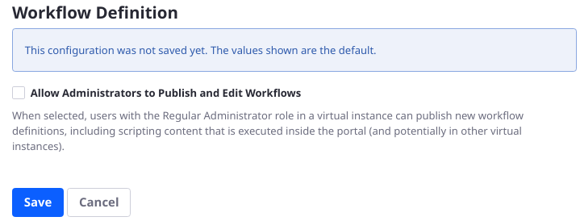
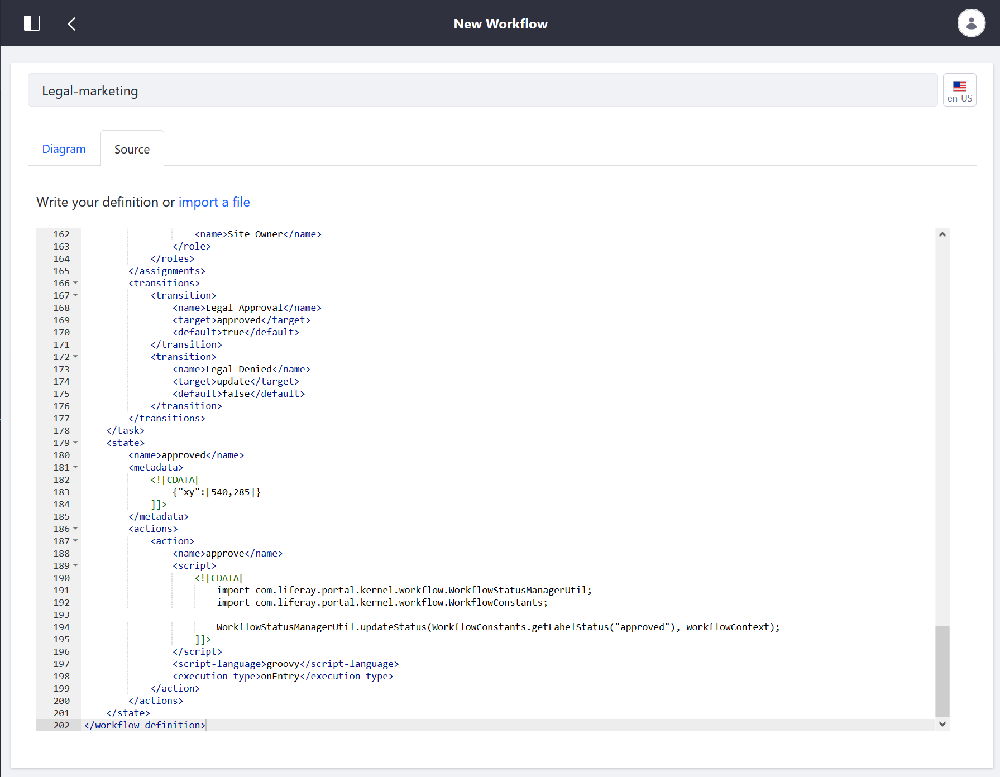
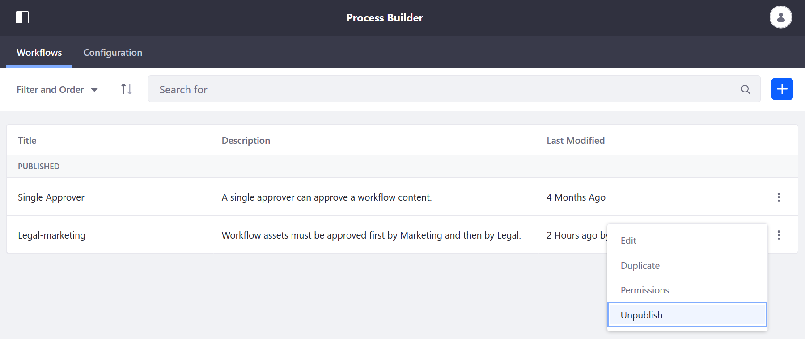

# Managing Workflows

The _Workflow_ application allows users to manage their workflow processes; they can upload a new workflow definition, and make changes to the definitions. Lastly, they can delete workflows.

## Workflow Definition Publication Permissions

Users with permission to edit or publish workflow definitions can add [Groovy scripts](../../../system-administration/using-the-script-engine/using-the-script-engine.md) to the workflow. Access to the scripting engine means access to the server's Java Virtual Machine (JVM). Users with permission to publish (or edit) can therefore access any data within the reach of the JVM, such as data contained in a separate [Virtual Instance](../system-administration/../../../system-administration/configuring-liferay/virtual-instances/understanding-virtual-instances.md) of Liferay DXP.

Because of this far-reaching access, permission to create or edit workflow definitions is limited to Regular Administrators of the Default Virtual Instance. For Liferay DXP customers, Users (e.g., Site Administrators) can also edit and publish workflows with their access to the Kaleo Designer and Kaleo Forms Admin applications.

To grant Users with these Roles the workflow publication access in additional Virtual Instances,

1. Make sure you understand the [access you're granting these administrators](../../../users-and-permissions/roles-and-permissions/understanding-roles-and-permissions.md).
1. Navigate to Control Panel &rarr; System Settings &rarr; Workflow &rarr; Workflow Definition.
1. Check the box for the setting _Allow Administrators to Publish and Edit Workflows_.

This only applies to Virtual Instances that have been added to the system. The Default Virtual Instance provides out of the box workflow publication access to Regular Administrators, via Control Panel &rarr; Workflow &rarr; Process Builder and for Liferay DXP subscribers via the Kaleo Forms Admin application.

## Uploading a New Workflow Definition

Workflow process definitions can be [built in Liferay](./building-workflows.md) or uploaded in `XML` format. DXP workflow definitions are written in `XML` format; see the [Introduction to Crafting XML Workflow Definitions](https://help.liferay.com/hc/articles/360029147791-Introduction-to-Crafting-XML-Workflow-Definitions) to learn more.

To upload a new definition:

1. Navigate to the _Control Panel_ &rarr; _Workflow_ &rarr; _Process Builder_.
1. Click the _New Workflow_ button ().
1. If you have a local XML definition file based on an embedded workflow, you can upload it to DXP. Click the _Source_ tab.
1. Enter a name for the new definition.
1. Copy the content of the XML file and and overwrite the sample code or click "_import a file_" to upload the file.

    

1. Click the _Save_ button.
1. Click the _Publish_ button.

The newly added definition is ready to be used as a workflow process.

## Editing a Workflow Definition

To edit a workflow:

1. Navigate to the _Control Panel_ &rarr; _Workflow_ &rarr; _Process Builder_.
1. Click the _Actions_ button () for the workflow then _Edit_.

    

Changes to Workflow Definitions are tracked in the _Details_ and _Revision History_ menus.

### Viewing and Restoring Workflow Revisions

To view the workflow definition details and the revision history:

1. Click the *Information* button ()
1. Next to a previous version on the _Revision History_ tab, click the *Actions* button () and select either *Preview* or *Restore*.

    

1. When you click *Restore* and see the success message, the prior version is the current version of the workflow. You can now edit the restored version of the workflow.
1. If edits are necessary, edit and click *Update*. This creates another version of the workflow.

## Deleting a Workflow Definition

There are two statuses for a workflow:

* **Published:** Validation is complete, and the workflow can be assigned to assets.
* **Unpublished:** Validation is not performed on the unpublished workflow, and it cannot be assigned to assets until it is published.

Only *Unpublished* workflows can be deleted.

_Published_ workflow definitions cannot be deleted if they are current associated with an asset type. Users have to first deactivate the workflow process and then place the workflow in the _Unpublished_ status.

1. To deactivate an asset type's workflow, reverse the steps found in the [Activating Workflow](../using-workflows/activating-workflow.md) article for each asset type and select _No Workflow_.
1. Navigate to the _Control Panel_ &rarr; _Workflow_ &rarr; _Process Builder_.
1. Click the _Actions_ button () for the workflow then _Unpublish_.

    

1. The selected definition is now in the _Unpublished_ section. Click the _Actions_ button () for the workflow then _Delete_.

    

## Additional Information

* [Crafting XML Workflow Definitions](../developer-guide/crafting-xml-workflow-definitions.md)
* [Workflow Designer Overview (Subscription)](./workflow-designer-overview.md)
