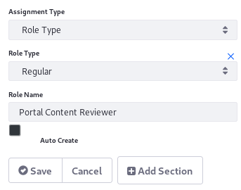

# Assigning Task Nodes

> Subscribers

Once you have [created a few task nodes](./creating-workflow-tasks.md), you must assign a Workflow _Task_ to a User or "entity" to complete the review; in DXP, this entity is loosely defined. You can assign the Tasks to specific Roles, multiple Roles of a [Role Type](../../../../users-and-permissions/roles-and-permissions/understanding-roles-and-permissions.md) (Organization, Site, or regular Role types), to the Asset Creator, to Resource Actions, or to specific Users. In the example below, this task has been assigned to a Portal Content Reviewer Role.



 Additionally, you can write a script to define the assignment (see below).

## Resource Action Assignments

You can assign a workflow task to a _Resource Action_. Resource actions are operations performed by Users on an application or entity. For example, a User might have permission to update Message Boards Messages. This is called an UPDATE resource action, because the User can update the resource. If your workflow definition specifies the UPDATE action in an assignment, anyone with permission to update the asset type being processed in the workflow is assigned to the task. You can configure multiple assignments for a task.

To learn more about Resource Actions, refer to the developer tutorial on the [permission system](../../../developing-applications/permissions.md) for a more detailed explanation.

Here's what the assignment looks like in the Source (Workflow XML) tab:

```xml
<assignments>
    <resource-actions>
        <resource-action>UPDATE</resource-action>
    </resource-actions>
</assignments>
```

You can assign the workflow to the appropriate workflow enabled asset.

Now when the workflow proceeds to the task with the resource action assignment, Users with `UPDATE` permission on the resource (for example, Message Boards Messages) are notified of the task and can assign it to themselves (if the notification is set to Task Assignees). Specifically, Users see the tasks in their *My Workflow Tasks* application under the tab *Assigned to My Roles*.

Use all upper case letters for resource action names. Here are some common resource actions:

* UPDATE
* ADD
* DELETE
* VIEW
* PERMISSIONS
* SUBSCRIBE
* ADD_DISCUSSION

You can determine the probable resource action name from the permissions screen for that resource. For example, in Message Boards, one of the permissions displayed on that screen is *Add Discussion*. Convert that to all uppercase and replace the space with an underscore, and you have the action name.

### Scripted Assignments

You can also use a script to manage the assignment. Here's the script for the Review task assignment in the Scripted Single Approver workflow definition (`single-approver-definition-scripted-assignment.xml`):

```groovy
import com.liferay.portal.kernel.model.Group;
import com.liferay.portal.kernel.model.Role;
import com.liferay.portal.kernel.service.GroupLocalServiceUtil;
import com.liferay.portal.kernel.service.RoleLocalServiceUtil;
import com.liferay.portal.kernel.util.GetterUtil;
import com.liferay.portal.kernel.workflow.WorkflowConstants;

long companyId = GetterUtil.getLong((String)workflowContext.get(WorkflowConstants.CONTEXT_COMPANY_ID));

long groupId = GetterUtil.getLong((String)workflowContext.get(WorkflowConstants.CONTEXT_GROUP_ID));

Group group = GroupLocalServiceUtil.getGroup(groupId);

roles = new ArrayList<Role>();

Role adminRole = RoleLocalServiceUtil.getRole(companyId, "Administrator");

roles.add(adminRole);

if (group.isOrganization()) {
    Role role = RoleLocalServiceUtil.getRole(companyId, "Organization Content Reviewer");

    roles.add(role);
}
else {
    Role role = RoleLocalServiceUtil.getRole(companyId, "Site Content Reviewer");

    roles.add(role);
}

user = null;
```

This script assigns the task to the *Administrator* Role, then checks if the asset's *group* is an Organization. If so, it assigns it to the *Organization Content Reviewer* Role. If not, it assigns the task to the *Site Content Reviewer* Role.

Note the `roles = new ArrayList<Role>();` line above. In a scripted assignment, the `roles` variable is where you specify any Roles the task is assigned to. For example, when `roles.add(adminRole);` is called, the Administrator Role is added to the assignment.

## Additional Information

* [Creating Workflow Tasks](./creating-workflow-tasks.md)
* [Using Task Nodes](./workflow-nodes.md)
