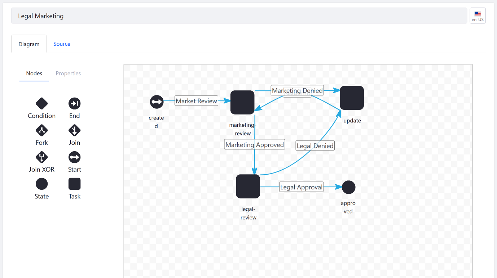

# Introduction to the Workflow Designer

> Subscribers

 The Workflow Designer is a graphical designer lets users develop their own workflow definitions so their assets go through a review process before publication. By using a convenient drag and drop user interface, users do not need to be familiar with writing XML definitions by hand. Lastly, some of the features can be enhanced Groovy (a supported Java-based scripting language) scripts.

To start building a new workflow:

1. Navigate to the _Control Panel_ &rarr; _Workflow_ &rarr; _Process Builder_.
1. Click the Add button ().
1. Click on the _Diagram_ tab.

    

```tip::
   Alternately, users can upload XML scripts then modify the definition using the user interface. To learn more about uploading an XML script, see `Managing Workflows <./managing-workflows.md#uploading-a-new-workflow-definition>`_.
```

Each Workflow Node represents a specific point in an approval process, whether it is starting the review process, approving or rejecting the asset, or reassigning the task.

Workflow transitions link each node to create the desired flow in the review process. On exiting the first node, processing continues to the next node indicated by the transition.

## Additional Information

* [Managing Workflow with Designer](./workflow-designer/managing-workflow-with-designer.md)
* [Workflow Designer Nodes]
* [Workflow Designer Workflow Processing]
* [Creating Workflow Tasks](./workflow-designer/creating-workflow-tasks.md)
* [Configuring Workflow Actions and Notifications](./workflow-designer/configuring-workflow-actions-and-notifications.md)
* [Workflow Designer Nodes Reference](./workflow-designer/workflow-designer-nodes-reference.md)
