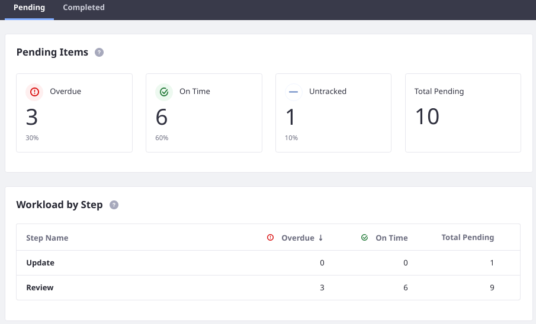

# Introduction to Workflow

Liferay DXP ships with a workflow engine that allows users to review and approve content such as Blogs, Web Content, Wikis before they are published. As you define your review processes, DXP's _Workflow_ application makes it possible to define any number of simple to complex business processes/workflows, deploy them, and manage them through a portal interface. These approval processes are defined in several XML documents and can leverage Users, Groups, and Roles as reviewers and approvers. After you defined your review process, you can select which types of content requires a review process before publication.

If you're a DXP subscriber, you also have access to a visual process builder called _Kaleo Forms_.

## Activating Workflow

When a workflow is activated for a particular asset, the _Publish_ button is replaced by a _Submit for Publication_ button, and instead of instant publication, the asset's status is set as _Pending_. It must proceed through the workflow before publication.

The out-of-the-box workflow process is called _Single Approver_; that means only one person is required to review and approve submissions before publication.

To learn more, see the [Activating Workflow](./activating-workflow.md) and [Sending assets through review](./reviewing-assets.md) articles.

## Building a Workflow

DXP _Workflow_ allows users to build more complex workflows that can have multiple reviewers and approvers. Learn how to build an effective workflow:

* [Designing review processes in XML](https://help.liferay.com/hc/articles/360029147791-Introduction-to-Crafting-XML-Workflow-Definitions)
* (Subscriber only) [Visually designing review processes](https://help.liferay.com/hc/articles/360028821892-Workflow-Designer)
* [Uploading workflow definitions](./managing-workflows.md#uploading-workflow-definitions)
* [Managing Workflow definitions](./managing-workflows.md)
* (Subscriber only) [Using Workflow Metrics](./using-workflow-metrics.md)

To start building your own workflows, see [Building Workflows](./building-workflows.md).

### Workflow Definition Permissions

In the _System Settings_, you can enable or disable permissions for site administrators to publish workflows and scripts.

### Implementing SLAs

SLAs define the deadlines on a workflow process's events. They can be formally agreed-upon deadlines between you and your customers, or informally created to meet internal goals, tracking events such as:

* Total time to resolution
* Time to complete a specific workflow task

Once an SLA is set, workflow submissions that trigger the SLA timer are automatically reported on by the workflow metrics framework, and given the status _on time_ or _overdue_.

See the [Using Workflow Metrics](./using-workflow-metrics.md) article to learn how to add SLAs into your workflows.

### Embedded Workflows

In additional to the out-of-the-box workflow _Single Approver_ definition, there are some workflow definitions that ship with DXP but are not pre-installed. They are primarily included for test cases but you can still leverage them to build your specific workflow processes.

To learn more about the embedded workflows, see [Using Embedded Workflows]()

## What's Next

* [Activating Workflow](./activating-workflow.md)
* [Managing Workflows](./managing-workflows.md)
* [Building Workflows](./building-workflows.md)
