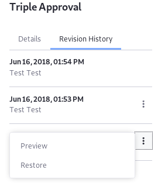
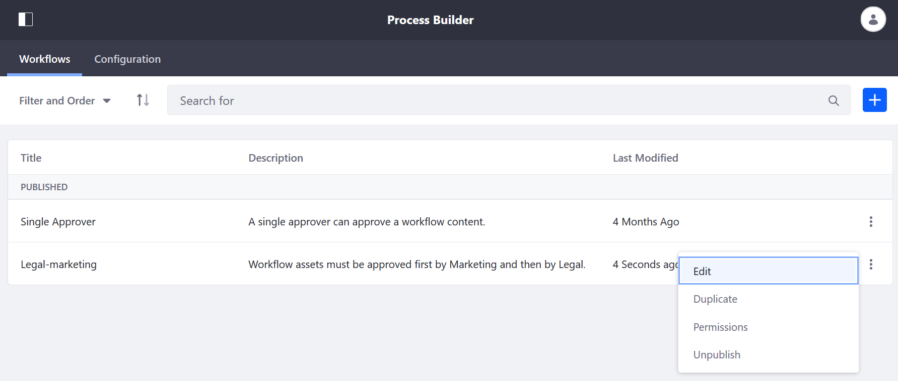
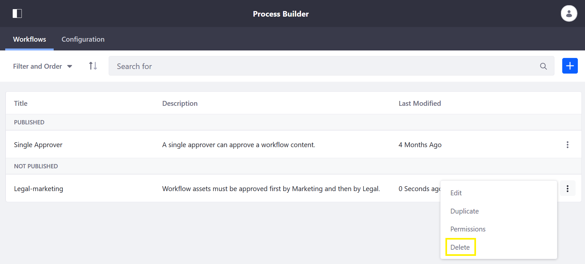

# Managing Workflows

Liferay DXP's _Workflow_ application allows users to manage their workflow processes; they can upload a new workflow definition, and make changes to the definitions. Lastly, they can delete workflows.

## Uploading a New Workflow Definition

If you are not [building a new workflow process](./building-workflows.md), you can upload one in `XML` format. All DXP workflow definitions are written in `XML` format; see the [Introduction to Crafting XML Workflow Definitions](https://help.liferay.com/hc/articles/360029147791-Introduction-to-Crafting-XML-Workflow-Definitions) to learn more.

To upload a new definition:

1. Navigate to the _Control Panel_ &rarr; _Workflow_ &rarr; _Process Builder_.
1. Click the _New Workflow_ button ().
1. If you have a local XML definition file based on an embedded workflow, you can upload it to DXP. Click the _Source_ tab.
1. Enter a name for the new definition.
1. Copy the content of the XML file and and overwrite the sample code or click _import a file_ to upload the file.

    

1. Click the _Save_ button.
1. Click the _Diagram_ tab to view the workflow definition as an image.

    

1. Click the _Publish_ button.

The newly added definition is ready to be used as a workflow process.

## Editing a Workflow Definition

Users can edit the workflow definitions and all changes are tracked in the _Details_ and _Revision History_ menus. To edit a workflow:

1. Navigate to the _Control Panel_ &rarr; _Workflow_ &rarr; _Process Builder_.
1. Click the _Actions_ button () for the workflow then _Edit_.

    

### Workflow Versions

To view the workflow definition details and the revision history:

1. Click the *Information* button ()
1. Next to a previous version on the _Revision History_ tab, click the *Actions* button () and select either *Preview* or *Restore*.

    

1. When you click *Restore* and see the success message, the prior version is the current version of the workflow. You can now edit the restored version of the workflow.
1. If edits are necessary, edit and click *Update*. This creates another version of the workflow.

## Deleting a Definition

There are two statuses for a workflow:

* **Published:** Validation is complete, and the workflow can be assigned to assets; cannot be deleted.
* **Unpublished:** Validation is not performed on the unpublished workflow, and it cannot be assigned to assets until it is published; _can_ be deleted.

_Published_ workflow definitions cannot be deleted if they are current associated with an asset type. Users have to first deactivate the workflow process and then place the workflow in the _Unpublished_ status.

1. To deactivate an asset type's workflow, reverse the steps found in the [Activating Workflow](./activating-workflow.md) article for each asset type and select _No Workflow_.
1. Navigate to the _Control Panel_ &rarr; _Workflow_ &rarr; _Process Builder_.
1. Click the _Actions_ button () for the workflow then _Unpublish_.

    

1. The selected definition is now in the _Unpublished_ section. Click the _Actions_ button () for the workflow then _Delete_.

    

## Additional Information

* [Introduction to Crafting XML Workflow Definitions](https://help.liferay.com/hc/articles/360029147791-Introduction-to-Crafting-XML-Workflow-Definitions)
* [Workflow Designer (DXP only)](https://help.liferay.com/hc/articles/360028821892-Workflow-Designer)
