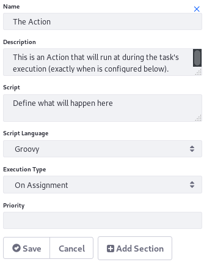
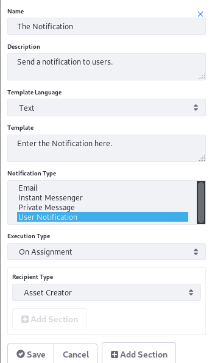

# Configuring Workflow Actions and Notifications

Actions do additional processing before entering the node, after exiting a node, or once a task node is assigned. They're configured by accessing a node's Properties tab, then double clicking _Actions_.



The Single Approver workflow contains an Update task with an action written in Groovy that sets the status of the asset as _denied_, then sets it to _pending_.

```java
    import com.liferay.portal.kernel.workflow.WorkflowStatusManagerUtil;
    import com.liferay.portal.kernel.workflow.WorkflowConstants;

    WorkflowStatusManagerUtil.updateStatus(WorkflowConstants.getLabelStatus("denied"), workflowContext);
    WorkflowStatusManagerUtil.updateStatus(WorkflowConstants.getLabelStatus("pending"), workflowContext);
```

Why would the action script first set the status to one thing and then to another like that? Because for some assets, the *denied* status sends the asset creator an email notification that the item has been denied.

The end node in your workflow definition has an action configured on it by default, on entry to the end node:

```java
    import com.liferay.portal.kernel.workflow.WorkflowStatusManagerUtil;
    import com.liferay.portal.kernel.workflow.WorkflowConstants;

    WorkflowStatusManagerUtil.updateStatus(WorkflowConstants.getLabelStatus("approved"), workflowContext);
```

This is a Groovy script that updates the status to *approved*, since that's usually the goal of a workflow process.

Workflow Notifications are sent to tell task assignees that the workflow needs attention or to update asset creators on the status of the process. They can be sent for tasks or any other type of node in the workflow. To set up notifications, double click on *Notifications* in a node's Properties tab and create a notification.



You must specify the Notification Type, and you can choose User Notification, Email, Instant Messenger, or Private Message. You can use Freemarker if you need a template, or you can choose to write a plain text message.

Here's a basic Freemarker template that reports the name of the asset creator and the type of asset in the notification:

```freemarker
    ${userName} sent you a ${entryType} for review in the workflow.
```

You can also choose to link the sending of the notification to entry into the node (On Entry), when a task is assigned (On Assignment), or when the workflow processing is leaving a node (On Exit). You can configure multiple notifications on a node.

Commonly, the assignment and notification settings are teamed up so a user receives a notification when assigned a task in the workflow. To do this, choose *Task Assignees* under Recipient Type when configuring the notification.

| **Note:** The _from name_ and _from address_ of an email notification are configurable via portal properties. Place these settings into a `portal-ext.properties` file, in your Liferay Home folder:

    ```
     workflow.email.from.name=
     workflow.email.from.address=
    ```

 Then restart the server.

These can also be set programmatically into the `WorkflowContext`, and the programmatic setting always takes precedence over the system scoped portal property.
