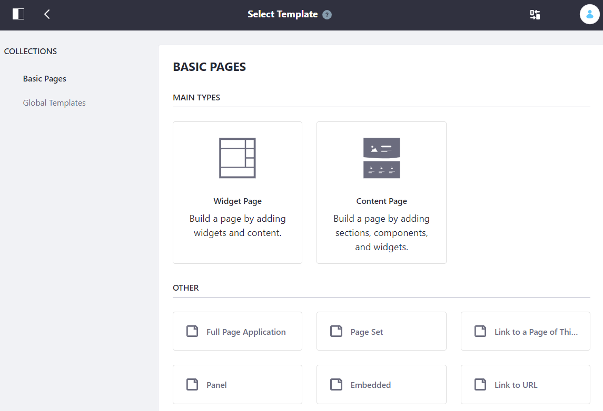
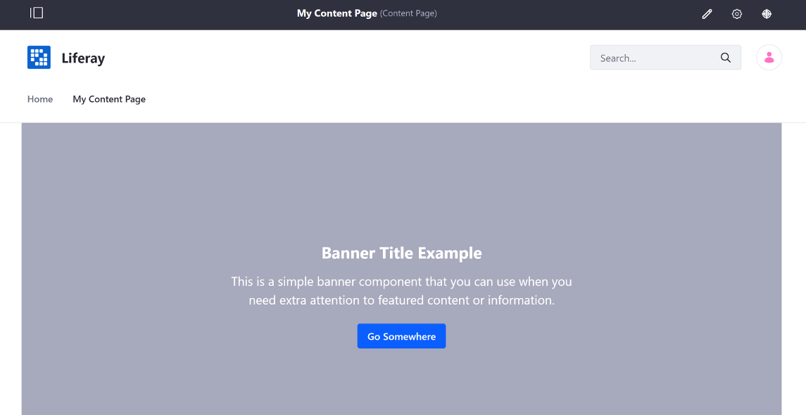
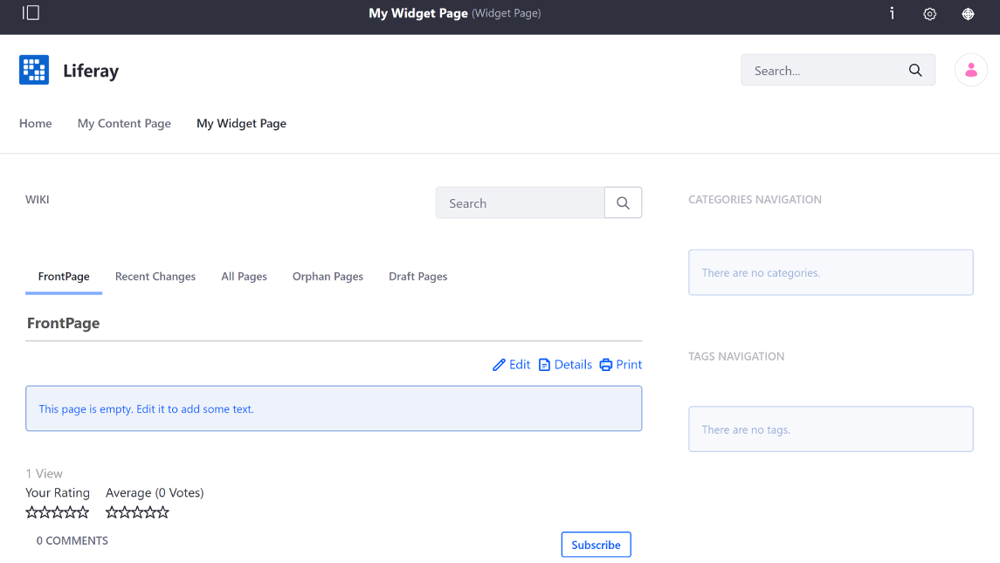
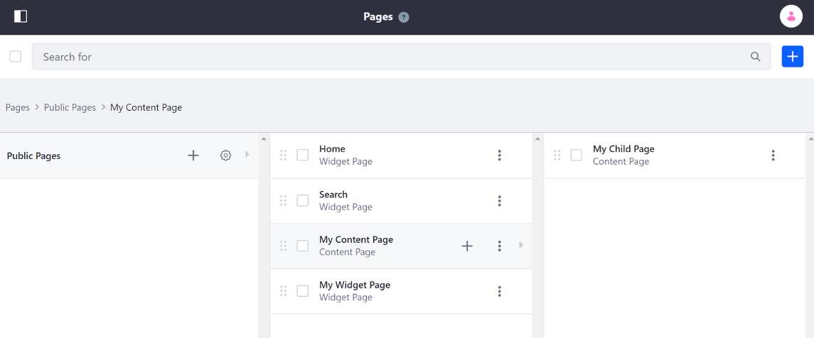

# Understanding Pages

Pages on Liferay DXP are primarily used to display content and applications to users of a Site.

## Page Sets

When adding Pages for a site, the pages are created as part of a Page Set: **Public Pages** or **Private Pages**.

| Behavior | Public Pages | Private Pages |
| --- | --- |---|
| Visible to unauthenticated users | &#10004; |  |
| Viewing requires Login and Site Membership |  | &#10004; |
| Distinct URL pattern | &#10004; | &#10004; |

## Page Types

There are several page types available when you [add a page](./02-adding-a-page-to-a-site.md). The two most commonly used types are **Content Pages** and **Widget Pages**. You can also create a page based on a [Page Template](./07-creating-a-page-template.md). The available page types and Page Templates are described here.

After you've added a page, it may be difficult to track what kind of page you're currently viewing. The page type appears at the top of the page to help you determine the administration options you have and where you need to go to configure the page.

### Content Pages

Content Pages enable users to build pages that can be easily managed and have their content edited in-line on the fly. Content Pages are primarily built using [Page Fragments](TODO), but also allow users to add widgets.

Some key features of Content Pages are listed below:

<!-- To clarify: Are the below features exclusively usable only when using Content Pages? Someone cannot do a/b testing or personalize experiences for users (however we define that) w/ a widget page?-->
<!--Yes, that is correct-->

* [Personalized Experiences](../../05-personalizing-site-experience/02-experience-personalization/01-personalization-intro.md)
* [A/B Testing](TODO)
* Simplified User
* More powerful for non-technical users compared to Widget Pages

### Widget Pages

A Widget Page is a page with a [set layout](link-to-something-about-layout-templates) that allows *widgets* (applications) to be displayed. Widgets can display content or add interactive and dynamic functionality to the page. When you first start Liferay Portal, you get a Widget Page by default as your home page. See [Adding Widgets to a Page](./adding-widgets-to-a-page.md) for more information.

### Content Pages and Widget Pages Compared

<!-- Example table -->
| Feature |  Content Pages | Widget Pages |
| --- | --- |---|
| Ability to Add Widgets | &#10004; | &#10004; |
| Advanced Custom Layouts |  | &#10004; |
| User-Customizable Columns |  | &#10004; |
| Staging Page Variations |  | &#10004; |

### Other Page Types

There are several other page types that are available in DXP - each can help to satisfy particular use cases. See [Other Page Types](./other-page-types.md) for more information.

## Global Page Templates

When adding a page, you also have the option to choose a Page Template. Page Templates are pre-set pages with applications already deployed to the page. By default, only *Global Templates* are available, but additional collections you create appear as an option as well.

| Global Page Template | Description |
| --- | --- |
| Blog | Creates a Blogs Widget Page with a Blogs widget, a Tag Cloud widget, and a Recent Bloggers widget. |
| Search | Creates a Widget Page with a Search Bar widget, a Search Results widget, and a Search Options widget. |
| Wiki | Creates a Widget Page with a Wiki widget, a Categories Navigation widget, and a Tags Navigation widget. |

Learn more about Page Templates:

* Adding a Page Using a Page Template
* [Creating a Page Template](./07-creating-a-page-template)

## Child Pages and Page Hierarchy

Pages can also be created in a hierarchical fashion by creating Child Pages. Child Pages can be useful if you have multiple pages that can be organized into categories.

## Next Steps

* [Adding a Page](./adding-a-page-to-a-site.md)
* [Configuring Individual Pages](./configuring-individual-pages.md)
* [Personalizing Pages](./personalizing-pages.md)
