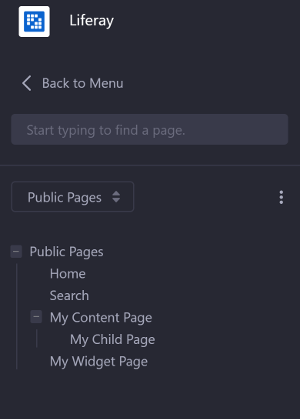
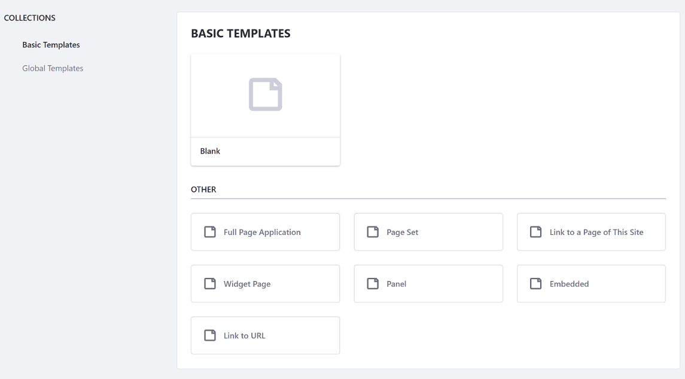

# Adding a Page to a Site

The steps below describe how to add a new page to your Site and configure the general options. To learn how to configure the remaining page settings, see [Configuring Individual Pages](./06-configuring-individual-pages.md), or see [Configuring Page Sets](./05-configuring-page-sets.md) to configure options for the [Page Set](./01-understanding-pages.md#page-sets).

## Adding a New Page

Follow these steps to add a page:

1. Navigate to your desired Site by using the [Site Menu](../../getting-started/navigating-dxp.md#site-menu).

1. Go to *Site Builder* &rarr; *Pages* under the Site Menu.

    

    ```tip::
       Alternatively, since Liferay DXP 7.3, you can click the () icon next to the Site name to open the Page Tree Menu. You can use the Page Tree Menu to quickly find a page by keyword in the search bar, navigate to a page by selecting it, or even add pages through the Actions Menu.
    ```

    

1. On the Pages page, click the *Add* button () to create a top-level page.

1. Click the *Blank* Master Page Template to create a [Content Page](./01-understanding-pages.md#page-types), or select [another page type](./other-page-types.md) under the *Other* heading or a Page Template listed under the *Global Template* menu. Prior to Liferay DXP 7.3, page types are listed under *Basic Pages*.

    

1. Enter a Name and configure the remaining settings for the page. <!-- Are the instructions that follow part of configuring settings for the page OR are we providing the instructions as a Next Step for the reader? --> <!-- Follow the instructions in [Configuring Content Pages](./04-building-content-pages.md) if you're adding a Content Page. -->
<!--
I guess it would be more of a next step. The Save Option doesn't show up for the next step until the user builds the Content Page.
-->

1. Click *Save* to create the page.

    ```tip::
       Creating a page by default also adds it to any Navigation Menus that are configured to have new pages added to them. Learn more about `Configuring Site Navigation <../04-site-navigation/README.md>`_.
    ```

## Adding a Child Page

You can add child pages through either the Pages page or the Page Tree Menu.

To add a child page through the Pages page, follow these steps:

1. Open the Product Menu and go to *Site Builder* &rarr; *Pages* under your Site's menu.
1. Click the *Add* button () next to an existing page. You can also click the *Add* button () in the top right of the Pages page to create a top-level page.
1. Follow the standard steps for creating a page, as outline above.

To add a child page through the Page Tree Menu, follow these steps:

1. Open the Product Menu and click the () icon next to the Site name to open the Page Tree Menu.
1. Select *Add Child Page* from the Actions Menu next to an existing page to create a nested child page for it.
1. Follow the standard steps for creating a page, as outline above.

You can nest pages as deep as you like.

## Additional Information

* [Understanding Pages](./understanding-pages.md)
* [Content Page Overview](./content-page-overview.md)
