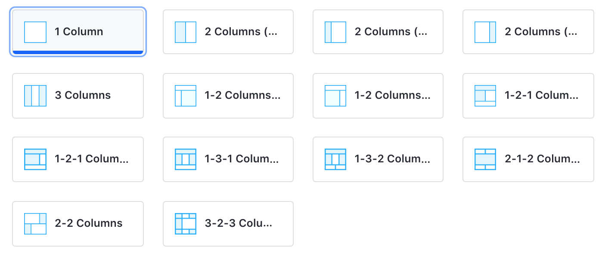
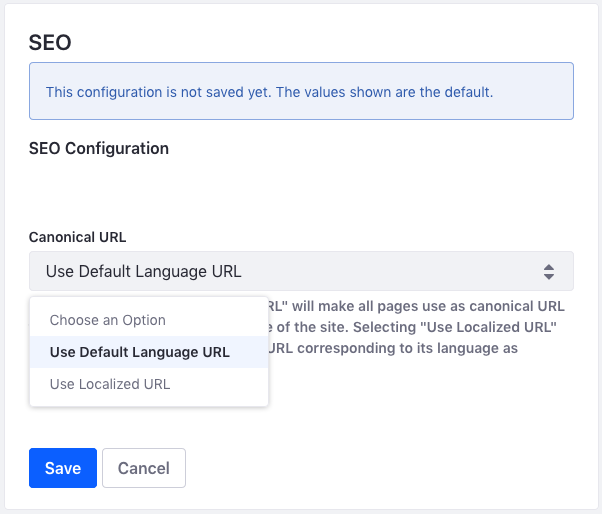
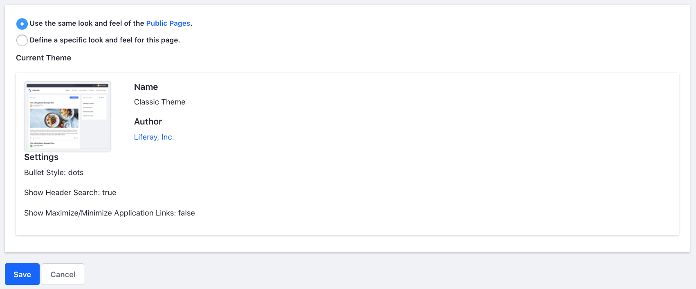

# Configuring Individual Pages

After you've configured your Page Set, you can reconfigure some options at the individual page level, including options that weren't available when you initially created the page. Options selected here only affect the page you've selected; they don't affect other pages of the site. Many of these options are the same as those that configure the complete Page Set; See [Configuring Page Sets](./05-configuring-page-sets.md) for more information on those.

To configure an individual page, follow these steps:

1. Open the Product Menu and go to *Site Builder* &rarr; *Pages* under your site's menu. Alternatively, since Liferay DXP 7.3, you can click the () icon next to the Site name to open the Page Tree Menu.
    
1. Open the Actions menu () next to the page you want to configure and select &rarr; *Configure*. Alternatively, you can click the *Configure* icon on the top right of any page.

1. Update the settings under the [*General*](#general), [*SEO*](#seo), [*Look and Feel*](#look-and-feel), and [*Advanced*](#advanced) tabs with the new values. Note that the *Look and Feel* and *Advanced* tabs aren't available for Content Pages

  ```note::
    Many of the configuration field values are localizable. Click the language flag next to a localized field, select the desired flag for the localization, and provide the translation for the user's locale to translate the field.
  ```

1. Click *Save* to apply the updates to the page.

The available page settings are described in more detail below.

## General

The *General* tab lets you configure the basic information and the design for Widget Pages. You can change the *Name*, *Friendly URL*, and *Page Layout* (Widget Pages only). 

**Name:** The title that appears in the browser's title bar, and how the page is identified in the navigation

**Hidden from Navigation Menu Widget:** Whether to include the page in the navigation.

**Friendly URL:** Defines the page's link. It's best practice to have the URL match the name of the Page, so you should update both fields at the same time.

**Inherit Changes:** Defines whether to inherit changes made to the Page Template. This option is only available for pages based on a Page Template, and it is enabled by default. See [Propagating Changes](./07-creating-a-page-template.md#propagating-changes) for more information.

**Page Layout (only available for Widget Pages):** For Widget Pages, you can select a Layout Template that defines droppable locations for widgets. Layout Templates define a number of sections with columns and rows. Widgets added to a section expand (or contract) horizontally to fill the space and can be stacked vertically. 



## SEO

The *SEO* tab provides categorization fields for organizing the page and Search Engine Optimization (SEO) fields for managing the indexing options for the page.

### Categorization

The *Categorization* section shows the categorization options. These tools help organize the page so users can find it through search and navigation. For more information on using tags and categories, see [Organizing Content with Tags and Categories](TODO).

### SEO

SEO provides several ways to optimize the data the page provides to an indexer that's crawling the page. 

**HTML Title:** Sets the value of the `<title>` element for the page, which defines the document's title displayed in the browser's title bar or page's tab in the browser.

**Meta Tags:** Sets the meta information for the Site's description, keywords, and robots.

**Sitemap:** tells robots how frequently the page is updated and how it should be prioritized.

  * *Include:* Whether to include the page in the sitemap.
  
  * *Page Priority:* The priority of the page's URL relative to other URLs for the site. See the Sitemap Protocol's [`<priority>` tag](https://www.sitemaps.org/protocol.html#prioritydef) for more information.
  
  * *Change Frequency:* How frequently the page is likely to change. See the Sitemap Protocol's [`<changefreq>` tag](https://www.sitemaps.org/protocol.html#changefreqdef) for more information.

**Canonical URL:** Each asset (web content article, blog entry, etc.) has a unique URL. From the search engine's point of view, this makes your pages rank higher since any references to variations of a specific URL are considered references to the same page. You can also use a canonical URL. If the page is localized, you can set whether to generate canonical links by language. If you want to set some of these settings for the entire Site, you can specify them from the Sitemaps and Robots tabs of the Manage Site Settings dialog box (see below).

  * *Use Custom Canonical URL:* Whether to use a custom canonical URL for the page instead of using the System Settings configuration. Once enabled, enter your desired canonical URL in the field that appears. You can define a custom canonical URL for each language. If there's no value for a specific language, the canonical URL for that language is controlled by the global/instance-level setting. 

  

You can also configure canonical URLs at the global and instance levels. 

```note::
  Any custom canonical URLs set for individual pages take precedent over the global and instance level settings.
```

1. Open the Product Menu and go to *Control Panel* &rarr; *Configuration* 

1. Click on the scope: *System Settings* or *Instance Settings*. 

1. Go to *Pages* &rarr; *SEO* and choose one of these options in the *Canonical URL* menu:

  **Use Default Language URL (default):** When a user visits a page in any supported language, the default language's URL is used as the canonical URL. 

  **Use Localized URL:** The page's localized URL is used as the canonical URL.



## Look and Feel

*Look and Feel* lets you set a page-specific theme. You can inherit what you already have configured for your [Page Set's Theme](./05-configuring-page-sets.md#look-and-feel), or you can define a theme per page. This section is available for Content Pages through the [*Look and Feel* menu](./03-content-page-elements.md#look-and-feel) of the Section Builder.

Follow these steps to manage the Theme for a page:

1. Click the radio button for *Define a specific look and feel for this page*.

1. Optionally click the *Change Current Theme* button to choose a different Theme.

1. Modify the available theme settings, color scheme(s), and CSS for the Theme and click *Save* to apply the changes to the page. See the [Configuring Page Sets](./05-configuring-page-sets.md#current-theme) for more information on the available settings for themes.



## Advanced

The *Advanced* tab contains options useful for specific cases. Some of these are the same as the options available at the Site or Page Set level, but *Custom Fields*, *Embedded Widgets*, and *Customization Settings* are unique to the individual page configuration.

```warning::
  The *Advanced* section contains powerful options that should only be used by those with a firm command of the technology, or they can have major unintended side effects. Proceed with caution.
```

### Advanced Section

*Query String:* Provides parameters to the page. This can be useful for web content templates.

*Target:* sets a target for the page so that it pops up in a particularly named window or appears in a frameset.

*Icon:* Sets an icon for the page that appears in the navigation menu.

### Custom Fields

*Custom Fields* lets you edit the custom fields you have configured for the *Page* resource. These are metadata about the page and can be anything you like, such as author or creation date. If you don't have any custom fields configured in your Site, this option doesn't appear. See [Custom Fields](TODO) for more information on creating Custom Fields.

### Embedded Widgets

This option only appears if you have embedded one or more widgets on the page. 

Widgets can be embedded on a page via a web content template or Fragment. See [Adding Templates](TODO) for more information. You can embed a widget on a page layout or theme programmatically. See [Embedding Portlets in Themes](TODO) for more information.

### JavaScript

Code entered in the JavaScript editor is executed at the bottom of the page. Your page's JavaScript is most likely (and should be) included with the Theme. However, this may be a good place to quickly test JavaScript code on a page while not in production.

This configuration option is also available for Page Sets like Public Pages and Private Pages. See the [JavaScript section](./05-configuring-page-sets.md#javascript) of Configuring Page Sets for more information.

### Mobile Device Rules

Apply rules for how this page should render for various mobile devices here. See [Mobile Device Rules](TODO) for more information.

### Customization Settings

This configuration option is only available for Widget Pages. It lets you make portions of the page customizable for site members. You can learn more about page customizations in [Personalizing Pages](./09-personalizing-pages.md).
