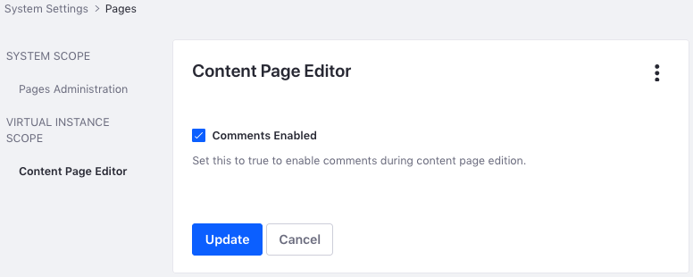

# Enabling and Using Fragment Comments

Comments are a useful tool for collaborating on Fragments. They're included out-of-the-box in Liferay Portal CE 7.3, but they are disabled in Liferay Portal CE 7.2.

## Disabling and Enabling Fragment Comments

You can enable/disable comments for Fragments in Liferay Portal CE 7.2 and Liferay Portal CE 7.3 through System Settings. Follow these steps:

1. Open the Product Menu and go to *Control Panel* &rarr; *Configuration* &rarr; *System Settings* &rarr; *Content and Data* &rarr; *Pages*.
1. Select *Content Page Editor* under the Virtual Instance scope.
1. Check/uncheck the *Comments Enabled* checkbox and click *Update*.

This affects content page comments for all instances. To control this on an instance-by-instance basis, navigate to the same setting in *Instance Settings* (instead of System Settings).

## Using Fragment Comments

If comments are enabled, you can access them via the *Comments* icon (). The comments appear for the selected Fragment. These actions are available for Fragment comments:

* Add new comments and reply to any existing ones.
* Resolve comments by clicking the checkbox for each. Resolving a comment hides it from view, unless *Show Resolved Comments* is selected.
* Edit and delete your own comments via the Actions button () for each.

If you de-select a Fragment or enter the comments UI without a Fragment selected, a list of the Fragments on the page appears with the number of comments for each. Selecting a Fragment then shows its comments.

