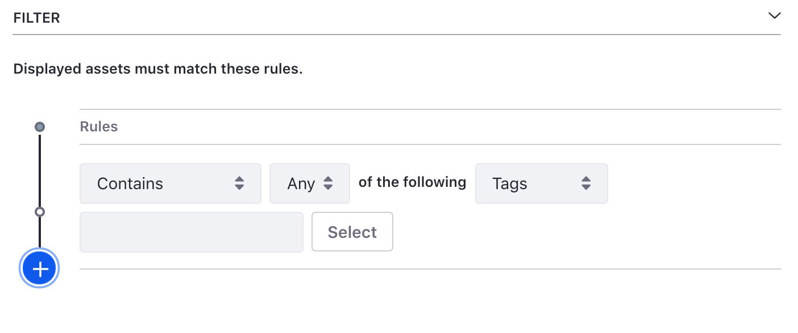

# Selecting Assets

You can configure the Asset Publisher to select assets manually, specifying exactly what assets to display, or you can configure it to select assets dynamically based on specific criteria. Both approaches are flexible; it just depends on your requirements.

## Selecting Assets Dynamically

By default, the Asset Publisher selects assets dynamically, according to a set of customizable rules. These rules can be combined to compliment each other to create a nice, refined query for your content. Assets are filtered by permissions automatically, no matter how complicated your asset selection rules are. You have the following rule types:

To enable dynamic asset selection, follow these steps:

1. Hover over the Asset Publisher and click the Options icon () in the widget's menu and select *Configuration*.

1. In the Asset Publisher configuration, click the *Dynamic* radio button beneath *Asset Selection* if it's not already selected.

1. Expand the *Source* panel and select the type of Assets to display. By default, all (any) assets are displayed.

1. Select a *Scope*. A list of configured scopes appears under the Scope heading. You can configure multiple scopes, including the global scope, from which to select assets. Remove a scope with the *X* button at the right. Add a scope with the *Select* button.

  
 
1. Optionally specify any filters for tags, categories, or keywords that you need under the *Filter* heading.

  

1. Optionally expand the *Custom User Attributes* heading and specify categories for the assets to match. These categories must be from the global context. See [Defining Categories for Content](TODO) for more information.

1. Expand the *Ordering* panel and specify how to order and group the assets. For example, you can display a series of "How To" articles in descending order based on whether the article has a certain tag. The second ordering is applied to any assets for which the first ordering isn't sufficient. For example, if you order assets by title and there are multiple assets with the same title, the second ordering takes effect. You can display the assets in ascending or descending order by these attributes:

  * Title
  * Create Date
  * Modified Date
  * Publish Date
  * Expiration Date
  * Priority


  Ordering rules are one way to control how your content appears. See [Asset Publisher Display Settings](./03-configuring-display-settings.md) for other display options.

1. click *Save* to apply the dynamic configuration.

```note::
  These actions are applied immediately to the Asset Publisher and don't require saving:

  * Changing the value of the *Asset Selection* option
  * Changing the value of the *Scope* option
  * Selecting, adding, sorting or deleting asset entries (only when selecting assets manually)
```

## Selecting Assets Manually

To enable manual asset selection, follow these steps:

1. Hover over the widget and click the *Options* icon () in the widget's menu and select *Configuration*.

1. In the Asset Publisher configuration, select *Manual* from the select box beneath *Asset Selection*.

1. Select a *Scope*. A list of configured scopes appears under the Scope heading. You can configure multiple scopes, including the global scope, from which to select assets. Remove a scope with the *X* button at the right. Add a scope with the *Select* button.

  

1. Open the *Asset Entries* panel and click the *Select* button for each scope to select the assets to display for it. A list of the selected assets appears in the Asset Entries section. By default, these are the available asset types:

  * Blogs Entry
  * Bookmarks Entry
  * Bookmarks Folder
  * Calendar Event
  * Basic Document
  * Google Drive Shortcut
  * Documents Folder
  * Dynamic Data Lists Record
  * Knowledge Base Article
  * Message Boards Message
  * Basic Web Content
  * Web Content Folder
  * Wiki Page

  You can select as many assets as you want. Note, however, that there's a [display setting](./03-configuring-display-settings.md) called *Number of Items to Display* that determines the maximum number of items to display (or, if pagination is enabled, the maximum number of items to display per page). The Asset Publisher can mix and match different asset types in the same interface. 

1. click *Save* to apply the manual configuration.

Manual selection gives you a great deal of control over what assets are displayed, but maintaining the list can be tedious if you find yourself updating the list on a regular basis. In this case, it's more convenient to use the Asset Publisher to select content dynamically.

## Selecting a Content Set

Since Liferay Portal 7.2 and Liferay DXP 7.2, you can select Content Sets: predefined lists of content to display in the Asset Publisher. To use a Content Set, follow these steps:

1. Hover over the widget and click the *Options* icon () in the widget's menu and select *Configuration*.

1. In the Asset Publisher configuration, select *Content Set* or *Content Set Provider* beneath *Asset Selection*.

1. Choose the Content Set that you want to use.

For more information on using Content Sets, see [Creating Content Sets](TODO).
