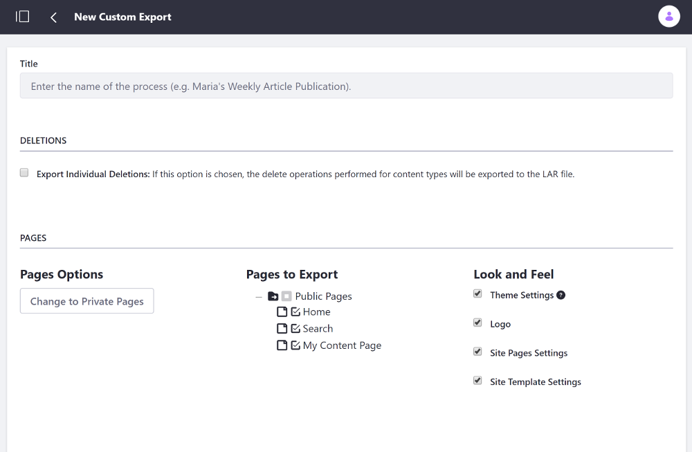
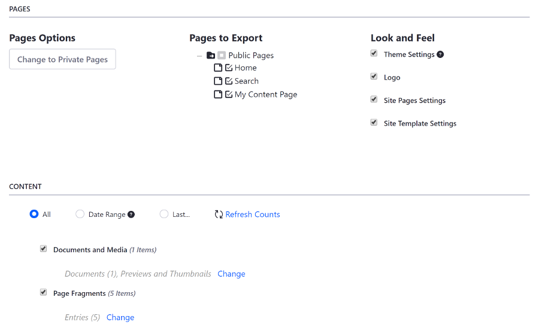

# Importing/Exporting Sites and Content

Export/Import lets you export and restore your Site and app data as a LAR (Liferay Archive). There are two primary places Export/Import is used: Sites and apps. You can learn more about exporting/importing app data in the [Exporting/Importing Widget Content]() <!-- TODO: Fix link --> section. In this section, you'll learn how to export and import content and pages for Sites.

## Site LAR Properties and Requirements

LARs have these properties and requirements:

-   LARs are version dependent. They can be imported into a Site on another Liferay Portal server, as long as the Liferay Portal versions on each server are the same.
-   Some naming collisions are handled automatically. For example, if the LAR you're importing and the Site both have a page with the same friendly URL, a number is appended to the friendly URL and incremented until the collision no longer occurs. The same is true for category names that collide.
-   You can restore your Site with the latest LAR, but to do so you must delete your Site entirely and then create a new Site with the same name to import the LAR into. This avoids potential data conflicts between content that exists both in the LAR and in the Site.

If you want to regularly move pages from one server to another, you should use the Changelist feature(7.2 Staging environment), instead of a LAR. See the [Changelists]() (7.2 [Staging]() <!-- TODO: Fix links --> section for more details.

```note::
  Periodically exporting LARs is *not* a backup solution; it should only be used to migrate information between two environments. Please refer to the `Backing up a Liferay Portal Installation <../../installation-and-upgrades/maintaining-a-liferay-dxp-installation/backing-up.md>`_ section for information on backing up Liferay Portal.
```

## Importing and Exporting Pages

Follow these steps to export and import your Site's pages:

1. Open the Site Menu and go to _Publishing_ &rarr; _Export_.

1. Click the _Add_ icon ().

    A _New Custom Export_ page loads. You can choose the pages and content you want to export from your Site:

    - Site pages (you can select exactly which ones)
    - Page settings
    - Theme
    - Theme settings
    - Logo
    - Application configurations
    - Application content
    - Archived setups
    - User preferences

    

1. Enter a Title.

1. Under _Pages_, select Public or Private Pages and the settings you want to export.

1. Under the _Content_ category, select _All_ to export all content or specify a date range or time to filter the content to export.

    ```note::
      If you select one of the *Choose* radio selectors or *Change* links, you're given checkboxes for options to choose. Application content can also be selected for export, including the Documents and Media Library, Message Boards, and Web Content assets. You can even export the theme you're using.
    ```

1. Select whether the permissions for your exported pages and content are included.

    

1. Click _Export_. The menu automatically switches to the _Processes_ tab, where you see the status of your exported LAR file.

1. Select the _Download_ icon () to download the export to your local machine and copy it to a secure location for safekeeping or import it into another installation of Liferay Portal.

1. To rebuild or revert back to this version of your Site, you can import this file by clicking the _Import_ button from the _Publishing_ menu, browsing to it, and selecting it. You can also drag a LAR file inside the dotted area, which also executes the import process.

## Creating Export Templates

Instead of manually creating an export process every time you export pages and/or content, you can create an Export Template to store the export process settings so they can be reused. To create an Export Template, follow these steps:

1. Open the Site Menu and navigate to _Publishing_ &rarr; _Export_

1. Select the _Options_ icon () from the top right corner of the screen and select _Export Templates_.

    

1. Click the _Add_ button ().

1. Provide a _Name_ and _Description_ for the template.

1. Fill out the configuration options for your export process.

1. Click _Save_.

Your template is now available to use from the _Export Templates_ menu.

## Using Export Templates

To use an Export Template, follow these steps:

1. Click the _Actions_ () Menu next to the Export Template and select _Export_.

    This automatically fills in the fields and options for exporting pages and their content.

1. Give the export a name.

1. Click _Export_ to generate your LAR file.
