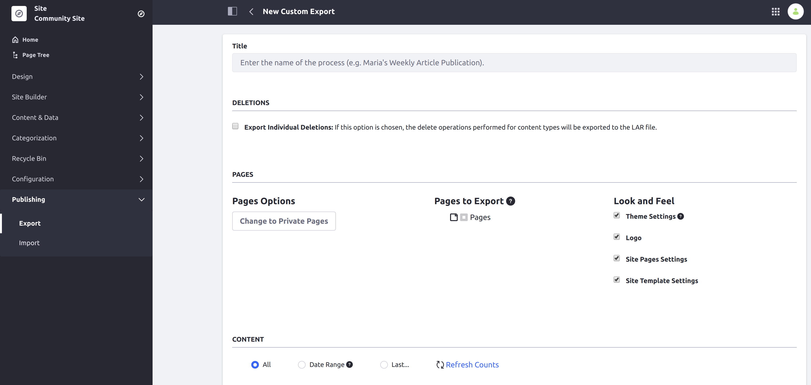

# Sharing Site Templates

To export a Site that uses Site Templates or Page Templates to a different Liferay DXP installation (through a LAR file or remote publication), the Site Templates must be exported and imported manually first, before the Site.

To export a Site using a Site Template, follow these steps:

1. Open the Product Menu and go to *Control Panel* &rarr; *Sites* &rarr; *Site Templates*.
1. Open the *Actions* Menu () for the Site Template you want to export and select *Manage*.
1. From the Site Template's *Pages* page, open the Product Menu and select *Publishing* &rarr; *Export* under the Site Template's menu.
1. Click the *Add* icon () to create a new custom export.

1. Select the content and pages you want to export and click *Export*.
1. Click on the *Download* icon for the template that you exported.
1. In your target environment (Liferay Portal instance), go to *Control Panel* &rarr; *Sites* &rarr; *Site Templates* and create a new Site Template.
1. Open the *Actions* Menu () for the Site Template and select *Manage*.
1. From the Site Template's Pages page, open the Product Menu and select  *Publishing* &rarr; *Import* under the Site Template's menu and import the Site Template LAR you just downloaded.

The Site Template can be used normally in the new environment. For more information on exporting/importing content, see [Importing/Exporting Pages and Content](./09-importing-exporting-pages-and-content.md).

