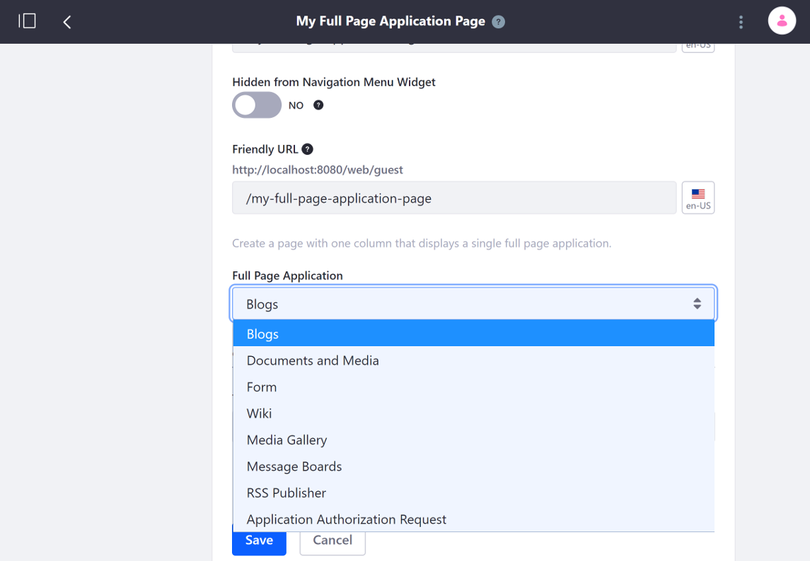
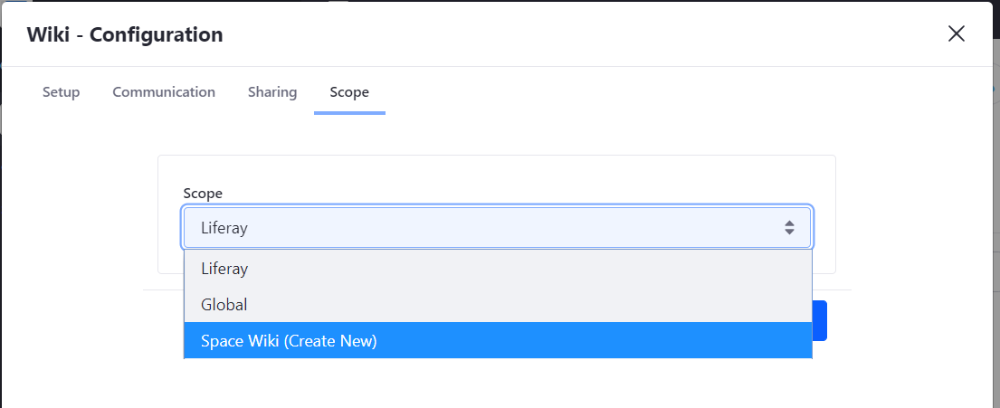

# Using the Full Page Application Page Type

Follow these steps to create and configure a Full Page Application Page:

1. [Create a new Page](./adding-a-page-to-a-site.md) and select *Full Page Application* under the *Other* heading.
1. Enter a name and click *Add*.
1. Select the application you want to display from the list of applications under the *Full Page Application* heading. By default, you can set the Blogs, Wiki, Media Gallery, Message Boards, RSS, Documents and Media, Form, or Application Authorization Request to be the sole application for the page. Developers can make their applications Full Page Applications.

    

1. Click *Save* to apply the changes.

## Scoping Full Page Application Data

All applications supported by the Full Page Application page type are non-instanceable and the content of the application you choose is based on the instance for that Site. Therefore, if you already had data in your application, such as a Wiki, it appears on the page. If you want to configure a full page application, such as wiki, to be scoped to a specific page, you can configure that through the application's settings. Below is an example for a Wiki:

1. From the page, click the () button for the Wiki and select *Configuration*.

1. From the *Wiki - Configuration* page, select the *Scope* tab.

1. Open the *Scope* menu and select the Wiki page you want.

