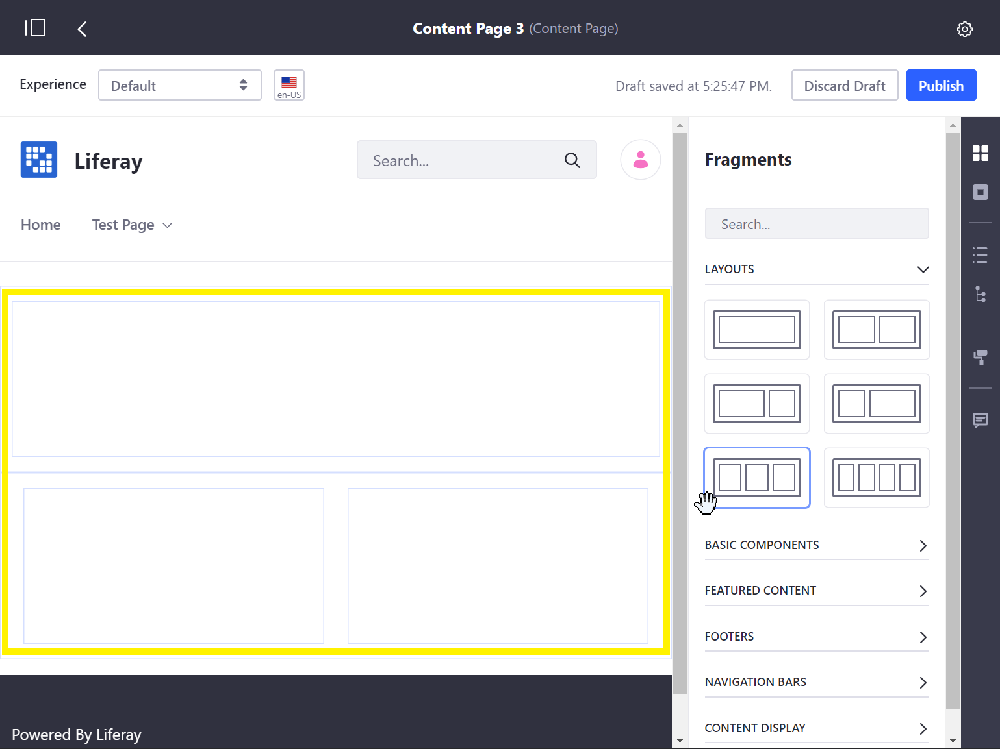
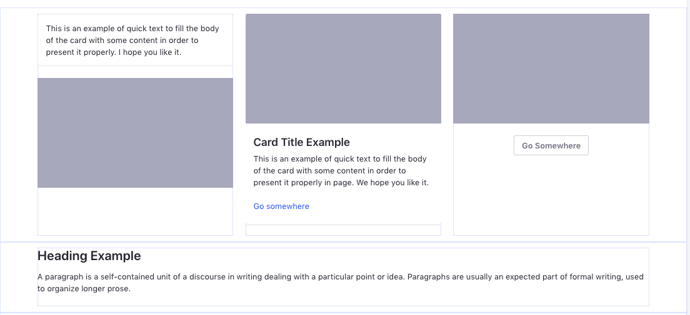
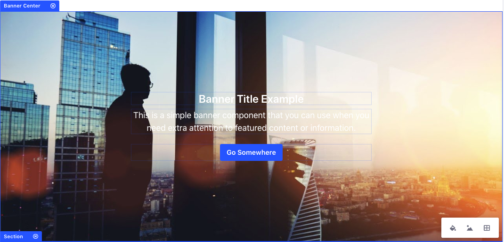
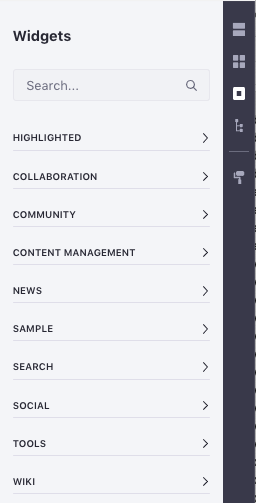
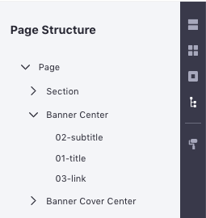

# Content Pages Overview

The default type of page used in Liferay DXP is a Content Page. The Content Page editing UI provides access to many different drag-and-drop elements (Fragments) that are available for immediate use with minimal configuration. Continue reading to get an overview of the Content Pages UI. See [Building Content Pages](./building-content-pages.md) to jump directly in to building a Content Page.


The Content Page sidebar contains these elements and tools for Content Pages:

* [Fragments](#fragments)
* [Widgets](#widgets)
* [Contents](#contents)
* [Page Structure](#page-structure)
* [Look and Feel](#look-and-feel)
* [Comments](#comments)

Liferay Portal ships with several Layouts, Fragments, and Widgets that you can use to build pages. Developers can [create their own Fragments](./README.md#dev-guide) to add to these.

## Fragments

```note::
   Available in Liferay DXP 7.3+. This section was previously divided between the *Sections* and *Section Builder* panels.
```

You can drag-and-drop Fragments on a page. Fragments can have editable elements, such as [text](./building-content-pages.md#modify-editable-text), [images](./building-content-pages.md#modify-editable-images), or [links](./building-content-pages.md#modify-editable-links), that you can replace with custom content. You can also [map these elements](./building-content-pages.md#mapping-elements) to content that is already available on the site itself. For more information on developing these elements, see [Fragment Specific Tags](./README.md#using-fragments).

### Layouts

Layouts provide a canvas where you can add Fragments or Widgets. Each Layout you add fills the width of the page. Multiple layouts can be added to a page.



### Basic Components

Basic Components are small design elements or pieces that add functionality to the page. A Component might be an image with formatting or a block of text with styling pre-applied. Components work together to build pages piece by piece.



### Featured Content

The Featured Content panel contains complete Fragments (composed of multiple components) that can be immediately used and customized as soon as they are added to a page. A large banner image with a text overlay and customizable CTA (Call to Action) is an example of a Fragment that is ready for immediate use.
<!-- An image with better text contrast would probably be a better example here - to help the image / text / CTA button stand out from one another more. -->


### Footers

```note::
   Available in Liferay DXP 7.3+. These Fragments were previously included in the *Sections* panel.
```

The *Footers* panel includes Fragments that you can add as the Footer of the page. See [Master Pages](./master-page-templates/master-page-templates-intro.md) for their use in Liferay DXP 7.3.

### Navigation Bars

```note::
   Available in Liferay DXP 7.3+. These Fragments were previously included in the *Sections* panel.
```

The *Navigation Bars* panel includes Fragments that you can add as the Header of the page. See [Master Pages](./master-page-templates/master-page-templates-intro.md) for their use in Liferay DXP 7.3.

### Content Display

```note::
   Available in Liferay DXP 7.3+.
```

The *Content Display* section lets you add the Content Display Fragment to display a single existing web content, blog entry, or document. See [Using the Content Display Fragment](./README.md#using-fragments) for more information.<!--Including this doc in the Page Fragments section-->

## Widgets

<!-- Suggestion for improving this content:

Rather than spend valuable real estate here comparing to how its different from a widget page - we should focus on what it is here:

"The widgets section shows a full list of out of the box applications and tools. There are some limitations to using a widget on a content page that distinguish it from its use on a widget page. See "Using Widgets on a Content Page" for more information."

-->

The Widgets section functions just like the *Add* menu on a Widget Page. The full list of available widgets is displayed, and you can add them to the page. The main difference is that only the main configuration options for Widgets on Content Pages. Various other configurations like *Look and Feel* are only available for Widgets on Widget Pages.



## Contents

```note::
   Available in Liferay DXP 7.3+
```

The Contents section provides a list of the web content that's used on the page. This includes content displayed in a widget and content mapped to content fields. Click the *Contents* button () to open the Contents panel. From this section, you can perform a variety of actions to edit and manage web content. See [Managing Web Content on Content Pages](./managing-web-content-on-content-pages.md) for more information.

## Page Structure

Page Structure provides a hierarchical view of every Fragment and field within each Fragment on the page. Click on a field in the page structure to highlight it on the page and quickly locate it amongst other elements.



## Look and Feel

Click the *Look and Feel* icon () to change the Theme or manage other options for the page. These options are further explored in [Configuring Individual Pages](./06-configuring-individual-pages.md#look-and-feel).

## Comments

You can comment on a Page Fragment to discuss changes and collaborate. Comments are disabled by default in Liferay DXP 7.2+, but Administrators can enable them. See [Using Fragment Comments](./using-fragment-comments.md) for more information.

## Next Steps

* [Building Content Pages](./building-content-pages.md)
* [Page Fragments](./README.md#using-fragments)
* [Using Fragment Comments](./using-fragment-comments.md)
