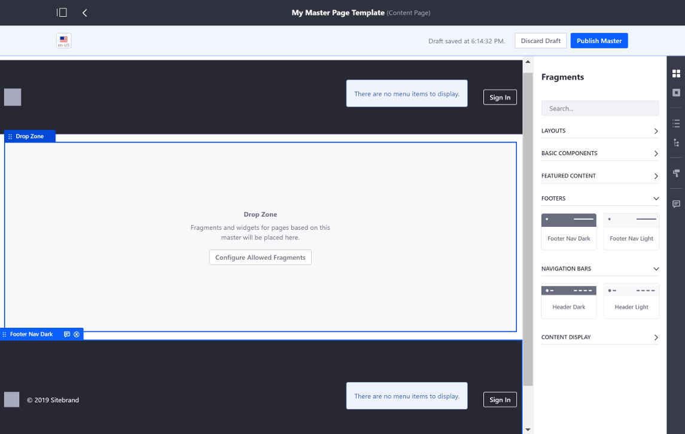

# Master Page Templates

> Liferay DXP 7.3+

<!-- Feedback on this introductory session: It's resistant to skimming because of its length and how the information is structured/presented. Here's some suggestions, and you may have already guessed that one of those suggestions is...a table. One principle I consider as I reviewed this is that it feels like we're defining MPT's in the shadow of themes. When, I think if this article is primarily about MPT's - we should describe it standalone in its entirety and then provide the helpful contrast w/ Themes. If MPT's are "the future" then let's present them well, and only secondarily talk about how they relate to Themes.

# Title
(Intro)
Master Page Templates are used to do X (provide consistent styling for a page's headers / footers / etc [what's the etc?]). MPT's can be created and scoped to a site, provide extensive access to look and feel customization options, and do not require the deployment of a plugin in order to update a site's look and feel.



## Building Master Page Templates

Building a Master Page Template is very similar to the process of creating a Content Page. A Master Page Template can contain any number of Page Fragments, like a Content Page. However, a Master Page Template differs in that it has one key area defined, called a *Drop Zone*, that specifies where you can place Page Fragments. This area can't be removed, but it can be drag and dropped somewhere else in the page layout. You can also define which Page Fragments can be added to the Drop Zone. A typical use case for a Master Page Template is to have a Header, a Footer, and a Drop Zone. See [Creating Custom Master Pages](./creating-a-master-page-template.md) for more information.

## Master Page Templates and Themes

Themes are still available in 7.3+ and they differ from MBT's in the following crucial ways:

| Capability | MBT | Theme |
| --- | --- | --- |
| Requires Plugin Deployment to update changes |  | x |
| Something you can only do with a theme |  | x |
| Something you can only do with a MBT | x |  |

-->

A Master Page Template provides the common elements for a page (Headers, Footers, etc.), while a Theme provides the overall look and feel for the Site's pages. Prior to Liferay DXP 7.3, these common elements were provided by the Theme, which means that any changes that needed to be made required an update to the Theme. Providing the common elements through a Theme poses a few limitations:

* System Administrators are required when a theme must be updated and re-deployed.

* Themes are available for all virtual instances and Sites, so you can't make a Theme available to certain customers, while hiding it from others.

* Common Theme element (Headers, Footers, etc.) customization options are limited to what the Theme developer provides (i.e. color schemes, theme settings, etc.).

Master Page Templates solve all these limitations by letting you create common elements that are unique per Site. The remainder of the page is left editable and is built like any other [Content Page](./04-building-content-pages.md). Each Page and Page Template must have an associated Master Page Template. By default, this is the "Blank" Master, which doesn't provide any common elements.

<!-- The highlighted portion of this screenshot looks...messy? -->


<!-- I'd remove this note because while it is a difference, it's a relatively subtle and obvious difference from how the UI appeared in the past.

```note::
   In Liferay DXP 7.3+, Page Templates and Display Page Templates have been moved out of "Pages" and into their own separate application called "Page Templates" under "Site Builder".
```
-->

## Master Page Elements

A Master Page Template can contain any number of Page Fragments, like a Content Page. However, a Master Page Template differs in that it has one key area defined, called a *Drop Zone*, that specifies where you can place Page Fragments. This area can't be removed, but it can be drag and dropped somewhere else in the page layout. You can also define which Page Fragments can be added to the Drop Zone. A typical use case for a Master Page Template is to have a Header, a Footer, and a Drop Zone. See [Creating Custom Master Pages](./creating-a-master-page-template.md) for more information.
