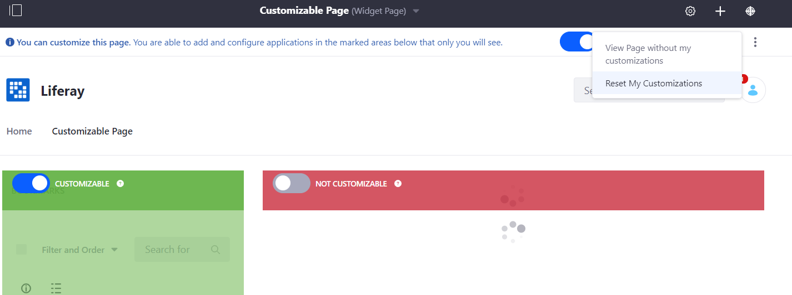

# Enabling User Personalization of Widget Pages

Administrators can designate some or all of the sections (rows and columns of the page layout) of a Widget Page as customizable for site members. Page customizations are only visible to the user who made the customizations. The steps below cover these topics:

-   [Making page sections customizable](#enabling-page-customizations)
-   [Modifying customizable page sections](#customizing-pages)
-   [Assigning non-site members permission to customize pages](#granting-roles-permission-to-customize-pages)

## Enabling Page Customizations

To enable page customizations, follow these steps:

1. Open the Product Menu and go to _Site Builder_ &rarr; _Pages_ under your site's menu.

1. Open the Actions menu next to the page you want to let Site members modify and select _Configure_.

1. Select the _Advanced_ tab at the top of the page and expand the _Customization Settings_ panel.

1. Toggle the _Customizable_ option to Yes.

    

1. Toggle the _Not Customizable_ option to _Customizable_ for each section you want to make customizable.

## Customizing Pages

With customization activated for a page, site members can add apps to the customizable sections of the page from the Add menu in the top right. Site members can make two kinds of customizations to customizable regions:

-   Add or remove apps
-   Configure applications

```note::
  Site members can't change a non-instanceable app's configuration inside a customizable region since those apps are tied to the site they've been added to.
```

Site members have access to these contextual options from the page's _Options_ menu () in the Control Menu:

-   _View Page without my customizations_: Displays the default page and hides the Add menu.

-   _Reset My Customizations_: Restores the customized page back to the default page, discarding any customizations.

-   _View My Customized Page_: Displays the page with the user's customizations and makes the Add menu available so users can add widgets to the page.



Administrators of customizable pages have the same two views as Site members: the _default page_ view and the _customized page_ view. Changes they make to the non-customizable sections of the default page affect all users just like other pages, whereas changes they make to the customized sections affect only themselves and do _not_ overwrite users' customizations.

## Granting Roles Permission to Customize Pages

By default, site members can make page customizations but non-site members and guests can't. Administrators can update permissions for an existing Role or [create a new Role](../../../users-and-permissions/roles-and-permissions/README.md) and assign it to other users to give them the ability to customize pages. Follow these steps to grant a Role permissions to customize pages:

1. Open the Product Menu and go to _Control Panel_ &rarr; _Users_ &rarr; _Roles_.

1. Open the Actions menu for the Role and select _Edit_.

1. Click the _Define Permissions_ tab for the Role and go to _Site Administration_ &rarr; _Site Builder_ &rarr; _Pages_ under Summary.

1. Scroll down to the Page section under the _Resource Permissions_ heading and check the _Customize_ permission.

1. Scroll down and click _Save_ to apply the changes.

```note::
  The *Customize* permission also lets users customize the look and feel of apps and import or export app settings.
```
