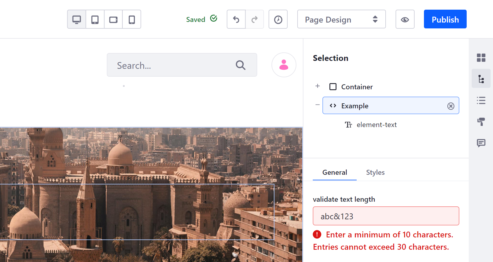
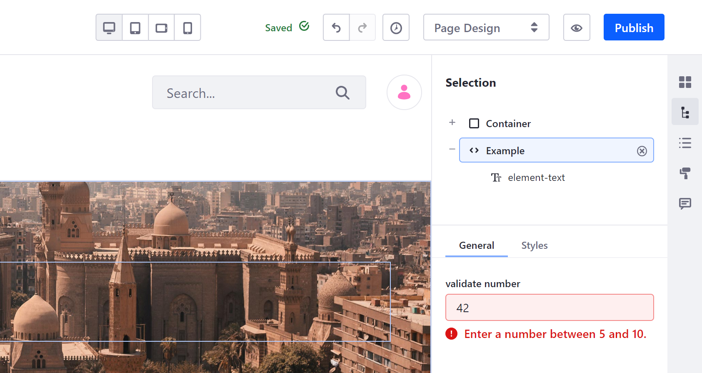
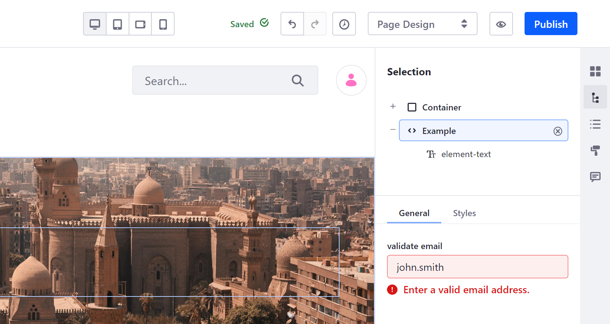
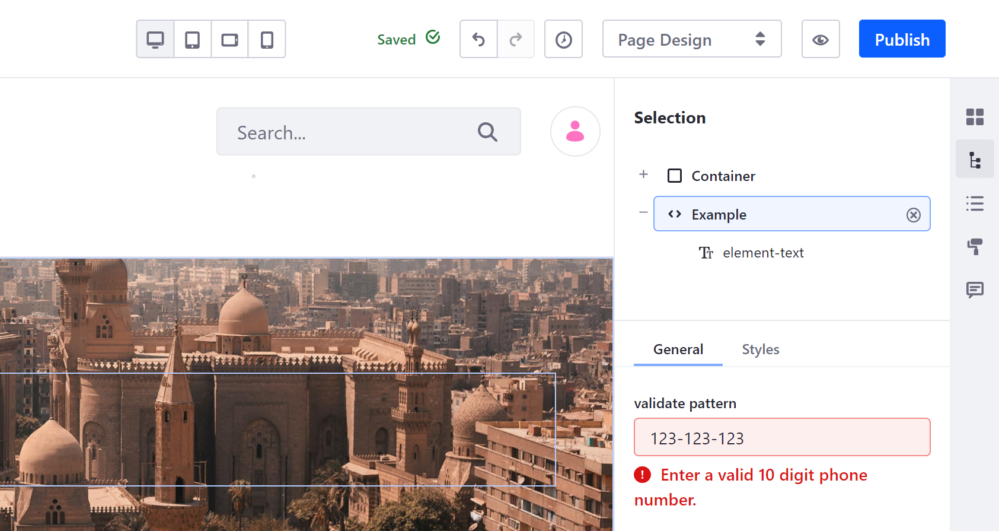

# Adding Validation Rules

When defining Fragment [configuration options](./adding-configuration-options-to-fragments.md), you can add `validation` properties to `text` type fields that determine rules for valid entries. As part of defining these properties, specify the rule's type: `text`, `number`, `email`, `url`, or `pattern`. Also, add custom error messages to notify users of invalid entries.

## Text Validation Rules

The following code adds `text` validation rules to set the minimum and maximum number of characters used in valid entries (i.e., `minLength` and `maxLength`) for a `text` type field.

```json
{
	"fieldSets": [
		{
			"fields": [
				{
					"label": "validate text length",
					"name": "text1",
					"type": "text",
					"typeOptions": {
					  "validation": {
					    "errorMessage": "Enter a minimum of 10 characters. Entries cannot exceed 30 characters.",
					    "type": "text",
					    "minLength": 10,
					    "maxLength": 30
					  }
					}
				},
			]
		}
	]
}
```



## Number Validation Rules

The following code adds `number` validation rules to define the numerical range of valid entries (i.e., `min` and `max`) for a `text` type field.

```json
{
	"fieldSets": [
		{
			"fields": [
				{
					"label": "validate number",
					"name": "text2",
					"type": "text",
					"typeOptions": {
					  "validation": {
					    "errorMessage": "Enter a number between 5 and 10.",
					    "type": "number",
					    "min": 5,
					    "max": 10
					  }
					}
				},
			]
		}
	]
}
```



## Email Validation Rules

The following code adds `email` validation rules to require email syntax and define the character length of valid entries (i.e., `minLength` and `maxLength`) for a `text` type field.

```json
{
	"fieldSets": [
		{
			"fields": [
				{
					"label": "validate email",
					"name": "text3",
					"type": "text",
					"typeOptions": {
					  "validation": {
					    "errorMessage": "Enter a valid email address.",
					    "type": "email",
					    "minLength": 1,
					    "maxLength": 30
					  }
					}
				},
			]
		}
	]
}
```



## URL Validation Rules

The following code adds `url` validation rules to require proper URL protocol and define the character length of valid URLs (i.e., `minLength` and `maxLength`) for a `text` type field.

```json
{
	"fieldSets": [
		{
			"fields": [
				{
					"label": "validate url",
					"name": "text4",
					"type": "text",
					"typeOptions": {
					  "validation": {
					    "errorMessage": "Enter a valid URL.",
					    "type": "url",
					    "minLength": 1,
					    "maxLength": 100
					  }
					}
				},
			]
		}
	]
}
```


## Pattern Validation Rules

The following code adds `pattern` validation rules to a `text` type field using regex to define valid entries.

```note::
   When using backslashes to escape characters in regex values (e.g., ``\d``), Users must use two backslashes within ``JSON`` files to first escape the backslash (e.g., ``\\d``). See `IETF <./https://www.ietf.org/rfc/rfc4627.txt>`_ documentation for more information on JSON grammar.
```

```json
{
	"fieldSets": [
		{
			"fields": [
				{
					"label": "validate pattern",
					"name": "text5",
					"type": "text",
					"typeOptions": {
					  "validation": {
					    "errorMessage": "Enter a valid 10 digit phone number.",
					    "type": "pattern",
					    "regexp": "([0-9]{3})[.-]?([0-9]{3})[.-]?([0-9]{4})",
					  }
					}
				},
			]
		}
	]
}
```



## Additional Information

* [Developing Fragments](./developing-fragments-intro.md)
* [Using the Fragments Editor](./using-the-fragments-editor.md)
* [Adding Configuration Options to Fragments](./adding-configuration-options-to-fragments.md)
