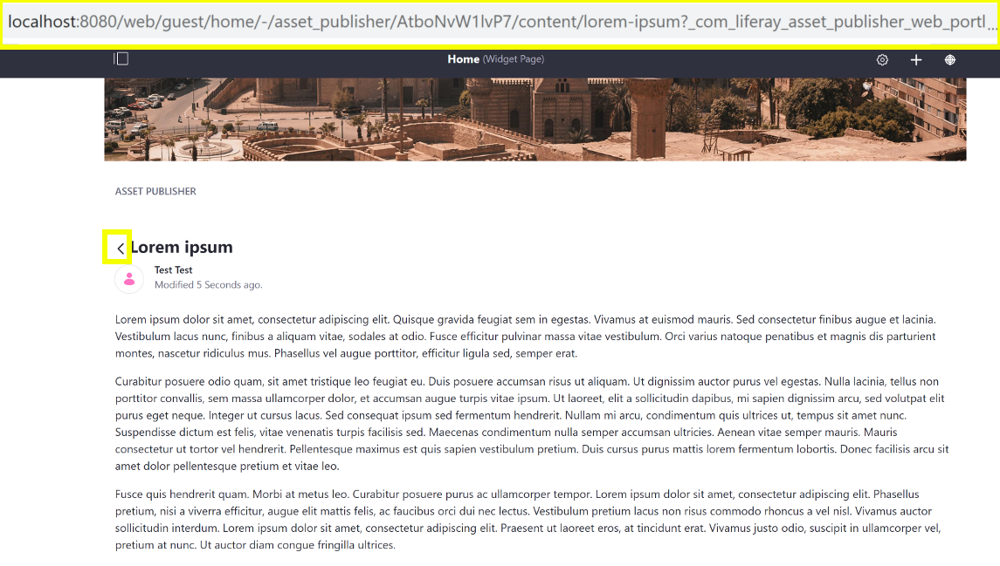
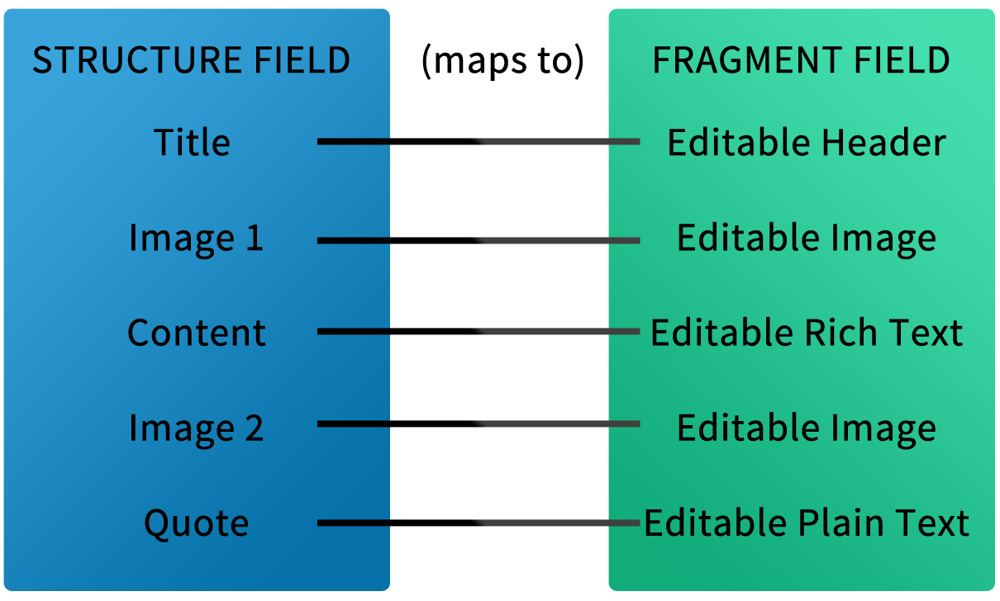

# Displaying Content with Display Page Templates

By default, web content is displayed in the context of the application that's viewing it. For example, when a web content article title is clicked in the Asset Publisher, it displays the full article within the Asset Publisher.

The default behavior may suit your needs. However, if you want something a bit more personalized and focused, you can create a Display Page Template for your web content. Display Page Templates specify the layout and formatting for your web content and display it using a unique friendly URL. Display Page Templates are built using the same tools as a [Content Page](../../../creating-pages/building-and-managing-content-pages/building-content-pages.md). You then add [Page Fragments](../using-page-fragments.md) to the Display Page Template and map them to the structure fields of the content (title, content, image, etc.) to create standardized formats for articles.

Once you've created a Display Page Template, you can reuse it for any content that uses the same content type (Web Content Article, Document, or Blogs Entry) and structure. When the web content is viewed (i.e. the web content article link is clicked), the full web content article appears on a Display Page, with a unique [friendly URL](../../../site-settings/managing-site-urls/configuring-your-sites-friendly-url.md), with the design you created.

Read on to learn more about these topics:

-   [Creating a Display Page Template](./creating-a-display-page-template.md)
-   [Publishing Content With Display Pages](./publishing-content-with-display-pages.md)
