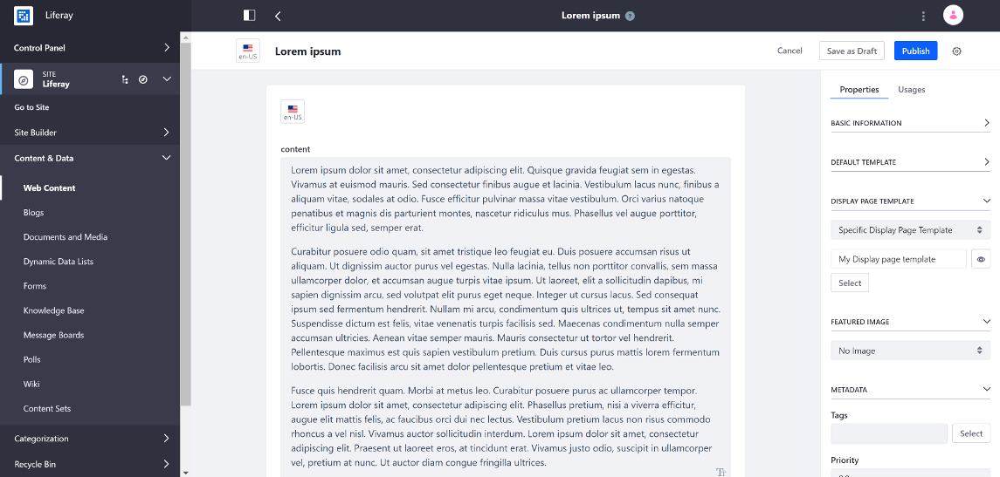
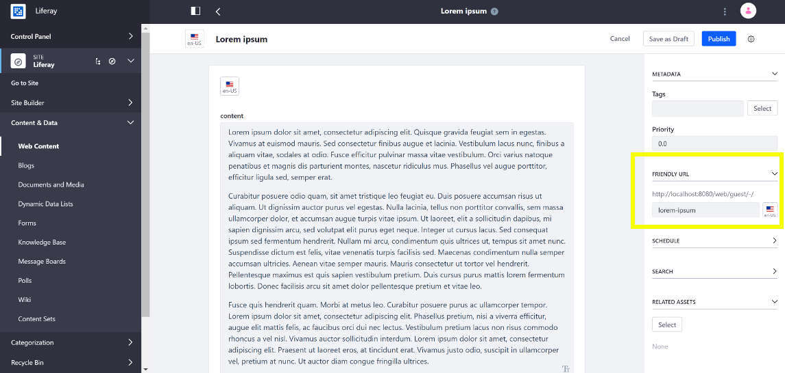
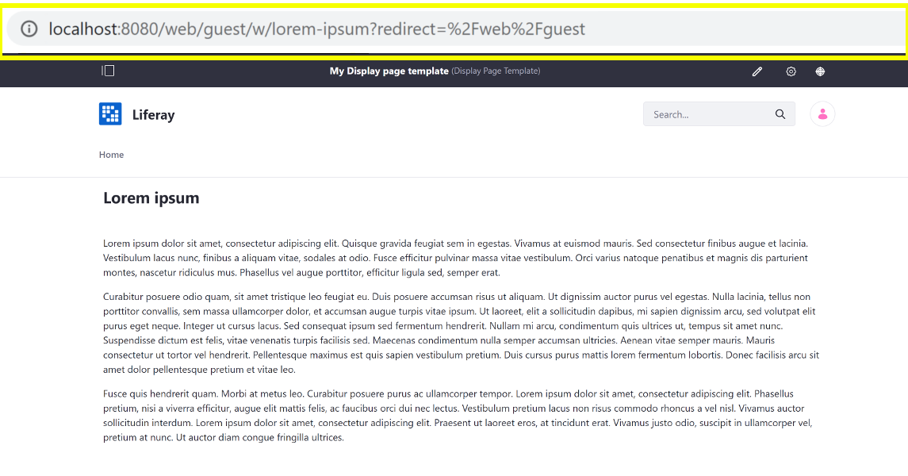

# Publishing Content With Display Pages

Follow these steps to display your content on a Display Page:

1. Open the Product Menu and go to _Content & Data_ &rarr;, open the site's menu, and select the type of content you want to configure a Display Page Template for: _Web Content_, _Blogs_, or _Documents and Media_.

1. Open the Edit menu for an existing content or create a new piece of content.

1. Expand the _Display Page Template_ section in the Properties window, open the dropdown selector and choose _Specific Display Page Template_.

    

1. Click the _Select_ button and select the Display Page Template and click _Done_.

    When editing the content, you can preview what the display page looks like with the _Preview_ () button located next to the selected Display Page Template.

    

1. Scroll down to the _Friendly URL_ panel, expand it, and modify the friendly URL if you want. This is the URL your web content is displayed at when the full content is viewed.

    

1. Click _Publish_.

When published, you can view the content at its Friendly URL or when you click on the content in an Asset Publisher with _Asset Link Behavior_ set to _View in Context_.
