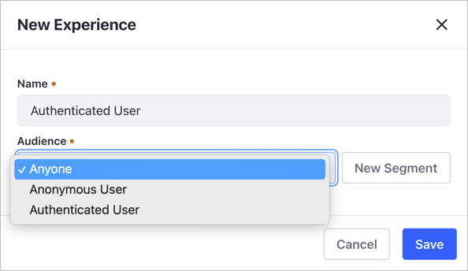
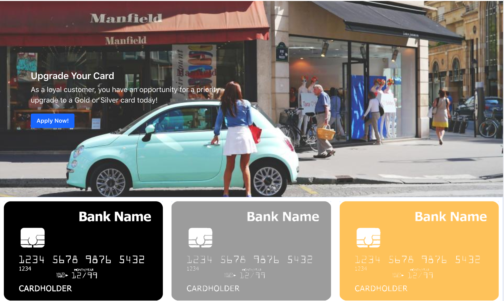
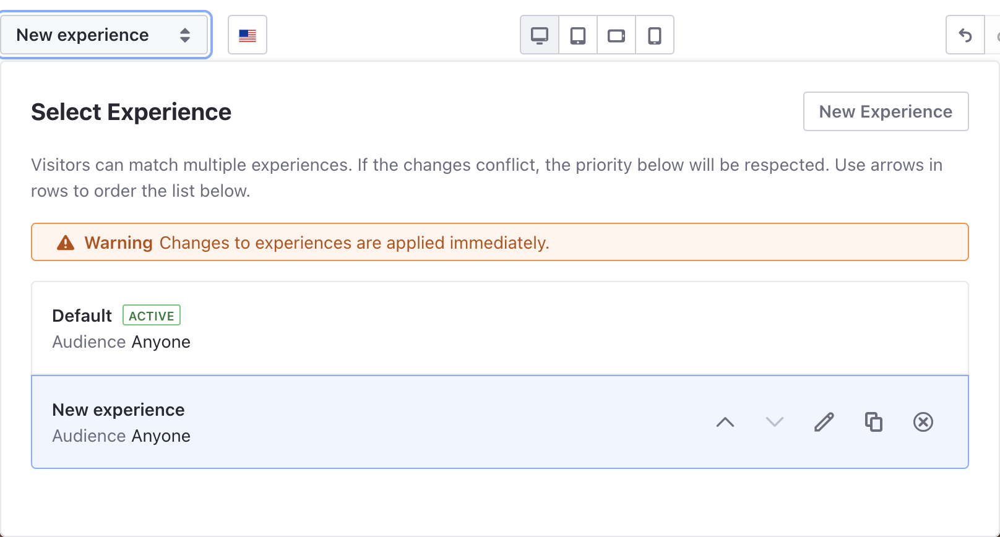
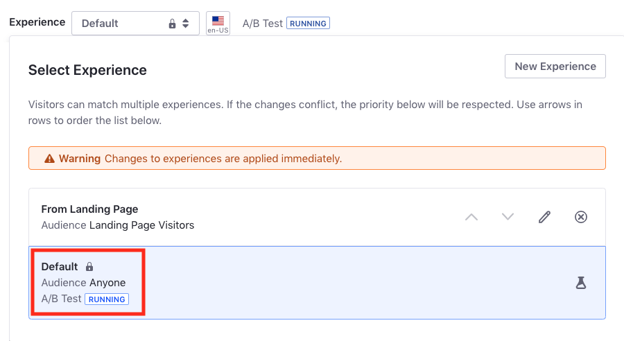

# Content Page Personalization and Management

You can tailor your Content Page for different groups of users, providing each group a personalized experience, rather than a generic one. You can also leverage Content Page personalization to conduct A/B Testing (for more information, see ).

Personalizing your Content page for different users is a two-step process:

1. Define a Segment for the users you want to provide a personalized experience.
2. Create a Experience with customized content for your User Segment.

These steps show how to create Experiences based on User Segments.

## Understanding How Experiences Work

You can create different experiences for the same Content Page. For example, for your Segment or authenticated users, you can create different experiences for the holiday and non-holiday seasons. 

- Every Content Page includes a *Default* experience. When you create a new Experience, *Default* is used as a template.
- You can modify the *Default* experience. Existing experiences based on *Default* will not change.
- You can duplicate any experience except *Default* (see [Managing Content Page Experiences](#managing-content-page-experiences)).
- When you have multiple experiences in the same Content Page, their order determines their preference and you may need to modify the order to achieve the desired goal.
  
  - Experiences on top of the list have preference over experiences at the bottom.
  - When a user meets the criteria for more than one Experience, the Experience listed first is the one selected.
  - New Experiences are listed below the Default experience.
  - You cannot reorder an experience that is part of an A/B Test, but you can reorder the resrt.

Consider the following example:

  

In the Content Page, we configured three different Experiences:

- *Anonymous User*, which applies to non-authenticated users accesing the Page.
- *Authenticated User*: Applies to the *Authenticated User* segment.
- *No Customization*: Applies to the *Anyone* Segment.

In this configuration, a non-authenticated user will see the experience *Anonymous User*. However, authenticated user will not see the experience configured for them (*Authenticated user*), because the *No customization* experience applies to Anyone and is listed first. To present the *Authenticated User*, you need to change the order of the experiences, moving the *Authenticated User* one before the *No customization* one.

## Creating a New Content Page Experience

1. Go to *Site Administration* &rarr; *Site Builder* &rarr; *Pages*.
2. Click the Actions () menu and select *Edit*, or [create a new Content Page](../../creating-pages/building-and-managing-content-pages/building-content-pages.md).
3. At the top of the page, for the *Experience* click on *Default* to open the experience selection dialog.

    

4. Click on *New Experience*.
5. Enter a name for the Experience and select the User Segment for the audience you want to cater the experience to, or [create a new User Segment].

    


6. Edit your Content Page with the information and layout you want to show to the selected User Segment.
7. Click *Publish*.

The *Default* version of the page appears for everyone except for members of the selected User Segment, who are presented with a version of the site for their defined User Segment. The example in the figure below creates a new experience for a fictional *Premium Card Prospects* User Segment.



```note::
  When you create a new experience, it copies the *Default* experience at the time that it is created. Any further changes to the *Default* experience do not effect any of the experiences for that page.
```

## Managing Content Page Experiences

When you edit a Content Page, you can click on the *Experience* to manage the options for that page.



1. Go to *Site Administration* &rarr; *Site Builder* &rarr; *Pages*.
1. Click the *Actions* button  &rarr; *Edit* for any Content Page.
1. Click on the *Default* Experience to manage experiences.

From here you have three options:

 changes the name or selected User Segment for the Experience.

 deletes the Experience.

 changes the priority of the Experience. If a User meets the criteria for more than one Experience, the highest ordered one is displayed.

```note::
  Creating new Segments from the New Experience interface is available in Liferay DXP 7.2 Fix Pack 1+ and Liferay Portal 7.2 CE GA2+.
```

## Content Page Experiences and A/B Testing

When you [create an A/B Test](../../optimizing-sites/ab-testing/creating-ab-tests.md) in Liferay DXP, you choose an Experience for the test. This Experience can be the Default one, or any other you have created.

To avoid changes in the Experience that can interfere with the A/B Test results, you cannot edit an Experience that is part of a running A/B Test.



For more information about A/B Testing in Liferay DXP and Liferay Analytics, see [A/B Testing](../../optimizing-sites/ab-testing/ab-testing.md).

## Related Information

* [Personalizing Collections](./personalizing-collections.md)
* [Getting Analytics for User Segments](../segmentation/getting-analytics-for-user-segments.md)
* [Creating User Segments](../segmentation/creating-and-managing-user-segments.md)
