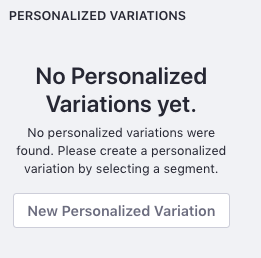
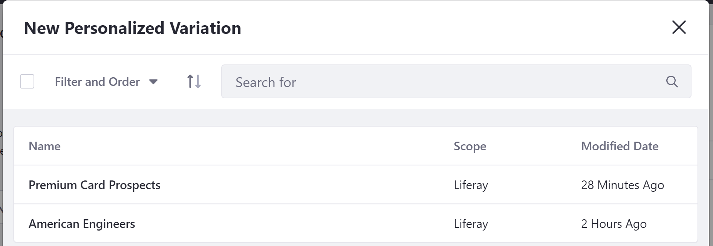
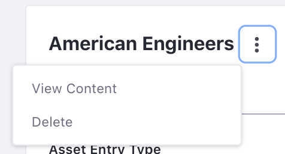

# Content Set Personalization

You can modify Content Sets to create a personalized variation for members of a specific User Segment. Follow these steps:

1. Open the Product Menu and select _Content & Data_ &rarr; _Content Sets_ under your Site's menu.
1. Select an existing Content Set or create a new Content Set<!-- Link required -->.
1. Click the _Actions_ button  &rarr; _Edit_ for the Content Set you wish to personalize.
1. Click the _New Personalized Variation_ button next to the Content Set if there are _No Personalized Variations yet_, otherwise click the `+` button next to Personalized Variations.

    

1. Select a User Segment from the next page to create a variation for that User Segment.

    

1. Select the content that you want to display for the Content Set in the selected User Segment.

Now anytime a member of the User Segment views this Content Set in context, such as in an Asset Publisher, they see the personalized version and not the default. Each new variation copies the default Content Set, but then essentially functions as its own Content Set after that.

## Managing Content Set Personalization

To edit or manage a Content Set Variation,

1. Click on the User Segment name under _Personalized Variations_ or click _Anyone_ to modify the default variation.
1. Click on the _Actions_ button () next to the User Segment and select _View Content_ to preview the content in that set or _Delete_ to remove it.

    

## Related Information

-   [Content Page Personalization](./content-page-personalization.md)
-   [Creating User Segments](../segmentation/creating-and-managing-user-segments.md)
-   [Assigning Roles to User Segments](../../../users-and-permissions/roles-and-permissions/assigning-roles-to-user-segments.md)
